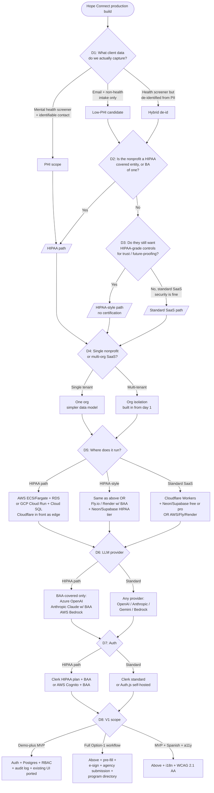
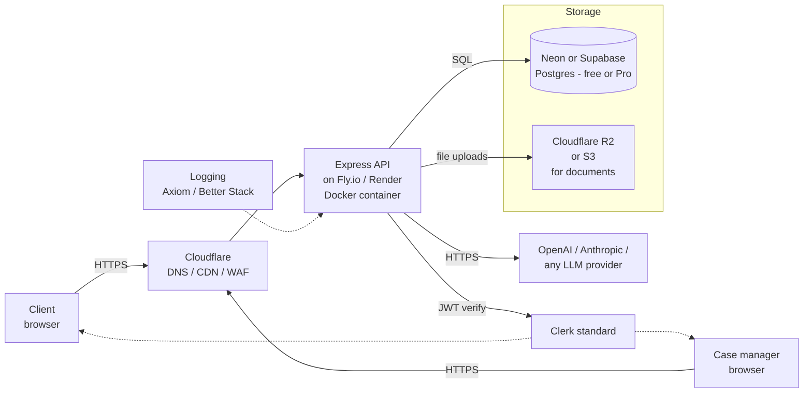
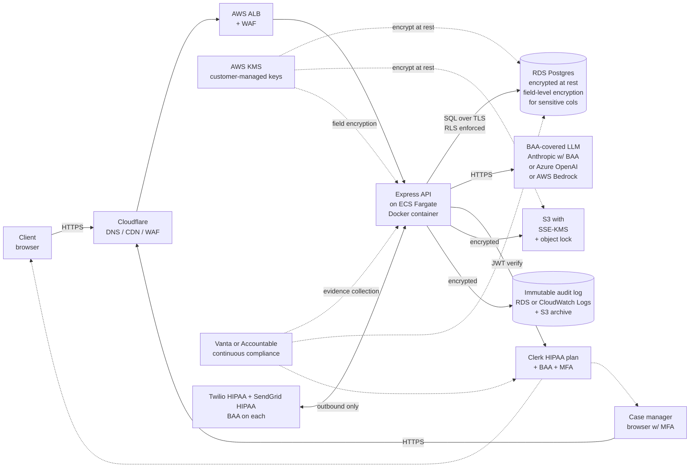
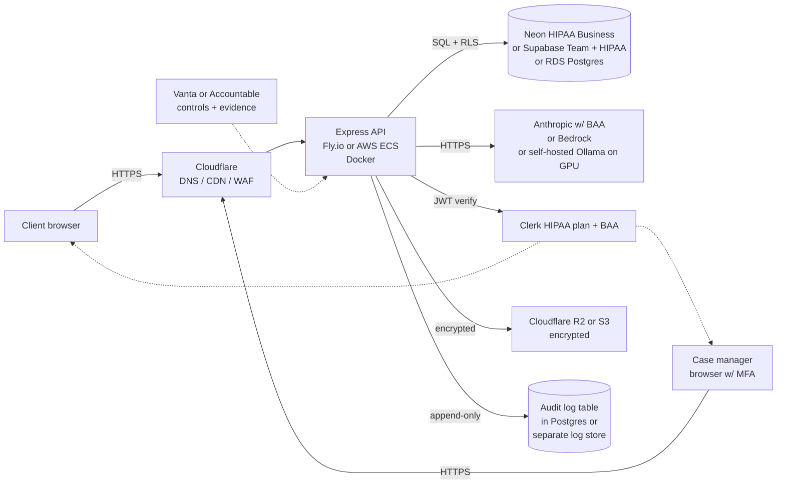
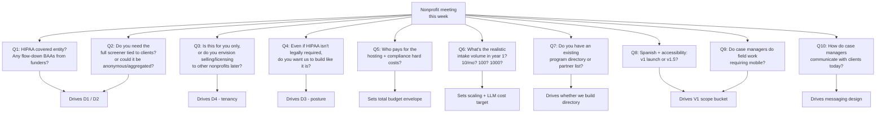

# Hope Connect — Architecture Decision Tree

_For the Tuesday-with-teammate sync and the nonprofit meeting later this week. Goal: separate what is locked from what depends on the nonprofit's answers, and show what the final architecture looks like in each major branch._

---

## 1. What is set in stone

These pieces are independent of every decision the nonprofit makes. Whatever else changes, this core stays the same.

- **Frontend:** React 19 + Vite SPA. React Router for client-side routing. lucide-react for icons. The page surface (intake, dashboard, detail, admin, reports) is built and works.
- **Backend shape:** Node.js + Express REST API, layered into routes / domain modules / store. The shape is good; what changes is what the store talks to.
- **Analyzer pipeline:** `qaPairs → prompt template → provider → Zod-validated AnalysisResult → severity floor → help-score → persist`. The provider abstraction means swapping the actual LLM is a one-file change.
- **Safety floor:** Regex-based crisis/urgency detection (`urgency.js`) that the LLM cannot de-escalate. This is non-negotiable for the use case.
- **Deterministic help score:** Pure function over the AnalysisResult, version-stamped, fully reproducible.
- **17-question Likert screener** as the input to the analyzer. (The questions themselves may change; the screener-as-an-input pattern stays.)
- **Eval harness** for the analyzer with golden-set fixtures.
- **Demo seeds** for offline review.

Everything else flexes on the decisions below.

---

## 2. The decision tree

The diagram below is the master flow. Each diamond is a question to bring to the nonprofit (or to settle with the team first). Each leaf is a concrete architecture path.

Three things to internalize before you walk into the meeting:

1. **D1 is the question that dominates everything.** If the nonprofit is willing to scope client data so the system never holds identifiable health information, the entire compliance burden shrinks dramatically. If they need the mental-health screener tied to a named person, you are on the HIPAA path no matter what else changes.
2. **D4 (tenancy) is the second-biggest fork.** It changes the data model on day one. Don't let this slip past the meeting.
3. **D5/D6/D7 cascade from D1–D3.** Once you know the compliance posture, the hosting / LLM / auth choices mostly fall out.

---

## 3. The decisions, one at a time

### D1 — Scope of data collected

The interesting middle path here is the one you raised: what if the only PII we keep is an email so a Hope Connector can reach out, and everything else is either freeform text the user already chose to share, or numbers from the screener that aren't tied to a record-of-medical-treatment relationship?

The technical line: HIPAA "Protected Health Information" is health-related information tied to an identifiable individual, held by a covered entity (provider, plan, clearinghouse) or its business associate. If the nonprofit is **not** a covered entity, technically HIPAA doesn't apply at all — but most state privacy laws (CA, WA, NY, IL especially) will still impose duties on sensitive health and mental-health information, and the trust expectation of clients in crisis is "you handle this like a hospital does." Even non-HIPAA nonprofits in this space tend to adopt HIPAA-style controls voluntarily.

**Options to put in front of the nonprofit:**

| Option | Data scope | Practical implication |
|---|---|---|
| **D1.A** | Email + name + free-text intake only; no Likert health screener | Almost certainly not PHI. Lowest-cost path. Loses the screener's signal for the analyzer. |
| **D1.B** | Full current scope: screener + identifiable contact + free text | PHI. HIPAA-or-equivalent required. |
| **D1.C** | Screener results stored separately from PII; never joined except transiently in the analyzer | Reduces blast radius. Adds engineering complexity. Defensible "lower PHI" posture but requires careful architecture. |

**Ask the nonprofit:** "How much of the screener do you actually use in case management? Could it be aggregated/anonymous, or do staff need it tied to the client?"

### D2 — Is the nonprofit a HIPAA covered entity?

Most nonprofits are not. But some are — if they provide healthcare services, run a clinic, or operate under contract for a state Medicaid or behavioral-health program, they may be a covered entity or business associate. This is a yes/no they can answer; if they're not sure, their counsel can answer.

**Ask the nonprofit:** "Are you a HIPAA covered entity? Do you have BAAs with any of your funders or partners that flow obligations to you?"

### D3 — Do they want HIPAA-grade controls anyway?

Even when HIPAA doesn't technically apply, three things often push you to behave as if it did: (1) the clients are vulnerable and the data is sensitive, (2) state laws may impose similar duties, (3) future funders / partners / government contracts will ask. A "HIPAA-style without the certification" posture is a real and defensible middle ground.

**Ask the nonprofit:** "Even if HIPAA isn't legally required, do you want us to build like it is? It costs more but it's a defensible position if any partner asks."

### D4 — Single nonprofit or multi-tenant SaaS

This is the strategic question. Findhelp, Unite Us, Bonterra are all multi-tenant SaaS. The Meeting-2 build assumes one customer. Multi-tenant doubles or triples the data-model and admin-UI work but unlocks the business model the proposal sketches out.

**Ask the nonprofit:** "Is this just for you, or do you envision selling/licensing it to other nonprofits later? The answer changes how we build the database."

### D5 — Where it runs

This is the one where your Docker / Cloudflare instinct ran into a wall. Let me make the options concrete.

| Stack | Compute | Database | Edge | BAA story |
|---|---|---|---|---|
| **AWS-native** | ECS Fargate (Docker) or EC2 | RDS Postgres or Aurora | CloudFront or Cloudflare in front | Full AWS BAA, broad service coverage |
| **GCP-native** | Cloud Run (Docker) | Cloud SQL Postgres | Cloud CDN or Cloudflare in front | Full GCP BAA |
| **Fly.io** | Fly Machines (Docker) | Fly Postgres or Neon | Cloudflare in front | Fly offers BAA on Enterprise; verify currency |
| **Render** | Render Services (Docker) | Render Postgres or Neon | Cloudflare in front | BAA on enterprise; verify |
| **Cloudflare Workers** | Workers (no Docker, JS/WASM only) | Neon, Supabase, D1 (D1 isn't HIPAA) | Native | Cloudflare BAA only on Enterprise; not their default story |

The cleanest HIPAA-path stack is **AWS ECS Fargate + RDS Postgres + Cloudflare in front for DNS/WAF/DDoS**. You get Docker, a managed database with a BAA, and the edge benefits without expecting Cloudflare to host the app.

The cleanest standard-SaaS stack is **anything you want.** Fly.io is the developer-friendly cheap option (single command deploy, good Docker support); Cloudflare Workers is fast and cheap if you're willing to refactor the Express server into a Workers-compatible runtime (Hono or similar — non-trivial but doable). Render and Railway are also fine.

### D6 — LLM provider

This is the single biggest hidden cost and the single biggest compliance lever.

| Provider | BAA? | Notes |
|---|---|---|
| **Azure OpenAI** | Yes (standard) | The boring/safe enterprise pick. GPT-4o, etc. |
| **Anthropic API** | Yes (request via sales for healthcare) | Claude Sonnet/Opus. The model you'd probably actually pick on quality for this use case. |
| **AWS Bedrock** | Yes | Gives you Claude, Llama, Titan. Lives inside your AWS account, easy if you're already on AWS. |
| **GCP Vertex** | Yes | Gemini, plus partner models. |
| **OpenAI direct** | Not by default | They have a healthcare offering but it's not the default account. Plan for "no" unless they confirm. |
| **Self-hosted Ollama on cloud GPU** | N/A — you own the BAA chain | $500–$2000/mo for moderate use. Lets you keep the current `qwen3:8b` posture in production. |

If standard SaaS path: pick on price + quality, no constraint.

If HIPAA / HIPAA-style path: pick from the BAA list. The current provider abstraction means swapping is a one-file change in `server/llm/providers/`.

### D7 — Auth

Clerk is a strong default. The question is which tier.

- **Clerk HIPAA plan + BAA** — paid plan, MFA-by-default for staff, audit logs. The right pick if you're on the HIPAA path.
- **Clerk standard plan** — fine for standard SaaS or HIPAA-style with auth handled carefully on your side.
- **Auth.js (NextAuth) self-hosted** — open source, you control everything, no third-party BAA needed because nothing leaves your stack. More engineering work.
- **AWS Cognito** — comes with the AWS BAA, less polished UX, free up to a point.

You also need RBAC enforced inside your own app — Clerk tells you who the user is and what role they have; your API still has to enforce row-level "can this case manager see this client" on every endpoint.

### D8 — V1 scope

This is the negotiable bit with the nonprofit. The three buckets I'd present:

- **Bucket 1 — Production MVP (smallest defensible v1):** Port current UI onto Postgres + Clerk + RBAC + audit logging on the hosting choice you settled. No new features. ~3–4 months of two-person work + compliance setup.
- **Bucket 2 — Full Option-1 workflow:** MVP + AI pre-fill of applications + user confirmation + case-manager final audit + document storage + e-signature + the program directory. ~7–9 months. Matches the proposal's $58–111k labor estimate.
- **Bucket 3 — Production-ready including Spanish, accessibility, mobile, closed-loop referral:** Bucket 2 + i18n + WCAG 2.1 AA + responsive mobile + outcome tracking. ~10–14 months. This is the "you could sell this to another nonprofit" version.

---

## 4. Scenario architectures

Three end-state architectures, one per major branch of the tree.

### Scenario A — Standard SaaS (no HIPAA, lightweight data)

The minimum-cost path. Applies if D1 = email-only, D2 = no, D3 = no.

What's true here: low cost, fast to ship, no BAA paperwork. What's not: if the nonprofit later collects mental-health data, you're rebuilding half of this.

### Scenario B — HIPAA-required (full path)

The most defensible architecture. Applies if D1 = full screener, or D2 = yes.

What's true here: defensible to any auditor, compatible with state Medicaid contracts, compatible with healthcare partnerships, future-proof. What's not: every line of this has a cost and a BAA — budget realistically.

### Scenario C — HIPAA-style without certification (middle path)

Apply if D1 = full screener but D2 = no and D3 = yes.

What's true: ~70% of the HIPAA cost for ~95% of the actual security posture, and you can promote to full HIPAA certification later by adding the missing pieces (formal audit, full incident response runbook, employee training program).

---

## 5. Mapping decisions to the nonprofit meeting

Order these by how much they constrain everything else. Get D1, D2, D4 nailed in the meeting; the rest you can decide later.

---

## 6. The boring but essential checklist

Regardless of branch, these get built. The list shrinks on the standard-SaaS branch but never disappears.

- Migrations system (Knex / Prisma / Drizzle) replacing the single-JSON-column SQLite table
- Postgres schema with proper indexes (case manager filters, severity sorts, date ranges)
- Row-level security enforced both in Postgres policies and in API
- Audit log table — append-only, append-only enforced at DB level, captures `(actor, action, resource, timestamp, change)` for every PHI read/write
- Encryption at rest (managed) + field-level encryption for the most sensitive columns
- Backup strategy with at least one off-site encrypted copy + tested restore
- Secrets management (AWS Secrets Manager / Doppler / 1Password Secrets)
- CI/CD with secrets injected at deploy, never in repo
- Monitoring (CloudWatch / Datadog / Better Stack) with PHI-safe log scrubbing
- Error tracking (Sentry with PII scrubbing on)
- Health-check + readiness endpoints
- Rate limiting on intake submission and LLM endpoints
- Vendor BAA inventory tracked in Vanta/Accountable
- Incident response runbook
- Data retention + deletion policy + a tested "delete this client" workflow

This list is roughly 200–300 hours of unglamorous work and is the difference between "demo" and "production."

---

## 7. What to do tomorrow with your teammate

A starting agenda for that conversation:

1. Agree on D4 (tenancy) — this is your call as much as the nonprofit's, because it changes how you architect from day 1. My recommendation: build multi-tenant from the start even if you launch with one customer, because retrofitting is painful. The cost is maybe 10–15% more engineering time up front.
2. Agree on what posture you'll *recommend* to the nonprofit at the meeting, so you're aligned. You're not asking them what they want technically — you're asking them what data is in scope and what their compliance situation is, then telling them what that implies.
3. Decide which V1 scope bucket you'll quote on, based on roughly what the nonprofit is signaling they can afford.
4. Pre-write the Q&A — for each question above, have an answer ready that maps their reply to one of the three scenarios.

Once they answer, we collapse the tree to one branch and build a real architecture diagram + sprint plan for that branch.
