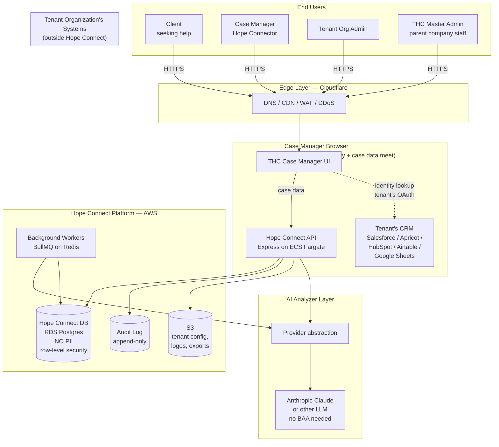

# Hope Connect — Proposal & Architecture Contract

**Prepared by:** Quinn Evans & Ted [last name]
**Prepared for:** Hope Connect parent company / Freebird Foundation leadership
**Date:** June 2026
**Document version:** 1.0 (draft for attorney review)

---

## 1. Executive summary

Hope Connect (THC) is a multi-tenant, AI-assisted intake and triage platform for social-services nonprofits and government partners. It transforms how community organizations receive, assess, and route requests for help by combining a configurable client-facing intake experience with a structured AI analyzer that surfaces severity, urgency, recommended programs, and follow-up actions for case manager review.

The platform is architected around a novel privacy posture we call **Federated Identity Architecture**, in which personally identifying information about clients is held exclusively by each partner organization in their own existing CRM (Salesforce, Apricot, HubSpot, Airtable, Google Sheets, and others). Hope Connect itself holds only de-identified case data: screening responses, AI analysis, severity flags, and case manager workflow state. The two halves are joined only in the case manager's browser at view time, via an opaque case identifier shared between the two sides.

This architecture has three consequences that define the rest of this proposal:

1. **Hope Connect is out of HIPAA scope.** Because Hope Connect's systems never receive, store, or transmit Protected Health Information (PHI), the platform is not subject to HIPAA's Privacy Rule, Security Rule, or Breach Notification Rule. This is a defensible legal position under HIPAA's Safe Harbor de-identification standard at 45 CFR § 164.514(b)(2).
2. **The platform integrates with rather than replaces existing partner systems.** Tenants don't have to migrate their client data to a new system; Hope Connect plugs into where their data already lives. This shortens sales cycles and reduces the migration risk that kills most nonprofit SaaS deals.
3. **Build cost is meaningfully reduced** compared to the equivalent HIPAA-covered system — roughly 25–35% lower year-one cost.

Total proposed engagement: **9–12 months calendar time**, **$103–140k in development labor**, plus **$20–30k in year-one hard costs**. Three pricing structures are offered in §11.

---

## 2. Background and context

### 2.1 Origin

Hope Connect originated as a research-and-demo prototype built between April and May 2026 to test whether an AI-assisted intake workflow could produce reviewable, defensible case summaries for nonprofit case managers. The prototype demonstrated:

- Configurable multi-step intake with a 17-question Likert screener
- A provider-abstracted LLM analyzer producing structured JSON output validated against a schema
- A deterministic 0–100 help-score function
- Rule-based crisis detection that the AI cannot override downward
- A staff dashboard, case detail view, admin panel, and reports
- A golden-set evaluation harness for the analyzer

The prototype satisfied the demo objectives set in Meetings 1 and 2 and was reviewed in Meeting 3 (May 20, 2026). The in-person meeting on June 13, 2026 redirected the engagement from a single-customer prototype to a multi-tenant SaaS platform.

### 2.2 Corporate structure (per 6/13 meeting)

- A **for-profit parent company** (the contracting entity) owns the Hope Connect platform and the physical community space.
- The **Freebird Foundation** (501(c)(3) nonprofit) is funded by the parent and operates as Hope Connect's flagship tenant, branded as "The Hope Connect" service in Charlotte, NC.
- **Quinn Evans and Ted [last name]**, doing business as [LLC name TBD], are the engineering team contracting with the for-profit parent to build the platform.

The IP and contracting relationship between the engineering team and the parent company is the subject of §11–§13 and requires attorney drafting.

### 2.3 Market position

Hope Connect addresses a documented market opportunity:

- Global case management software market: USD $8.26B (2024) → USD $24.09B (2034), 11.3% CAGR (Precedence Research, 2025).
- Direct competitors (Findhelp, Unite Us, Bonterra) have built businesses ranging from privately held to USD $1.5B valuations. None have an AI-native intake-and-triage product.
- Salesforce NPSP, Apricot, and ETO — the incumbent nonprofit case-management tools — have no AI-assisted intake or triage capability.

Hope Connect's competitive differentiation is the combination of (a) AI-native intake, (b) the federated identity architecture that allows integration with existing CRMs rather than displacement, and (c) a price point appropriate for community-scale nonprofits.

### 2.4 Charlotte launch context

The first tenant is the Freebird Foundation in Charlotte, NC. Cuddy Report ranked Charlotte 50/50 in economic mobility. Approximately $9M in Charlotte-area grants and $70M in physical-location funding has been identified as relevant. Priority service categories, in order: affordable housing, economic mobility (jobs and living wages), immigrant support, food access, youth programs, transportation.

Identified Charlotte-area partner organizations (subject to formal partnership): Urban League, Autism Charlotte, Isaiah House, Educated Hoodlums, Exit Ford / Nations Ford, Union County Crisis Ministries.

---

## 3. The system at a glance



The two boxes that never touch each other are the Hope Connect platform on the left and the Tenant's CRM on the right. They share an opaque case identifier; nothing else crosses the boundary. The case manager's browser is the only place in the system where identity data and case data are visible together.

---

## 4. The Federated Identity Architecture (key innovation)

This section establishes both the technical architecture and the legal foundation. It is written for both engineering and legal review.

### 4.1 The architectural principle

Hope Connect ("THC") and each partner organization ("Tenant") maintain separate data stores joined only by a randomly generated, opaque case identifier ("Case ID"). The Tenant's CRM holds client identifying information; the Hope Connect platform holds de-identified case data. Re-identification of any individual record requires access to both data stores held by both organizations. THC has access only to its own.

The Case ID has the following properties, which are material to the legal posture:

- **Randomly generated.** Produced by `crypto.randomBytes(16)` (or equivalent) at intake start. Not derived from client name, date of birth, identifiers, geographic information, or any other attribute of the individual.
- **Opaque.** No information about the individual can be inferred from the Case ID alone.
- **Single-use.** One Case ID per intake; never reassigned, never reused, never derived from a previous record.
- **One-way.** THC does not maintain any mapping from Case ID to client identity. The Tenant's CRM maintains that mapping in its own infrastructure.

### 4.2 The legal posture

Under 45 CFR § 164.514(b)(2) — the HIPAA Safe Harbor de-identification standard — a covered entity may consider health information de-identified when (1) all eighteen listed identifiers are removed and (2) "the covered entity does not have actual knowledge that the information could be used alone or in combination with other information to identify an individual who is a subject of the information."

Hope Connect's data store contains none of the eighteen listed identifiers. The Case ID is permitted under § 164.514(c) as a re-identification code so long as the code is "not derived from or related to information about the individual and is not otherwise capable of being translated so as to identify the individual" and "the covered entity does not use or disclose the code or other means of record identification for any other purpose."

Hope Connect satisfies these conditions because:

1. The Case ID is randomly generated and bears no relation to the individual.
2. Hope Connect's organization does not hold, and has no means of accessing, the lookup table that translates the Case ID to an individual identity.
3. The lookup is performed exclusively in the case manager's browser at view time and is not persisted by Hope Connect.

Because Hope Connect does not "create, receive, maintain, or transmit" PHI as defined at 45 CFR § 160.103, Hope Connect is not a Covered Entity or Business Associate. HIPAA does not apply to the Hope Connect platform. **This is the precise legal position the attorney is asked to confirm.**

### 4.3 Roles and responsibilities under the Federated model

The split of legal and operational responsibilities between THC and the Tenant Organization should be documented in each Tenant's Master Subscription Agreement. The proposed division:

| Responsibility | Hope Connect | Tenant Organization |
|---|---|---|
| Custody of client identifying information | Never | Always |
| Custody of screening / case data | Always | Never (except read access in browser) |
| HIPAA compliance for identifying information | Not applicable | Tenant's responsibility per its own status |
| CCPA / state privacy compliance for case data | Hope Connect's responsibility | Tenant's responsibility for identity data |
| Audit logs of case data access | Hope Connect | n/a |
| Audit logs of identity data access | n/a | Tenant |
| Breach disclosure if THC suffers incident | Hope Connect | n/a |
| Breach disclosure if Tenant's CRM suffers incident | n/a | Tenant |

### 4.4 The four conditions that must hold for the architecture to be defensible

These conditions are operationally enforced; the attorney should confirm they are sufficient.

1. **Hope Connect's API endpoints, request bodies, headers, and URLs do not accept identifying information.** Schema validation rejects any request containing fields matching common identifier patterns.
2. **Hope Connect's logs (application, access, audit, error) do not contain identifying information.** Sentry, Datadog, and CloudWatch are configured with PII scrubbing rules.
3. **Free-text input from clients is sanitized.** A two-layer PII detection pass (regex + LLM-based detection) runs on every free-text submission before storage; matches are either rejected at the form layer with user-facing guidance or stripped with a flag.
4. **Hope Connect internal tooling cannot query Tenant identity stores.** Internal admin tools are screening-only by design and policy; no THC employee or system has credentials to a Tenant's CRM.

### 4.5 Defined terms (for use in contracts)

The following terms should be incorporated by reference into the Master Subscription Agreement and the Privacy Policy:

- **"Case Data"** means the de-identified information collected, generated, or stored by Hope Connect in connection with a client intake, including screening responses, AI analysis outputs, severity flags, recommended programs, follow-up questions, case manager status updates, and audit log entries. Case Data does not include any direct or indirect personal identifiers.
- **"Identifying Information"** means the personally identifiable information of a client, including but not limited to name, contact information, address, government identifiers, and any combination of attributes that could reasonably identify an individual. Identifying Information is held exclusively by Tenant in Tenant's systems.
- **"Case Identifier"** means the opaque, randomly generated string assigned by Hope Connect to each intake. The Case Identifier is not derived from any individual attribute and conveys no information about the individual.
- **"Federated Identity Architecture"** means the system design under which Hope Connect maintains only Case Data and Tenant maintains only Identifying Information, joined exclusively at view time within an authorized user's browser via the Case Identifier.
- **"Tenant Identity Service"** means the API endpoint, hosted by or on behalf of Tenant, through which the Case Manager's browser retrieves Identifying Information for display alongside Case Data.

### 4.6 What this does NOT mean

To be precise, three things the federated architecture does not give us:

- **It does not exempt us from CCPA, VCDPA, CPA, CTDPA, UCPA, or other state privacy laws.** These laws apply to "personal information" broadly, including pseudonymous data with re-identification risk. Hope Connect must maintain a Privacy Policy, support data-subject rights for residents of covered states, and maintain reasonable security controls. None of these create HIPAA-equivalent overhead.
- **It does not exempt Tenants from their own HIPAA obligations.** If a Tenant is itself a Covered Entity (e.g., a healthcare-affiliated nonprofit), Tenant's handling of Identifying Information remains subject to HIPAA. Tenant is responsible for its own HIPAA compliance regarding the data it holds.
- **It does not exempt us from contractual data-handling obligations.** Each Tenant agreement will impose security and privacy standards on how Hope Connect handles Case Data even though it is technically de-identified.

---

## 5. The full system architecture

### 5.1 Frontend

A single React 19 SPA built on Vite 6, deployed via Cloudflare Pages or directly from the ECS-hosted backend.

The application renders four distinct user experiences based on the authenticated user's role:

- **Client intake experience** — multi-step form, configurable per tenant, immediate-crisis short-circuit, multi-language (English + Spanish at launch), progress indicator, reassuring UX patterns.
- **Case manager workspace** — intake queue, case detail view with browser-side identity join, review and approval workflow, status management, staff notes, reanalyze controls.
- **Tenant org admin panel** — manage case managers, configure tenant branding (logo, colors, copy), select questionnaire variant from THC's library, configure identity service connection, review usage and reports.
- **THC master admin panel** — tenant lifecycle management, question library management, cross-tenant anonymized analytics, billing, support tooling.

Per-tenant theming is implemented via CSS variables and a small tenant-config bootstrap call on page load; no per-tenant code or builds.

### 5.2 Backend

A Node.js Express 4 API, packaged as a Docker container, deployed on AWS ECS Fargate with multiple tasks behind an Application Load Balancer. The API is stateless except for connections to:

- **RDS Postgres** — primary data store, multi-tenant via row-level security policies keyed on `org_id`.
- **ElastiCache Redis** — session cache, rate limiting, BullMQ job queue backing.
- **S3** — tenant branding assets, exports, system backups.
- **AWS KMS** — encryption keys for column-level and at-rest encryption.

### 5.3 Background workers

Same Docker image as the API, run as separate ECS tasks. Process the BullMQ queue for:

- Analyzer invocations (initial intake, reanalysis on demand)
- Summary generation
- Aggregate report rollups (scheduled nightly)
- Email/notification dispatch
- Async exports (CSV, JSON)

### 5.4 LLM layer

A provider abstraction in the codebase allows the active LLM to be swapped via environment variable. Recommended v1 provider: **Anthropic Claude Sonnet** (direct API, no BAA required because no PHI is transmitted), with **Claude Haiku** for lower-cost calls like the optional chat helper.

Alternatives the abstraction supports without code changes: AWS Bedrock (any model), Azure OpenAI, GCP Vertex, OpenAI direct, self-hosted vLLM. Provider selection is a tenant-tier decision; v1 launches on Anthropic direct.

### 5.5 Data layer — Hope Connect Postgres schema (logical)

```
organizations              -- tenant orgs
  id, name, slug, tier, created_at, identity_service_url, branding_json

users                      -- case managers, org admins, THC master admins
  id, org_id, email, role, created_at, last_login_at
  (org_id NULL for THC master admins)

intakes                    -- the core unit of work
  id (= Case ID), org_id, status, current_step, created_at, updated_at,
  language, completed_at, urgency_flag, crisis_flag,
  help_score, severity_override, severity_override_reason

screening_responses        -- per-question Likert + per-section comments
  intake_id, section, question_id, answer_value, answer_text

free_text_responses        -- scrubbed of PII
  intake_id, prompt_id, original_length, scrubbed_text, pii_detected_flag

analyses                   -- LLM analyzer output
  intake_id, version, model, summary_staff, summary_client,
  primary_category, secondary_categories, severity_level, severity_score,
  risk_flags, urgency_window, recommended_programs, follow_up_questions,
  ai_comments, keywords, language_detected, model_meta, created_at

case_manager_actions       -- approval, status changes, notes
  id, intake_id, user_id, action_type, action_payload, created_at

programs                   -- per-org program directory
  id, org_id, name, description, eligibility_rules, contact_info

question_templates         -- THC's centrally managed question library
  id, version, sections_json, published_at

org_question_template      -- which template each org uses
  org_id, template_id, customizations_json

audit_log                  -- append-only, every read/write
  id, actor_user_id, actor_org_id, action, resource_type, resource_id,
  before_state, after_state, ip_hash, user_agent_hash, created_at

subscriptions              -- billing/tier
  org_id, tier, seats, monthly_intake_quota, features_enabled, period_start, period_end
```

Notable absences:
- No `clients` table. There are no client records in Hope Connect. The `intakes` table holds the Case ID; the client identity lives in the Tenant's CRM.
- No `contact_info` table. Phone numbers, emails, names, addresses are not stored.

### 5.6 Authentication and authorization

**Clerk** (standard plan, Organizations feature) provides:

- Authentication for clients (Google OAuth optional, anonymous Case IDs for unauthenticated intakes)
- Authentication for case managers and org admins (email + password + optional MFA)
- Authentication for THC master admins (MFA enforced)
- Organization-scoped user-to-org mappings

Authorization (RBAC) is enforced in Hope Connect's middleware layer with four primary roles:

| Role | Scope | Can do |
|---|---|---|
| `client` | Self | Complete an intake, view their own submission |
| `case_manager` | Within org | Read assigned intakes, update status, add notes, request reanalysis |
| `org_admin` | Within org | All case_manager actions + manage case managers, configure org, view org reports |
| `thc_admin` | All orgs | Tenant lifecycle, question library, cross-tenant anonymous analytics, billing |

Row-level security policies in Postgres enforce `org_id` matching on every query, providing defense-in-depth against application-layer bugs.

### 5.7 Tenant CRM integration (Federated Identity bridges)

For each supported Tenant CRM, Hope Connect provides a connector that runs in the case manager's browser. The connector:

1. Obtains tenant-scoped OAuth credentials from the Tenant's admin (entered once during onboarding).
2. Stores those credentials securely (browser session or, for some CRMs, server-side encrypted with KMS).
3. On case detail page load, makes a request to the Tenant's CRM API to retrieve `{ name, phone, email, language_preference, contact_history }` by Case ID.
4. Renders the identity panel alongside the screening data.

For CRMs that block browser-direct calls (Salesforce, Bonterra), Hope Connect provides a deployable **Bridge Template** — a small Cloudflare Worker or Node service the Tenant deploys to their own infrastructure. The Bridge accepts authenticated requests from the case manager's browser and forwards them to the CRM, returning identity data. Hope Connect's servers do not host or proxy these requests.

### 5.8 Reporting and analytics

Two distinct reporting surfaces:

**Per-tenant reporting** (existing, polished): KPI dashboard, case-volume trends, category and severity distributions, help-score distributions, top tags/keywords, CSV export of Case Data.

**Aggregate cross-tenant reporting** (new, for state/funder data sales): Anonymized rollups across all tenants in a region. Minimum cell-size threshold of 10 enforced — no bucket smaller than 10 records is shown. Output formats: CSV, JSON, scheduled email reports. This is the artifact that satisfies the "we can sell the data" use case from the meeting, scoped to aggregates only.

### 5.9 Crisis escalation pipeline

When the rule-based urgency detector or the LLM analyzer flags a Crisis-level case, the system:

1. Marks the intake with a `crisis_flag = true` and `severity = 'crisis'`.
2. Surfaces an immediate banner in the org's case manager queue.
3. Sends an email and (optionally) SMS to the Tenant's designated crisis-response contact.
4. Logs the escalation event.
5. Displays an immediate set of hard-coded approved resources to the client at intake-completion time (suicide hotline, abuse hotline, 911 guidance, local equivalents per the tenant's configuration).

The platform does not perform outreach to clients directly — all outreach is via the Tenant's case managers using the Tenant's own communication channels.

### 5.10 Hosting and infrastructure

| Layer | Service | Notes |
|---|---|---|
| DNS / Edge | Cloudflare | DNS, CDN, WAF, DDoS protection, bot management |
| Load balancer | AWS Application Load Balancer | TLS termination, ALB WAF rules |
| Compute | AWS ECS Fargate, 2+ tasks for HA | Dockerized Express API + Workers |
| Database | AWS RDS Postgres, multi-AZ | Encryption at rest via KMS, automated backups |
| Cache / queue | AWS ElastiCache Redis | Sessions, rate limiting, BullMQ |
| Object storage | AWS S3 | Branding assets, exports; encrypted via KMS |
| Secrets | AWS Secrets Manager | API keys, DB credentials |
| Observability | Sentry (errors), Better Stack or Datadog (logs/metrics) | PII-scrubbed |
| CI/CD | GitHub Actions | Deploy to ECS via blue/green |
| IaC | Terraform | Infrastructure-as-code for full reproducibility |

Region: AWS us-east-1 primary; us-west-2 reserved for future DR.

---

## 6. Component-by-component breakdown

### 6.1 Client intake experience

A multi-step form designed for accessibility, low literacy, and high emotional sensitivity. Tenant-configurable in branding only; the question set is the same canonical THC questionnaire across all tenants (with optional per-tenant question additions in v1.5+).

Components:

- **Welcome screen** with tenant branding and an immediate-crisis question (single yes/no: "Is this an emergency requiring help today?").
- **Contact preference selection** — the only "PII-adjacent" question, capturing how the user prefers to be reached (channel only, not the actual contact details).
- **Screening questionnaire** — three sections (mental health, physical health, quality of life), Likert 1–5 per question, optional comments per section, general comments at the end.
- **Free-text situation description** — PII-scrubbed at submission.
- **Review and submit** — client sees what's collected, can edit, submits.
- **Post-submission identity capture** — at the end of intake, the form prompts the client for contact info. This submission goes **directly to the Tenant's Identity Service**, not to Hope Connect.
- **Confirmation screen** — "A Hope Connector will be in touch within 24 hours. If you're in immediate crisis, please call [tenant-configured crisis line]."

Languages supported at launch: English, Spanish.
Accessibility: WCAG 2.1 AA, screen-reader tested, keyboard navigable, text-to-speech option.

### 6.2 Case manager workspace

Components:

- **Intake queue** — sortable, filterable list of cases. Default sort: severity desc, then submitted_at asc. Filters: status, severity, category, date range. The queue shows Case IDs + identity data (name, phone) fetched browser-side from the Tenant's CRM.
- **Case detail view** — the single screen where identity and case data meet. Two panels side by side: identity (from Tenant CRM) and case data (from Hope Connect). Tabs within case data: AI Summary, Screening Responses, Analyzer Output (risk flags, recommended programs, follow-up questions, AI comments), History.
- **Approval workflow** — case manager reviews AI recommendations, can approve as-is, modify, or reject. Approved recommendations move the intake to status `approved`, triggering the next workflow step.
- **Status management** — `new → in_review → approved → contacted → in_service → closed`. Each transition is logged with timestamp, user, and optional notes.
- **Staff notes** — free-text, audit-logged, visible to all case managers in the same org. Notes go through the same PII-detection layer (case managers are warned if they enter what looks like identifying info; the warning helps maintain the architectural integrity, but case managers can override since their notes don't go beyond the tenant's view).

Actually, wait — let me correct this last point. **Staff notes are stored in Hope Connect's database**, so if case managers write client names in them, we have PHI back in our system. Two options for handling this:

- Apply the same PII-scrubbing rules to staff notes (case managers warned at write, soft-blocked if PII detected).
- Treat staff notes as part of Tenant CRM rather than Hope Connect — i.e., the note is written into the Tenant's CRM via the bridge, not stored in Hope Connect.

The second approach is cleaner architecturally; the first is simpler to build. Recommended for v1: scrub staff notes and warn aggressively. Move to Tenant CRM in v1.5 if PII leakage proves to be a recurring problem.

- **Reanalyze button** — triggers a fresh analyzer run, useful after status changes or new information.

### 6.3 Tenant org admin panel

Components:

- **Org settings** — name, branding (logo, primary color, secondary color, copy strings, language defaults), timezone, locale.
- **User management** — invite case managers, assign roles, deactivate, view login history.
- **Identity service configuration** — connect Tenant CRM, configure field mapping, test connection. Per §5.7.
- **Question template selection** — pick from THC's central library, with optional per-tenant additions in v1.5+.
- **Program directory** — manage the list of programs that show up in the case manager's recommendation view. Per-org.
- **Crisis response settings** — phone number/email of the crisis contact, hard-coded resources to surface at intake completion.
- **Subscription view** — tier, usage, billing history (managed by Stripe in Phase 2).

### 6.4 THC master admin panel

Components:

- **Tenant lifecycle** — onboard new tenant, set tier, activate, suspend, deactivate.
- **Question library management** — version the canonical questionnaire, publish updates, deprecate old versions.
- **Cross-tenant analytics** — anonymized aggregate data across all tenants for product decisions. Subject to the same minimum-cell-size threshold as customer-facing aggregate reports.
- **Billing oversight** — view subscription status across tenants, manual override controls.
- **Support tooling** — read-only "view as tenant" mode (case data only — never identity, which THC cannot access in any case).

### 6.5 The analyzer pipeline

Already built in the prototype and described in detail in `PROJECT_STATE.md`. For this proposal:

- Inputs: Q/A pairs assembled from the structured screening responses, plus rule signals from the regex-based urgency detector.
- Process: prompt template substitution → LLM provider call → JSON parse → Zod schema validation (retry once on failure) → severity floor application → help-score computation → persistence.
- Output: AnalysisResult conforming to the schema in `server/llm/schema.js`. Stamped with model metadata.
- Quality assurance: golden-set eval harness in `server/llm/eval/` with 10 fixture cases. Required passing rate before each release: 100%.
- Performance: target p95 analyzer latency 8 seconds, p99 15 seconds. Backed by Claude Sonnet via the Anthropic API.

### 6.6 Reporting

Already described in §5.8. The work in this phase is rounding out the existing prototype with:

- Per-tenant scope enforcement on all queries.
- Date-range and category filters refined.
- Help-score-over-time chart.
- Top tags / top keywords views.
- CSV export with column selection.
- Aggregate cross-tenant view in THC master admin (k-anonymity threshold 10).
- Scheduled report delivery via email (weekly summary digest).

### 6.7 Notifications

Components:

- **Transactional email** via Postmark or SendGrid: case manager notifications when intakes arrive, weekly summary digests, password resets, account invitations.
- **Crisis SMS** via Twilio: alerts to designated crisis-response contact when crisis_flag fires. Optional per tenant.
- **In-app notifications** — bell icon, badge count, list view.

No client-facing communication is sent from Hope Connect. All client outreach is the Tenant's responsibility, via the Tenant's own channels.

### 6.8 Audit logging

The audit log captures every meaningful action: every intake view, every status change, every settings edit, every login, every export, every API key usage. Records are append-only at the database level (enforced via Postgres trigger preventing UPDATE/DELETE on the audit_log table) and replicated nightly to S3 with object lock for long-term retention.

Retention: 7 years (consistent with HIPAA expectations even though HIPAA doesn't apply, because state laws and tenant contracts may demand similar).

### 6.9 PII scrubbing layer

A two-pass system applied to every free-text input before persistence:

1. **Regex pass** — patterns for US phone numbers, email addresses, US Social Security numbers, US ZIP codes (5-digit and ZIP+4), and common name patterns (Title + Capitalized Word + Capitalized Word).
2. **LLM pass** — Claude Haiku call asking "Does this text contain a person's name, address, phone, or email? Return JSON: { detected: bool, items: [...] }." Cheap and high-accuracy.

If PII is detected: at the form layer, the user sees an inline warning and is asked to re-enter. At the API layer, if PII is still detected after submission (defensive), the text is stored with the PII stripped and a `pii_detected_flag = true` for the org admin to review.

---

## 7. Phased delivery plan

Two developers at part-time pace (combined ~50 hours/week). All hours and costs in USD. All hour estimates are ranges to reflect uncertainty; midpoint values are used in the totals.

### Phase 0 — Prototype ✅ (delivered)

The existing prototype documented in `PROJECT_STATE.md`. Approximately 100–160 hours invested April–May 2026.

### Phase 1 — Production foundation (7–9 weeks)

The invisible-to-the-user work that makes everything else possible.

**Deliverables:**
- AWS account setup, Terraform infra-as-code, VPC, RDS, ECS Fargate, ElastiCache, S3, KMS, Secrets Manager
- Postgres schema migration system (Drizzle or Knex), full schema implementation
- Multi-tenant data model with `org_id` everywhere + Postgres RLS policies
- Migration of existing SQLite store to Postgres
- Clerk Organizations integration, auth middleware, RBAC scaffolding
- Containerized Express API deployed to ECS, blue/green deploys via GitHub Actions
- Cloudflare DNS / WAF / CDN in front
- Sentry + Better Stack observability with PII scrubbing
- Audit log table + middleware
- BullMQ + Redis for background jobs; port analyzer to async
- Health checks, readiness probes, structured logging

**Hours:** 280–360 | **Cost:** $21–27k

### Phase 2 — Multi-tenant SaaS shell (8–10 weeks)

The architecture that makes the SaaS pitch real.

**Deliverables:**
- THC master admin: tenant onboarding, lifecycle management, tier assignment
- Org admin panel: branding, case manager management, identity service configuration UI
- Question library system: versioned templates, central management, per-org template selection
- Per-tenant theming via CSS variables and runtime config
- Tenant signup flow (manual for v1; self-serve in v2)
- Stripe billing scaffolding (subscriptions table, webhook handling, basic invoice generation)
- Subscription / feature-flag enforcement on key endpoints
- Federated identity framework: connector interface, OAuth credential storage, browser-side hooks
- Google Sheets connector (Pattern A)
- Airtable connector (Pattern A)
- Identity service spec (REST API documented for tenants integrating other CRMs)

**Hours:** 320–440 | **Cost:** $24–33k

### Phase 3 — Full workflow (6–8 weeks)

Closing the loop from intake to case-manager review to client outreach.

**Deliverables:**
- Case manager review → approve → mark contacted workflow
- Reach-out queue UI
- Crisis escalation pipeline + email/SMS notifications via Postmark/Twilio
- Staff notes with PII scrubbing
- Reanalyze button + versioned analysis history
- Hard-coded immediate-resource response per tenant configuration
- Status workflow + transitions logged in audit log
- Aggregate cross-tenant reporting in THC master admin
- Per-tenant scheduled report digests via email

**Hours:** 240–320 | **Cost:** $18–24k

### Phase 4 — Accessibility, Spanish, mobile polish (4–5 weeks)

**Deliverables:**
- i18n framework integration (i18next or equivalent)
- Spanish translation pass — professional translator engaged
- WCAG 2.1 AA audit and remediation
- Text-to-speech and font-scaling controls
- Mobile responsive QA across iOS Safari, Android Chrome, common tablets
- Browser compatibility matrix tested (Chrome, Safari, Firefox, Edge — current and one prior major version)

**Hours:** 160–200 | **Cost:** $12–15k

### Phase 5 — Pre-launch hardening (3–4 weeks)

**Deliverables:**
- Independent security review (engagement with third-party reviewer; ~$3–5k additional cost)
- Load testing to 1000 concurrent users / 100 intakes per hour peak
- Documentation for tenant onboarding, case manager training, org admin reference
- Tenant onboarding script (the consultant enablement)
- Charlotte launch with Freebird Foundation as Tenant #1
- Post-launch monitoring runbook + on-call rotation setup

**Hours:** 120–160 | **Cost:** $9–12k

### Cross-phase work

| Stream | Hours | Cost |
|---|---|---|
| Testing & QA (unit, integration, E2E) | 200–280 | $15–21k |
| Eval suite expansion (analyzer fixtures) | 40–60 | $3–4.5k |
| Project management & client communication | 80–120 | $6–9k |

### Totals

| Category | Hours | Cost |
|---|---|---|
| Phase 1 — Foundation | 280–360 | $21–27k |
| Phase 2 — Multi-tenant shell | 320–440 | $24–33k |
| Phase 3 — Workflow | 240–320 | $18–24k |
| Phase 4 — A11y + Spanish | 160–200 | $12–15k |
| Phase 5 — Pre-launch | 120–160 | $9–12k |
| Testing + Eval + PM | 320–460 | $24–34.5k |
| **Total dev labor** | **1,440–1,940** | **$108–146k** |

**Calendar time: 9–12 months from contract signing to Charlotte launch** at part-time developer pace.

### Hard costs (year 1, not included in labor above)

| Item | Year-1 cost |
|---|---|
| AWS infrastructure | $3–7k |
| Cloudflare | $0–1.2k |
| Clerk paid plan | $1.2–2.4k |
| Anthropic Claude API (~50k intakes total) | $1.5–3k |
| Postmark + Twilio + Sentry + observability | $1.5–3k |
| Domain, email, miscellaneous | $300–500 |
| Independent security review (one-time) | $3–5k |
| Legal: contract drafting, IP, ToS, Privacy Policy | $4–8k |
| Professional Spanish translation | $2–4k |
| **Total year-1 hard costs** | **$17–34k** |

Notable absences vs. a HIPAA-covered build: no HIPAA security audit (~$5–15k saved), no Vanta/Accountable subscription required (~$6–18k/yr saved), no BAA negotiation legal time (~$3–8k saved). The Federated Identity Architecture saves approximately $14–41k in year-one hard costs.

---

## 8. Connector roadmap

Tenant CRM connectors built across the phases above and beyond:

### v1 connectors (in Phase 2)

- **Google Sheets** — browser-direct via Google OAuth. ~40–60 hours.
- **Airtable** — browser-direct via Personal Access Token. ~30–50 hours.

For tenants without an existing CRM, onboarding helps them stand up an Airtable or Google Sheet during the implementation engagement.

### v1.5 connectors (post-launch)

- **HubSpot CRM** — browser-direct via HubSpot OAuth. Free tier sufficient for small nonprofits. ~60–100 hours.
- **Microsoft Excel via OneDrive** — Microsoft Graph API. ~80–120 hours.

### v2 connectors (with Bridge Template)

- **Salesforce NPSP** — Bridge required (tenant-hosted Cloudflare Worker). ~150–250 hours including Bridge template + Salesforce-specific connector.
- **Bonterra Apricot** — Bridge required. ~120–200 hours.
- **ETO** (Social Solutions) — Bridge required. ~120–200 hours.

### Custom connectors

For tenants with bespoke databases or non-standard CRMs, custom connector engagements priced per-tenant. Estimated 80–150 hours per custom connector.

---

## 9. Acceptance criteria and quality gates

Each phase has a defined "done" before payment milestone releases. Acceptance is jointly signed by the parent company's designee and the engineering team.

### Phase 1 acceptance

- Production infra deployed and reachable
- All migrations apply cleanly to a fresh database
- 100% of analyzer eval fixtures pass against deployed environment
- Auth login + RBAC works for all four roles
- A test intake can be submitted, analyzed, and viewed
- Audit log records all defined events
- Observability dashboards show real metrics

### Phase 2 acceptance

- THC master admin can create a new tenant, configure them, and activate
- Org admin can configure branding and connect Google Sheets or Airtable
- A case manager from Tenant A cannot see any intake from Tenant B (verified by automated test)
- The browser-side identity join displays correctly with both supported connectors
- Stripe subscription state correctly limits features when configured

### Phase 3 acceptance

- A case manager can review, approve, and mark an intake contacted
- A crisis-flagged intake triggers the configured notification within 60 seconds
- Reanalyze produces a new analysis with proper version tracking
- The aggregate cross-tenant report respects minimum-cell-size threshold

### Phase 4 acceptance

- The full UI is available in Spanish, professionally translated
- WCAG 2.1 AA audit passes with zero blockers
- Mobile responsive layout works on iOS Safari and Android Chrome at common viewport sizes

### Phase 5 acceptance

- Load test sustains target throughput without errors
- Independent security review delivered with no critical or high findings open
- Charlotte launch with Freebird Foundation as the production Tenant #1
- All documentation delivered

---

## 10. Maintenance and support

After Phase 5 launch, ongoing services covered by the maintenance retainer:

- Security patching of dependencies (npm + system packages)
- Bug fixes and critical issue response (4-hour business-day acknowledgment, 24-hour P1 resolution target)
- Minor feature additions (≤ 8 hours per feature)
- Compliance maintenance — annual review of privacy policy, terms of service, vendor list
- Tenant support escalation (parent company handles tier-1 support; engineering escalates)
- Monthly status report + quarterly business review

Larger feature work — new connectors, new modules, significant UX changes — is contracted separately at the hourly rate established in §11.

**Recommended retainer: $1,500–2,500 per month**, depending on volume of tenants and rate of feature requests. Includes up to 20 hours of work per month; overages billed at standard rate.

Hard costs (AWS, Clerk, Anthropic, etc.) are billed to the parent company directly and not included in the retainer.

---

## 11. Investment and pricing

Three pricing options are offered for the parent company's selection. Numbers reflect dev labor only; hard costs in §7 are additional and paid directly by the parent.

### Option A — Cash buyout

The simplest structure. Full IP transfer to the parent company at final payment.

- **Total cash:** $115,000 (midpoint of $108–146k range), paid against the milestone schedule in §12
- **Equity to engineering team:** none
- **Ongoing maintenance retainer:** $2,000/month starting at Phase 5 launch
- **IP transfer:** Full transfer to the parent company at final milestone payment, except as carved out in §13
- **Right shape if:** the parent wants a clean transaction and the engineering team prefers cash certainty over upside

### Option B — Hybrid (cash + per-tenant license)

Smaller cash upfront, with a per-tenant license fee paid back to the engineering team for each Tenant onboarded over the following 3 years.

- **Cash:** $75,000 paid against milestones
- **Per-tenant license fee:** $200/month per active Tenant (excluding Freebird Foundation), paid to engineering team for 36 months from launch, capped at $150k total
- **Maintenance retainer:** $1,800/month
- **IP:** Full ownership to the parent, with engineering team retaining license to reuse Federated Identity Architecture patterns (not Hope Connect-specific code) in unrelated future projects
- **Right shape if:** the parent expects to onboard multiple tenants quickly and wants to align engineering incentives with platform growth

### Option C — Equity participation

Engineering team takes founder-equivalent equity in the for-profit parent in exchange for reduced cash.

- **Cash:** $40,000 paid against milestones (covers approximate at-cost labor)
- **Equity:** 15–20% in the for-profit parent (vesting over 4 years, 1-year cliff)
- **Maintenance retainer:** $1,500/month
- **IP:** Full ownership to the parent
- **Right shape if:** the engineering team has high conviction in the parent's outcomes and wants founder-level upside

### Engineering team recommendation

We recommend **Option B (Hybrid)** as the structure to propose. It is the only structure that aligns the engineering team's incentives with the parent's long-term success (more tenants = more revenue for both sides) while not demanding founder-level commitment from either party. The cap on per-tenant fees ($150k) caps the parent's exposure if the platform scales much faster than expected; the floor ($75k cash) ensures the engineering team is paid for the work even if growth is slow.

This is presented for the parent's selection. We will accept any of the three options.

---

## 12. Payment milestone schedule

Cash portion of any option is released on the following schedule:

| Milestone | Trigger | % of cash |
|---|---|---|
| M1 | Contract execution + Phase 1 kickoff | 15% |
| M2 | Phase 1 acceptance | 20% |
| M3 | Phase 2 acceptance | 25% |
| M4 | Phase 3 acceptance | 20% |
| M5 | Phase 4 acceptance | 10% |
| M6 | Phase 5 acceptance + Charlotte launch | 10% |

The prototype work (Phase 0, completed) is credited at the engagement value already discussed (range: $8,000–$15,000) — included as a credit against M1 at the parent's choice, or applied as additional equity in Option C.

---

## 13. Intellectual property

Three layers of IP exist in this engagement and are treated differently:

1. **The Hope Connect platform (frontend, backend, schema, business logic).** Owned by the for-profit parent company outright upon final milestone payment under Options A and B. Owned by the parent from day one under Option C (the equity model).
2. **The analyzer pipeline and eval harness infrastructure (provider abstraction, schema validation, severity floor pattern, deterministic scoring rubric architecture).** Under Options A and C, owned by the parent. Under Option B, co-owned: the parent has perpetual unrestricted use within Hope Connect and any successor products; the engineering team retains the right to reuse the *patterns and architecture* (not Hope Connect's specific code or prompts) in unrelated future projects.
3. **The Federated Identity Architecture pattern and Bridge Template framework.** Public/non-proprietary architectural pattern; both parties retain the right to use, document, and publish about it.

Hope Connect-specific assets — the question library, the analyzer prompts, the Charlotte program directory, the help-score rubric, the brand and trademarks — are owned by the parent under all options.

The engineering team retains the right to reference the engagement in portfolios and case studies, subject to confidentiality of any non-public business information.

---

## 14. Risks and mitigations

| Risk | Likelihood | Impact | Mitigation |
|---|---|---|---|
| A tenant turns out to be a HIPAA Covered Entity, requiring full HIPAA compliance | Medium | High | Detect at onboarding. Tier those tenants separately; offer "Hope Connect HIPAA" as a future product tier requiring an additional architectural retrofit (~$25–35k incremental). |
| Free-text PII scrubbing fails to catch identifiers, putting PHI in Hope Connect | Medium | High | Two-layer scrubbing (regex + LLM). UI warnings. Quarterly audit of free-text fields. |
| Tenant org's CRM doesn't support browser-direct connection and they refuse to deploy the Bridge | Low (in v1.5+) | Medium | Onboarding script qualifies tenants on integration capability. Tenants without integration capacity directed to Airtable/Sheets path. |
| LLM provider deprecates Claude Sonnet version mid-build | Low | Medium | Provider abstraction allows model switching with eval-suite revalidation. Pin model version in code. |
| Charlotte launch volume exceeds projections, infra costs spike | Low | Low | Per-tenant subscription enforces intake quotas. Quotas reviewable and increasable. |
| Engineering team availability constrained (other obligations) | High (part-time) | High | Conservative calendar estimate (9–12 months). Buffer in phase plans. PM communication required if slip emerges. |
| Tenant data sale to state runs into CCPA-style scrutiny | Low | Medium | Aggregate-only reporting with minimum-cell-size enforced. Privacy Policy explicitly documents aggregate reporting practices. |

---

## 15. Open items for nonprofit / parent company review

The following items require parent company decisions before contract execution. They do not change the architecture but they affect contract terms.

1. **Selection of pricing option** (A, B, or C from §11). Engineering team's recommendation is B.
2. **Selection of payment milestone schedule treatment of the Phase 0 credit** (apply against M1, or treated as equity).
3. **Identification of the parent company's legal entity** (assumed to be in formation; legal name needed for contract drafting).
4. **Identification of the parent company's attorney of record** for HIPAA confirmation and contract drafting.
5. **Selection of the security review firm** for Phase 5 (engineering team can recommend candidates).
6. **Confirmation of go/no-go on selling to HIPAA Covered Entities in years 1–2** — affects whether to allocate any architecture budget for an eventual "Hope Connect HIPAA" tier or proceed without that consideration.
7. **Identification of the Spanish translator / translation agency** for Phase 4.
8. **Confirmation of Tenant Identity Service approach** for Freebird Foundation specifically — do they have an existing CRM, or will they need an Airtable/Sheets setup as part of onboarding?
9. **Trademark and brand:** confirmation that "Hope Connect," "The Hope Connect," and any associated marks are clear of conflicting registrations (recommended: trademark search before launch).

---

## 16. Glossary and defined terms

For consistent use across this document, the eventual Master Subscription Agreement, the Privacy Policy, and any communications with regulators or partners.

**Aggregate Report** — A summary report containing only counts, sums, distributions, or rollups of Case Data, with a minimum cell-size threshold of 10 records enforced to prevent re-identification.

**Application** — The Hope Connect software platform.

**Audit Log** — The append-only record of access and modification events maintained by Hope Connect, retained for seven (7) years.

**Bridge Template** — A small, deployable software package provided by Hope Connect that a Tenant hosts in its own infrastructure to expose a Tenant Identity Service endpoint when the Tenant's CRM does not support browser-direct integration.

**Business Associate** — Has the meaning set forth at 45 CFR § 160.103.

**Business Associate Agreement (BAA)** — A written contract between a Covered Entity and a Business Associate as required by HIPAA.

**Case Data** — As defined in §4.5.

**Case ID / Case Identifier** — As defined in §4.5.

**Case Manager** — An employee, contractor, or volunteer of a Tenant Organization authorized to review and act on Hope Connect intakes for that Tenant.

**Covered Entity** — Has the meaning set forth at 45 CFR § 160.103: a health plan, health care clearinghouse, or health care provider that transmits health information in electronic form in connection with a covered transaction.

**De-identified Information** — Health information that does not identify an individual and with respect to which there is no reasonable basis to believe that the information can be used to identify an individual, in accordance with 45 CFR § 164.514(b).

**Federated Identity Architecture** — As defined in §4.5.

**Hope Connect / THC** — The for-profit parent company and the software platform it operates.

**Identifying Information** — As defined in §4.5.

**Master Subscription Agreement (MSA)** — The contract between Hope Connect and a Tenant Organization governing use of the Application.

**Personally Identifiable Information (PII)** — Information that, alone or in combination with other available information, can reasonably identify a specific individual.

**Protected Health Information (PHI)** — Has the meaning set forth at 45 CFR § 160.103: individually identifiable health information held or transmitted by a Covered Entity or its Business Associate.

**Pseudonymous Data** — Information from which direct identifiers have been removed and replaced with one or more artificial identifiers (e.g., a Case ID), but which could theoretically be re-identified by combining with separately held identifying information.

**Safe Harbor De-identification** — The de-identification method described at 45 CFR § 164.514(b)(2).

**Tenant / Tenant Organization** — A nonprofit, government agency, or community-based organization that licenses the Application to operate its own intake and triage workflow.

**Tenant Identity Service** — As defined in §4.5.

---

## 17. Suggested attorney review checklist

For the parent company's attorney reviewing this proposal. These are the legal-substantive questions whose answers determine whether the architecture as described stands up.

1. Does the Federated Identity Architecture, as described in §4, satisfy the conditions of HIPAA Safe Harbor de-identification under 45 CFR § 164.514(b)(2) such that Hope Connect is not subject to HIPAA as a Business Associate?
2. Does the Case Identifier described in §4.1 satisfy the requirements of 45 CFR § 164.514(c) regarding re-identification codes?
3. Are the operational conditions in §4.4 sufficient to maintain the de-identified status in practice, or are additional safeguards required?
4. Does the proposed Master Subscription Agreement language (to be drafted, using the defined terms in §16) appropriately allocate responsibilities between Hope Connect and Tenants?
5. Does the platform's processing of Case Data trigger any applicable state privacy laws (CCPA, VCDPA, CPA, CTDPA, UCPA, others), and what obligations follow?
6. Is the aggregate cross-tenant reporting described in §5.8 / §6.6, with minimum-cell-size thresholds, defensible against re-identification challenges under federal and state law?
7. What additional contractual language is required to protect Hope Connect from liability arising from a Tenant's misuse or mishandling of Identifying Information in the Tenant's own systems?
8. Do the IP allocations in §13 reflect the parent's intended ownership posture?
9. Are the pricing options in §11 consistent with the parent's corporate structure and tax posture?
10. Does the proposed legal framework adequately protect against a regulator characterizing Hope Connect as a Business Associate by virtue of its functional role, despite the technical de-identification?

---

## 18. Sign-off block

This proposal is valid for thirty (30) days from the date above.

**For the parent company:**

________________________________
Name, Title
Date

**For the engineering team:**

________________________________
Quinn Evans
Date

________________________________
Ted [last name]
Date

---

_End of proposal. Companion documents: `PROJECT_STATE.md` (current prototype documentation), `ARCHITECTURE_DECISIONS.md` (decision-tree origin), `STRATEGY_AND_ROADMAP.md` (working strategy doc), and `TEAM_PROPOSAL_AND_RESEARCH.md` (market and business research)._
