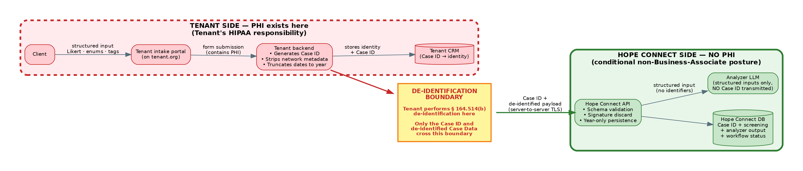
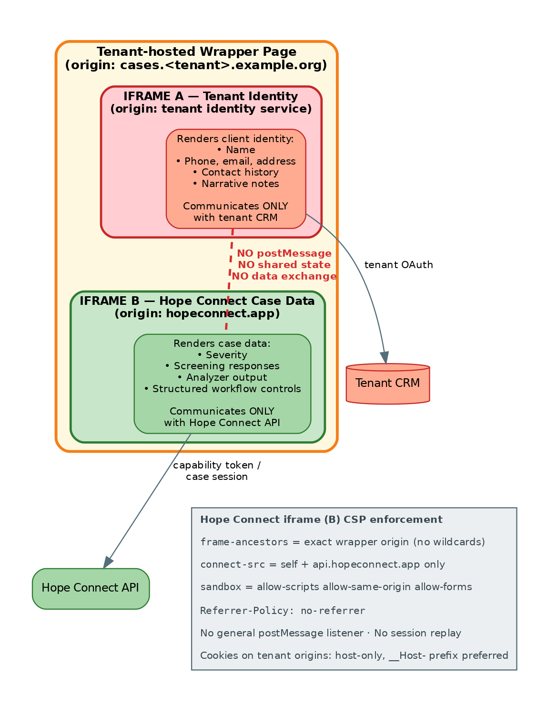
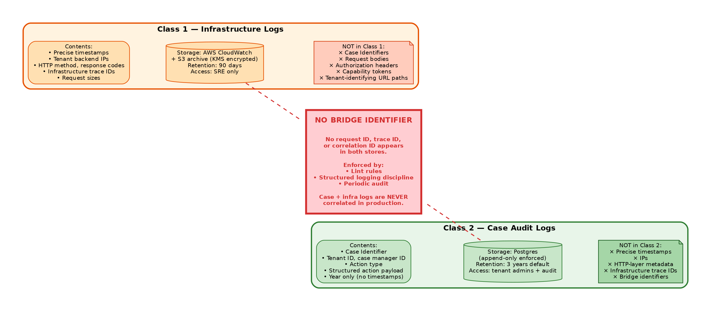
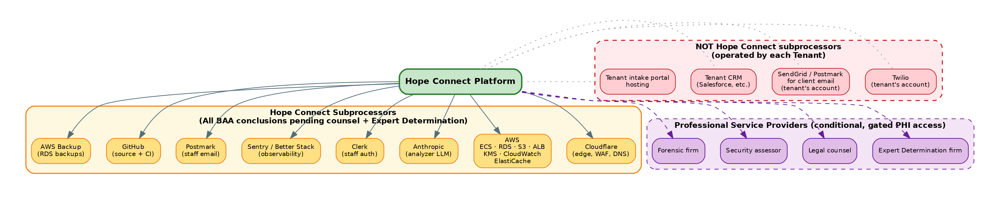

# Hope Connect — Architecture & Compliance Review

**Prepared for:** Counsel retained by the Freebird Foundation (the "Client")
**Prepared by:** Quinn Evans and Ted Roper, engineering team for Hope Connect
**Date:** June 2026
**Document version:** 1.0

**Accompanying documents:**

- *Hope Connect — Engineering Proposal* (the business case and delivery plan)
- *Hope Connect — Statement of Work* (the contractual instrument)
- `LEGAL_ARCHITECTURE_V4.md` (the underlying engineering architecture specification, attached for technical reference)

---

## Cover Memo

To counsel:

This document is the architectural specification for Hope Connect, a multi-tenant SaaS for nonprofit case management to be operated by the Freebird Foundation (the "Client"). The engineering team has structured the platform around a conditional non-Business-Associate posture that we believe is defensible but that requires your formal evaluation.

The architectural posture rests on a specific design choice we call the **Federated Identity Architecture**: client identifying information is held exclusively by each Tenant Organization in their own existing CRM, never by Hope Connect. Hope Connect's data plane holds only de-identified case data — structured screening responses, AI analyzer output, severity flags, workflow status — joined to client identity only by an opaque Case Identifier that the Tenant generates under 45 CFR § 164.514(c) and whose mapping the Tenant retains exclusively. We believe this architecture supports the position that Hope Connect does not create, receive, maintain, or transmit Protected Health Information as defined at 45 CFR § 160.103, and is therefore not a Business Associate of any Tenant, regardless of whether the Tenant is itself a Covered Entity.

We are asking you to evaluate this position formally. Specifically:

- Whether the architecture as specified supports the claim that Hope Connect does not handle PHI
- Whether the operational uses of the Case Identifier satisfy 45 CFR § 164.514(c)
- Which subprocessor relationships require Business Associate Agreements under current HHS guidance
- Whether the FTC Health Breach Notification Rule applies to the platform as designed
- What state privacy law obligations apply (CCPA, VCDPA, CPA, CTDPA, UCPA, others as you identify)
- What Master Subscription Agreement language is required to support the architectural posture
- What incident response process structure is required to handle the limited scenarios where PHI exposure may be necessary during forensic investigation

The architecture has been refined through multiple rounds of adversarial review by an independent reviewer. Each round identified specific weaknesses and required substantive revisions. The version presented here is the fourth-round architecture, structured to address the specific issues those reviews surfaced. We are not asking you to validate a draft we have not stress-tested; we are asking you to evaluate one that has already been put through significant scrutiny by a non-attorney reviewer and revised in response.

Timeline: we are targeting production launch with Freebird Foundation as the first Tenant approximately fourteen months from contract signing. The Expert Determination engagement under 45 CFR § 164.514(b)(1) runs in parallel with this legal review. We would appreciate your engagement letter and initial review feedback within four weeks of receipt of this document.

The attached `LEGAL_ARCHITECTURE_V4.md` is the engineering specification underlying this document. This Review is a restructured, attorney-facing presentation of that material plus the new Master Subscription Agreement framework clauses in §7 and the review checklist in §10. Where this Review and `LEGAL_ARCHITECTURE_V4.md` differ in detail, `LEGAL_ARCHITECTURE_V4.md` is authoritative on the engineering specification; this Review is authoritative on the legal framing.

---

## 1. Executive Summary for Counsel

Hope Connect is designed to minimize PHI exposure and to receive only information that has been de-identified by the Tenant before transmission. The platform's non-Business-Associate position is **conditional** on:

1. The Tenant performing de-identification before transmission to Hope Connect
2. Hope Connect receiving no PHI through any service, support, or operational channel
3. Hope Connect's data plane operating in accordance with the architectural commitments documented in this Review
4. Completion of a formal Expert Determination by a qualified statistician under 45 CFR § 164.514(b)(1) before production data flows
5. Your confirmation of the Business Associate analysis and any subprocessor BAA requirements

The architectural approach is the Federated Identity Architecture described in detail in §4. Hope Connect's data plane is structured to receive only de-identified Case Data; client identifying information is held exclusively by each Tenant in the Tenant's own CRM systems; the two are joined only visually in the case manager's browser at view time.

The Expert Determination engagement is separate from this legal review and runs in parallel. The expert determines whether the actual data flows pose no more than a "very small" re-identification risk under § 164.514(b)(1). You determine whether Hope Connect's status under HIPAA, the FTC Act, and applicable state privacy laws is as the engineering team has framed it. These are distinct legal determinations made by different qualified parties.

We are asking you to confirm, refine, or replace the architectural and contractual posture documented here. Where your conclusions differ from our framing, your conclusions supersede.

---

## 2. The Legal Position

### 2.1 Conditional non-Business-Associate posture

Hope Connect is designed to minimize PHI exposure and to receive only information de-identified by the Tenant. Covered-entity Tenants must document de-identification through Safe Harbor (45 CFR § 164.514(b)(2)), including § 164.514(c), or through Expert Determination (45 CFR § 164.514(b)(1)) before transmitting records to Hope Connect.

Hope Connect's non-Business-Associate position is **conditional** on:

1. The Tenant performing de-identification before transmission.
2. Hope Connect receiving no PHI through any service, support, or operational channel.
3. Hope Connect's data plane operating exactly as specified in this Review.
4. A completed Expert Determination by a qualified expert evaluating the actual data flows, Tenant context, operational telemetry, capability tokens, and controls under § 164.514(b)(1).
5. Counsel review confirming the architectural conclusions and any subprocessor BAA requirements.
6. Ongoing compliance with the operational commitments in §9.

If a Tenant transmits PHI in violation of its Master Subscription Agreement obligations, Hope Connect **may become or be treated as a Business Associate** depending on the resulting data flow, irrespective of contractual intent. Hope Connect's posture is therefore not absolute and must be re-evaluated whenever the architecture, support channels, integrations, or subprocessor relationships change.

The operational uses Hope Connect makes of the Tenant-generated Case Identifier (per §4.2) are stated as the intended design and remain expressly **subject to counsel confirmation**.

### 2.2 Scope limitation

This architecture addresses HIPAA de-identification and Business Associate analysis only. It does not determine compliance with the FTC Act, the FTC Health Breach Notification Rule, 42 CFR Part 2, state consumer-health and privacy laws, state breach-notification laws, laws governing automated decisions or discrimination, crisis-response obligations, minors' privacy, accessibility requirements, or contractual restrictions on data use and sale. Each of these regimes requires its own separate analysis. The non-HIPAA legal posture of Hope Connect across these regimes is not a subject of this document and must be evaluated by counsel and applicable subject-matter experts on its own terms.

### 2.3 Incident-response exception

The conditional non-Business-Associate posture stated above is conditioned on Hope Connect receiving no PHI through any service, support, or operational channel. Security-incident response is the only contemplated exception, and it is gated.

**No PHI may be disclosed to Hope Connect, to any incident-response provider, or to any other professional service provider, until counsel has activated the appropriate Business Associate Agreement, subcontractor arrangement, or other authorized process.** A Business Associate Agreement must be in place **before** intended PHI disclosure, not added afterward. Any disclosure of PHI during incident response — whether to Hope Connect personnel, to counsel, to a forensic firm, to a security assessor, or to any other provider — triggers reassessment of Hope Connect's status for the affected Tenant and may convert Hope Connect or the receiving provider into a Business Associate or subcontractor for that incident and any follow-on activities.

The incident-response exception is therefore not a residual leakage point in the architecture; it is a counsel-controlled process that suspends and reassesses the non-BA posture rather than violating it.

---

## 3. Data Flow and Inventory

{ width=95% }

This Part exhaustively enumerates every category of information Hope Connect's systems receive. Sections §3.1 through §3.6 enumerate **case data and the artifacts that authorize access to it**. Sections §3.7 through §3.11 enumerate the **authentication, administrative, infrastructure, business, and support artifacts** Hope Connect also receives.

Any field, header, body, or artifact not listed in this Part is rejected at the API boundary by schema validation, or — where it cannot be rejected (such as source IP and request timing at the load balancer) — is explicitly enumerated in §3.9 with the operational treatment that mitigates its identification risk.

### 3.1 Per intake submission (request body)

| Field | Type | Source | Notes |
|---|---|---|---|
| `case_id` | Opaque string (16 bytes from cryptographically secure PRNG, base64url-encoded) | Tenant backend | Generated under 45 CFR § 164.514(c). Tenant retains the re-identification mapping. |
| `tenant_id` | Hope Connect-assigned UUID | Hope Connect-managed | Does not encode geography or any Tenant identifier visible to clients. |
| `submission_year` | Integer (year only) | Tenant backend | No month, day, hour, or finer precision. |
| `intake_template_id` | UUID | Hope Connect-managed | References the published template version. |
| `screening_responses` | Array of `{ question_id, likert_value }` | Tenant backend | Likert values are integers 1 through 5 only. |
| `categorical_responses` | Object of `{ field_id: enum_value }` | Tenant backend | All values from published enum lists. |
| `tag_selections` | Array of strings from the published tag library | Tenant backend | No free-form tags. |
| `submission_signature` | Cryptographic signature bytes | Tenant backend | **Received, validated, and immediately discarded.** Not logged. Not persisted. Not echoed in error responses. |

### 3.2 Categorical enum vocabulary

No enum value encodes a calendar reference. The time-window enumerations are severity-only:

| Field | Values |
|---|---|
| `need_category` | `housing`, `food`, `healthcare`, `employment`, `legal`, `utilities`, `other` |
| `urgency_classification` | `immediate`, `urgent`, `standard`, `planning` |
| `language_preference` | ISO 639-1 codes (`en`, `es`) |
| `housing_status` | `stable`, `at_risk`, `unstable`, `unhoused` |
| `employment_status` | `employed_stable`, `employed_unstable`, `unemployed_seeking`, `unemployed_not_seeking`, `unable_to_work` |

The full enum library is maintained in `intake_template_specification.json` (engineering reference). No enum value contains a calendar reference, a date, or a quantity that could imply a date.

### 3.3 Analyzer output (constrained generation)

The analyzer's LLM call is constrained via JSON schema with enum constraints to produce only structured output:

| Field | Type |
|---|---|
| `severity_level` | Enum: `low`, `medium`, `high`, `crisis` |
| `severity_score` | Integer 0–100 (deterministically computed from inputs and severity_level, not LLM-generated) |
| `risk_flags` | Object of `{ flag_name: boolean }` |
| `primary_need_category` | Enum |
| `secondary_need_categories` | Array of enums |
| `urgency_classification` | Enum (per §3.2) |
| `recommended_program_categories` | Array of enums |
| `recommended_followup_question_ids` | Array of IDs from published library |
| `comment_codes` | Array of strings from published comment library |

No free-text output is permitted. The LLM cannot generate narrative content.

### 3.4 Case Data persisted in Hope Connect's database

In addition to the fields in §3.1 and §3.3, Hope Connect persists:

| Field | Notes |
|---|---|
| `current_status` | Enum value (`new`, `in_review`, `approved`, `contacted`, `closed`) |
| `status_history` | Ordered list of `{ status_enum, status_year }`. **No ordinal counter.** |
| `analyzer_version` | Reference to which prompt and model version analyzed this intake |

### 3.5 Per case manager workflow action

| Field | Notes |
|---|---|
| `case_id` | Per § 164.514(c). |
| `case_manager_id` | Tenant staff UUID. Case manager email is held by Clerk; not transmitted per-action. |
| `action_type` | Enum |
| `action_payload` | Structured per action type. No free text. |
| `action_year` | Year only. No timestamps. |

### 3.6 Capability tokens and case sessions

Capability tokens are short-lived signed JWT-style tokens issued by Tenant wrappers to authorize the initial exchange that establishes a short-lived case-scoped Hope Connect session. They are not used directly to authorize ongoing iframe requests, because single-use tokens cannot cover the multiple requests needed to load a case, change status, and request reanalysis within one work session.

**Exchange flow:**

1. The Tenant wrapper page generates a single-use capability token per case selection and passes it to the Hope Connect iframe (URL fragment or POST body).
2. The Hope Connect iframe presents the capability token to the Hope Connect API in a single exchange request.
3. Hope Connect validates the token (signature, audience, expiration), enforces single-use via the `jti`-hash replay marker described below, and on success issues a short-lived **case session** identifier scoped to the case manager, the Case ID, and the Tenant.
4. All subsequent iframe requests during that work session authenticate with the case session identifier, not the original capability token.
5. The capability token body is discarded after the exchange; only its `jti_hash` replay marker survives until the token's `exp`.

**Capability token contents:**

- `case_id` (the Case Identifier being authorized)
- `tenant_id` (issuing Tenant)
- `aud` (audience: Hope Connect API)
- `exp` (expiration timestamp; required for validation)
- `jti` (random unique token identifier, used for replay detection)
- Signature bytes

The `iat` (issued-at) claim is omitted unless cryptographically required by the chosen token format.

**Binding handling constraints:**

| Constraint | Specification |
|---|---|
| Maximum life | 5 minutes |
| Single-use | Enforced via `jti` replay marker (see below) |
| Logging | Token bodies and `jti` values never appear in access logs, error logs, or traces |
| Persistence | Token bodies validated and immediately discarded. The `jti` hash is the only artifact retained, scoped as below. |
| Claims | Minimal — only fields required for validation |
| ED scope | Capability token handling and the replay-marker store are included in the Expert Determination scope (§6) |

**Replay-marker storage (ephemeral):**

| Field | Notes |
|---|---|
| `jti_hash` | SHA-256 of the token's `jti` claim. Not the token body. Not the Case Identifier. |
| `used` | Boolean flag set on first validation. |
| `expires_at` | Time after which the marker is purged (≤ token expiration plus a small grace window). |

The replay-marker store has the following properties:

- **No Case Identifier is stored alongside the marker.** The marker stores only `jti_hash`, `used`, and `expires_at`. There is no path from the marker back to a case.
- **Ephemeral.** Markers are purged at or shortly after `exp`. They never persist longer than the token's lifetime.
- **Storage location:** AWS ElastiCache Redis or equivalent ephemeral key-value store.
- **No logging.** Marker reads and writes are not captured in Class 1 or Class 2 logs.

**Case session contents and storage (issued after capability-token exchange):**

| Field | Notes |
|---|---|
| `session_id` | Opaque, randomly generated server-side identifier. Not derived from the Case Identifier; not equal to any token's `jti`. |
| `case_id` | The Case Identifier this session authorizes access to. |
| `tenant_id` | The issuing Tenant. |
| `case_manager_id` | The Clerk staff user the session is bound to. |
| `expires_at` | 30-minute default with rolling extension on activity, hard cap 2 hours. |

The case session is the only artifact within Hope Connect that holds a live mapping from a server-side identifier to a Case Identifier. It is included in the Expert Determination scope as a re-identification vector and as part of the § 164.514(c) analysis of Case Identifier operational uses.

### 3.7 Authentication and authorization artifacts

Beyond capability tokens, Hope Connect receives the following authentication-related data:

| Artifact | Source | Storage / handling |
|---|---|---|
| Staff user email addresses | Clerk during user registration | Held by Clerk; referenced by Hope Connect via Clerk user ID |
| Staff authentication tokens / session cookies | Clerk via standard OIDC flow | Validated by Hope Connect API; not persisted as session content |
| HTTP authentication credentials on the Tenant→Hope Connect server-to-server channel | Tenant backend signing key plus per-Tenant API credentials | Per-Tenant API credentials stored by Hope Connect (encrypted at rest via KMS); used to authenticate Tenant backends only |
| Tenant signing-key public key (for verifying Tenant-backend submission signatures) | Provided during Tenant onboarding | Stored in Tenant configuration; rotated per policy |
| Webhook authentication secrets | Generated jointly during Tenant onboarding | Encrypted at rest; used to authenticate Hope Connect webhook deliveries to Tenant URLs |

These artifacts are operational credentials, not PHI. They are inventoried here for completeness and are within the Expert Determination scope to confirm they cannot bridge Class 1 and Class 2 logs.

### 3.8 Tenant administration data

Hope Connect's tenant administration plane receives:

| Artifact | Notes |
|---|---|
| Tenant legal name | Stored in tenant business records; structurally separated from case data per §4.7 |
| Tenant primary contact information (name, email, phone of administrator) | Same as above |
| Tenant configuration (theme, branding, identity service URL, webhook URL, intake template selection, enabled features) | Stored in tenant configuration table |
| Tenant signing-key public keys and credential identifiers | Per §3.7 |
| Tenant subdomain assignment and CSP origin enumeration | Stored in tenant deployment records |

This category is referenced in §4.7 as Hope Connect's "necessary operational knowledge" of Tenants. It is separated from case data and subject to ED review.

### 3.9 Infrastructure metadata

This category honestly enumerates what Hope Connect's infrastructure components necessarily receive even though they are not application-layer fields:

| Component | What it receives |
|---|---|
| Cloudflare (DNS, WAF, DDoS, CDN) | TLS handshake metadata, source IP (Tenant backend IPs, not client IPs), request timing, request method and path (without Case Identifiers in paths), response codes, byte counts |
| AWS Application Load Balancer | Same as above, plus its own request/response metadata |
| AWS WAF | Same as ALB, plus sampled requests configured to exclude request bodies and authorization headers |
| Application infrastructure logs (CloudWatch) | Class 1 log entries per §4.4 |

Per §4.4, this infrastructure metadata is stored in Class 1 logs only and contains no Case Identifiers, no request bodies, no authorization headers, no capability tokens. The two-class logging discipline applies. Residual probabilistic linkage between this infrastructure metadata and case data via Tenant identity, traffic volume, and timing is evaluated by the Expert Determination.

### 3.10 Business and billing data

Hope Connect receives:

| Artifact | Notes |
|---|---|
| Tenant subscription tier, billing contact, payment information (via Stripe at parent-company level) | Tenant-level business data; not associated with cases |
| Contract documents, MSA, signed addenda | Stored in document management; not in case data plane |
| Usage metrics for billing purposes | See note below on granularity |

**Usage metric granularity.** Monthly intake counts per Tenant carry a re-identification risk for small Tenants: a Tenant with a monthly count of one effectively discloses that a specific intake occurred in that month. To mitigate, Hope Connect applies the following defaults:

- **Quarterly billing periods, not monthly**, for Tenants where monthly volume would fall below a defined threshold
- **Minimum-count suppression** in any billing-derived report: counts below the threshold are reported as "<threshold" rather than as exact small numbers
- **Larger Tenants** may use monthly counts where volume is sustained well above the suppression threshold

The exact threshold and suppression policy are subjects of the Expert Determination scope.

### 3.11 Support and incident response data

Inbound support intake is structured-only with no narrative or attachment fields. Hope Connect receives:

| Artifact | Notes |
|---|---|
| Support ticket category (from enum: login, billing, feature request, etc.) | Structured field |
| Tenant staff user identifier raising the ticket | Clerk user ID |
| Callback request indicator (boolean) | If Tenant staff wants a callback to discuss; no narrative captured |
| Synthetic record ID (when a technical issue requires reproduction) | Tenant generates a synthetic case-shaped record for debugging; never a real Case Identifier |
| Security incident report (separate channel, counsel-reviewed) | Counsel-designed process per §2.3 and §4.8; may involve PHI exposure to legal/forensic professional service providers under appropriate confidentiality and BAA terms |

No free-text narrative is captured through routine support channels. Security incident handling is intentionally separate and may necessarily expose PHI to professional service providers under the gated process described in §2.3.

---

## 4. The Federated Identity Architecture

### 4.1 Data flow

The platform's full data flow:

1. **Client intake** occurs entirely on Tenant infrastructure. The client visits the Tenant's intake portal on the Tenant's domain. The intake form contains only structured inputs (Likert, enums, predefined tags) — no free-text fields. The client's submission stays on Tenant infrastructure.

2. **Tenant backend processing** (Tenant infrastructure): Tenant receives the structured submission, generates a Case Identifier using cryptographically secure PRNG, stores the mapping from Case Identifier to client identity in the Tenant's own CRM, constructs the de-identified payload (with year-truncated dates and no client metadata), signs the payload with a Tenant-backend-only signing key, and POSTs to Hope Connect's API over server-to-server TLS.

3. **Hope Connect API** (AWS behind Cloudflare): Hope Connect accepts traffic from authenticated Tenant backends only. Hope Connect validates the signature and discards the signature bytes. Hope Connect validates the schema and rejects any unexpected field. Hope Connect persists the structured intake record (year-only, no Case Identifiers in URL paths). Hope Connect enqueues the analyzer job.

4. **Analyzer** (Anthropic Claude or equivalent cloud LLM): The analyzer reads the structured intake record and constructs an LLM call payload containing only the screening responses, categorical responses, tag selections, and intake template ID. The payload does NOT contain `case_id`, `tenant_id`, or any identifier. The LLM produces structured output via JSON schema with enum constraints. Hope Connect associates the analyzer output with the `case_id` on its own side, after the LLM call returns. Hope Connect publishes a webhook event to the Tenant containing `{ case_id, event_type, analyzer_output }`.

5. **Case manager workspace** (isolated iframes in a Tenant-hosted wrapper): The case manager opens the Tenant's wrapper page (Tenant origin, no Case Identifier in URL). The Tenant page authenticates the case manager against the Tenant's identity system and generates a capability token per selected case (see §3.6). The wrapper page renders two iframes:
   - **Iframe A** at the Tenant's identity origin: displays client identity, contact history, and narrative notes from the Tenant's CRM.
   - **Iframe B** at the Hope Connect origin: displays severity, screening, analyzer output, and structured workflow controls.
   The wrapper page does not exchange data between iframes. Each iframe communicates only with its own backend.

6. **Notifications** (entirely Tenant-operated): Hope Connect publishes webhook events to Tenant URLs containing only `{ case_id, event_type, structured_payload }`. The Tenant backend receives, joins to Tenant CRM identity, and issues client-directed notifications via Tenant infrastructure (Tenant's Twilio account, Tenant's SendGrid, etc.). Twilio, SendGrid, and similar are NOT Hope Connect subprocessors.

### 4.2 The Case Identifier under § 164.514(c)

**Tenant responsibilities** as the party performing de-identification of the underlying PHI:

1. Generates the Case Identifier at intake time using cryptographically secure PRNG. The identifier is not derived from any information about the individual. The identifier does not encode date, demographic, geographic, or any other individual attribute.
2. Maintains the re-identification mapping in the Tenant's own CRM, never disclosed to Hope Connect.
3. Discloses to Hope Connect only the Case Identifier alongside the de-identified record, and never discloses the re-identification key or mechanism to Hope Connect.
4. Limits the Case Identifier's use to the disclosure to Hope Connect and to the Tenant's own internal lookup.

**Hope Connect's permitted uses of the Case Identifier** (the only permitted uses, subject to counsel confirmation):

1. Primary key for internal database retrieval
2. Workflow lookup in the case manager iframe
3. Aggregate analytics with cell-size suppression (Case Identifiers not disclosed in aggregates)
4. Webhook event references back to the originating Tenant

**Hope Connect's prohibited propagations of the Case Identifier:**

- **Not sent to Anthropic or any LLM provider.** Analyzer payloads carry only structured inputs. The association of analyzer output to Case Identifier happens only inside Hope Connect's database after the LLM call returns.
- **Not sent to Sentry, Datadog, Better Stack, or any observability vendor.** Error reports use scoped, non-case-specific error correlation strings; **no mapping from those correlation strings to Case Identifiers is persisted anywhere.**
- **Not included in staff email content.** Emails reference the dashboard generically. The dashboard determines what to display from the authenticated user's permissions.
- **Not placed in URL paths or query parameters.** Case Identifiers are transported via short-lived capability tokens in URL fragments (which do not transmit over the wire after the initial request) or via authenticated POST bodies. Both iframes use generic URL paths.
- **Not present in browser referrer headers.** Both iframes set `Referrer-Policy: no-referrer`. The Tenant wrapper sets `referrerpolicy="no-referrer"` on the iframe element.
- **Not present in Cloudflare access logs, AWS ALB access logs, AWS WAF sampled requests, Cloudflare security events, reverse proxy logs, or failed-request diagnostics.** Infrastructure, WAF, proxy, and access logging are configured **never** to capture request bodies, authorization headers, capability tokens, or Case Identifiers.

**The operational use of the Case Identifier under § 164.514(c) remains expressly subject to counsel confirmation.** This document specifies the intended design; the legal sufficiency of that design under § 164.514(c) requires your determination.

### 4.3 Isolated iframe architecture

{ width=95% }

The top-level wrapper page is hosted on the Tenant origin. The URL contains no Case Identifier; case selection occurs after authentication. A capability token per case selected is generated per §3.6.

The Hope Connect iframe at `hopeconnect.app/case` is delivered with the following HTTP headers:

```http
Content-Security-Policy:
  default-src 'self';
  script-src 'self';
  style-src 'self' 'unsafe-inline';
  connect-src 'self' https://api.hopeconnect.app;
  frame-ancestors https://cases.tenant1.example.org https://cases.tenant2.example.org;
  form-action 'self' https://api.hopeconnect.app;
  base-uri 'self';
  object-src 'none';

Referrer-Policy: no-referrer
Cache-Control: no-store, no-cache, must-revalidate, private
X-Content-Type-Options: nosniff
```

**Critical:** `frame-ancestors` uses exact registered wrapper origins per deployment. No wildcards. Each Tenant's wrapper origin is explicitly enumerated.

The Tenant wrapper sets sandbox attributes on the Hope Connect iframe:

```html
<iframe
  src="https://hopeconnect.app/case#token=..."
  sandbox="allow-scripts allow-same-origin allow-forms"
  referrerpolicy="no-referrer"
  allow="">
</iframe>
```

**JavaScript behavior in the Hope Connect iframe:**

- No general-purpose message listener. No `window.addEventListener('message', ...)` is registered. Any future cross-frame coordination via `postMessage` is a material change requiring renewed architecture review.
- No session replay tools (FullStory, LogRocket, Hotjar, or equivalents)
- No third-party scripts loaded at runtime
- No analytics tools capturing DOM content
- Error reporting strips request URLs, query parameters, and any Case-Identifier-bearing data

**Cookie isolation requirements (critical):**

The per-Tenant subdomain deployment introduces a real risk that Tenant cookies could leak to Hope Connect. If the Tenant sets a cookie with `Domain=.tenant.example.org`, browsers will send that cookie to `hopeconnect.tenant.example.org`. The MSA must require:

- Tenant wrapper and identity service cookies are host-only (no `Domain` attribute)
- All cookies on Tenant origins set `Secure`, `HttpOnly`, and appropriate `SameSite`
- Preferred: the `__Host-` cookie prefix
- Pre-launch automated testing for broad-domain cookies on each Tenant origin
- Contractual obligation in the MSA that Tenants do not issue domain-wide identity cookies on any subdomain hierarchy that includes the Hope Connect subdomain

### 4.4 Two-class logging

{ width=95% }

Hope Connect operates two strictly separated log classes.

**Class 1 — Infrastructure logs:**

- Contents: precise timestamps, source IPs (which are Tenant backend IPs — clients never connect to Hope Connect), HTTP method, response codes, request sizes, infrastructure trace IDs
- Storage: AWS CloudWatch plus S3 archive with KMS encryption
- Retention: 90 days
- Access: SRE and on-call engineering only
- **No Case Identifiers. No Tenant-identifying URL paths. No request body content. No authorization headers. No capability tokens.** This applies to application logs, Cloudflare access logs, Cloudflare security events, AWS ALB access logs, AWS WAF logs (including sampled requests), reverse proxy logs, and failed-request diagnostics.

**Class 2 — Case audit logs:**

- Contents: Case Identifier, `tenant_id`, `case_manager_id`, `action_type`, structured action payload, year only
- Storage: Hope Connect's primary Postgres database, separate table with append-only enforcement at the database level
- Retention: Tenant-configurable (default 3 years)
- Access: Tenant org admins; Hope Connect support personnel only with explicit per-case justification subject to documented review

**No bridge identifier connects the two classes.** Request IDs, trace IDs, and error correlation IDs are scoped to a single class. **No mapping from a Class 1 identifier to a Class 2 identifier is persisted anywhere.**

**Case and infrastructure logs are never correlated in production.** If a production incident requires correlation, it is treated as a security/privacy incident: a documented break-glass process, reviewed and approved by counsel and the Expert Determination's documenting expert if relevant, with after-action review. This is not a routine debugging mechanism.

**The two classes contain no deterministic case-level bridge. Residual linkage through Tenant identity, traffic volume, request timing, and request characteristics is evaluated by the Expert Determination.** Hope Connect does not claim that case and infrastructure events are completely unlinkable in the abstract; the claim is that no deterministic case-level bridge exists and that residual probabilistic linkage is within the bounds the Expert Determination accepts.

### 4.5 Intake form: structured-only

The published `intake_template_specification.json` permits only Likert, single-select, multi-select, and predefined-tag input types. No free text. No date input. No file upload. No number input outside Likert bounds.

### 4.6 Date handling

Year-only for all individual-related dates. The enum vocabulary in §3.2 eliminates calendar-referencing terms. Per-tenant per-year ordinal counters are absent. Per-case action sequence numbers are retained because they are intra-case-only and provide no cross-case ordering information.

Capability token `exp` fields use precise timestamps because they are validation-only and non-retained; `iat` is omitted unless cryptographically required.

### 4.7 Geographic handling

Hope Connect's database stores no geographic subdivision below state. Hope Connect's business systems (billing, contracts, support, Tenant onboarding) necessarily know each Tenant's legal name, address, and service territory. This operational knowledge is:

1. **Structurally separated** from the case data plane. Tenant business records and Tenant case data records are in different schemas, accessed by different services, and not joined in any production data path.
2. **Procedurally constrained** by policy: Hope Connect personnel with access to Tenant business information are prohibited from combining that knowledge with case data for re-identification purposes. Enforced via access logging, training, and contractual commitments.
3. **Evaluated by the Expert Determination** as a re-identification vector requiring documentation of the residual risk under the stated controls.

We do not claim Hope Connect lacks knowledge of Tenant geography. We claim that this knowledge does not enter Hope Connect's case data analytics path, and we submit that claim to expert evaluation.

### 4.8 Support and operational communications

**Outbound staff email** (Postmark or equivalent): Generic transactional emails to Hope Connect staff users referencing the dashboard, never specific cases by Case Identifier. Email templates audited for absence of Case Identifier variables.

**Inbound support intake** (v1): Inbound support is **not via free-text email**. Hope Connect operates a structured support form on Hope Connect's own platform. For v1, every category of support intake is structured-only with no free-text narrative permitted in any category. Standard support categories use enum, dropdown, checkbox, structured numeric inputs only. No attachments. Callback requests permitted without narrative.

**Security incident response** (separate, counsel-designed): Genuine security concerns are handled through a distinct process designed by counsel. This process is intentionally not structured-only because security investigations may necessarily expose PHI to legal counsel, forensic firms, security assessors, or specialized consultants. When PHI is exposed during incident response: the exposure is documented and minimized; the professional service provider receiving PHI may itself become a Business Associate or subcontractor; appropriate Business Associate Agreements or subcontractor arrangements are executed with each such provider on a per-incident or standing basis as counsel directs; the incident response process is reviewed and approved by counsel before any PHI exposure occurs.

The security incident channel is therefore outside the routine support architecture and outside the no-PHI-receipt posture. Its handling is the province of counsel, not of architectural commitments.

---

## 5. Subprocessor Inventory

{ width=95% }

All subprocessor BAA conclusions are **pending Expert Determination and counsel confirmation; BAAs executed where required.** HHS guidance on software-vendor Business Associate status turns on actual access to PHI, not on the architectural label assigned by the parties. The conclusions below reflect the architectural intent but require attorney determination before being treated as final.

### 5.1 Subprocessor inventory table

| Subprocessor | What it actually receives | BAA requirement | Mitigations |
|---|---|---|---|
| **Cloudflare** | Server-to-server TLS traffic from Tenant backends. Source IPs are Tenant infrastructure. Request paths do not contain Case Identifiers. Precise timestamps in access logs, but no case-level bridge identifier. | Pending ED + counsel | Case Identifier never in URL path; access logs Class 1 only; logging configured to exclude request bodies, auth headers, capability tokens |
| **AWS (ECS, RDS, S3, ALB, KMS, CloudWatch, ElastiCache)** | Server-to-server traffic; encrypted at-rest storage of Case Data per §3.4; Class 1 logs with precise time but no Case Identifiers in URLs; ElastiCache holds the ephemeral capability-token replay-marker store per §3.6 (jti_hash only, no Case Identifier, purged at expiration) | Pending ED + counsel; AWS BAA available regardless and recommended as defense-in-depth | Same as Cloudflare; ALB access log fields configured to omit sensitive content; ElastiCache logging configured to exclude key contents |
| **Anthropic (analyzer LLM)** | Structured inputs only per §3.3. No Case Identifier. No `tenant_id`. No identifier of any kind. | Pending ED + counsel | Analyzer call schema enforces input restriction; payloads audited |
| **Clerk (auth)** | Staff user emails and authentication state. No Case Identifiers. No client data. Per-Tenant subdomain isolation. | Pending ED + counsel | Auth tokens scoped to per-Tenant subdomain |
| **Sentry / Better Stack (observability)** | Class 1 errors only. Non-case-specific error correlation strings. No request bodies. No URL query parameters. No Case Identifiers. No capability tokens. | Pending ED + counsel | Strict log scrubbing rules; periodic audit |
| **Postmark (staff outbound email)** | Hope Connect staff email addresses and generic content ("you have cases to review"). No Case Identifiers. No client identifiers. | Pending ED + counsel | Email templates audited; no template includes a Case Identifier variable; outbound-only — no inbound support email |
| **GitHub (source control, CI)** | Source code only. No production data. | Not applicable | Standard repo hygiene |
| **AWS Backup (RDS automated)** | Encrypted backups of Hope Connect's database. Contents are de-identified Case Data per §3.4. | Pending ED + counsel | KMS encryption; same posture as primary database |

### 5.2 Professional service providers (conditional, pending counsel)

The following professional service providers may receive Hope Connect datasets, logs, or incident information in the course of legal, audit, or investigation work. Each is treated as a conditional provider whose handling is specified per engagement.

| Provider category | What they may receive | Default posture | If PHI access becomes necessary |
|---|---|---|---|
| Expert Determination firm | Synthetic or de-identified datasets and architectural documentation for the ED analysis | Synthetic / de-identified by default; no production identity mapping; performs analysis in a controlled environment | Tenant-specific arrangement may require additional terms; documented per engagement |
| Legal counsel | Architecture, contracts, MSA drafts, incident summaries | Synthetic or de-identified information by default | If counsel must review PHI during incident response, counsel may itself become a Business Associate; HHS expressly recognizes lawyers as Business Associates when legal services involve PHI; BAA executed |
| Security assessor | Architectural documentation, code, synthetic test data | Minimum-necessary access; no production identity mapping; synthetic data for testing | BAA or subcontractor terms executed if access to PHI becomes necessary |
| Forensic firm (security incident response) | Incident artifacts, logs, potentially affected records | Minimum-necessary access; specific incident scope | BAA or subcontractor terms executed before PHI exposure |

**Standing requirements for all professional service providers:**

- Engagement letter or contract documenting confidentiality, data handling, and minimum-necessary access
- Synthetic or de-identified information by default; production identity mappings not disclosed
- No standing access to production data; access is per-engagement and time-bounded
- BAA or subcontractor terms if any PHI access becomes necessary during the engagement
- All engagements reviewed and approved by counsel

### 5.3 NOT Hope Connect subprocessors (operated by Tenant)

The following are operated by each Tenant and are not part of Hope Connect's subprocessor inventory:

- Twilio for client SMS
- SendGrid / Postmark for client-directed email
- The Tenant's CRM (Salesforce, Apricot, HubSpot, Airtable, Google Sheets, others)
- The Tenant's identity iframe origin and backend
- The Tenant's intake portal hosting
- The Tenant's webhook receiver

### 5.4 Not used in v1

- Customer support tooling — v1 uses the structured support form on Hope Connect's own platform
- Product analytics — none in v1
- Session replay / heatmap tools — explicitly disallowed by architecture
- Incident response platform — handled via internal operations runbook with counsel review for security events

---

## 6. Expert Determination Engagement Scope

Hope Connect commits to commissioning a formal Expert Determination under 45 CFR § 164.514(b)(1) **before any production data flows.**

### 6.1 Scope of the determination

The expert evaluates:

1. Real-time processing latency between Tenant submission and Hope Connect's storage, and the implications for inferred individual-related timing
2. Operational telemetry (Class 1 logs) and whether the strict separation from case data is sufficient, including residual probabilistic linkage through Tenant identity, traffic volume, request timing, and request characteristics
3. Tenant identifiability through Hope Connect's necessary operational knowledge of Tenants' legal names, addresses, and service territories, and the structural and procedural controls separating that knowledge from case data
4. Structured-data combination re-identification risk given the actual screening question set, enum vocabularies, tag library, and Tenant population characteristics
5. Case Identifier handling under § 164.514(c), including all operational uses Hope Connect makes of the Case Identifier and the constraints on its propagation
6. Capability token handling — token format, claim minimization, lifetime, single-use enforcement via the ephemeral `jti`-hash replay-marker store (including whether this store constitutes a re-identification vector), non-logging, non-persistence after expiration
7. Case session handling per §3.6 — the server-side mapping from `session_id` to Case Identifier, its lifetime, and whether the case session store constitutes a re-identification vector under § 164.514(c)
8. Cross-site iframe cookie isolation requirements per §4.3, including the host-only / `__Host-` cookie discipline on Tenant origins and the residual risk of broad-domain Tenant cookies leaking to the Hope Connect subdomain
9. Tenant-level billing and usage metric granularity per §3.10 — including whether monthly intake counts at small Tenant volumes constitute disclosure of individual-related dates, and confirmation of the appropriate suppression threshold and reporting period
10. Aggregate reporting risk and the appropriate cell-size suppression thresholds across all aggregate outputs (clinical, operational, and billing)
11. **Whether the specified data, recipients, operational context, telemetry, and controls produce no more than a very small identification risk under § 164.514(b)(1).**

The Expert Determination determines re-identification risk. It does not determine Hope Connect's status as a Business Associate; that determination belongs to counsel.

### 6.2 Engagement structure

The expert engagement is structured to address that re-identification risk depends on the dataset, anticipated recipient, external information, and environment. A large statewide Tenant and a small specialized organization may present different risks. Counsel and the expert will structure the engagement using one of the following approaches:

- **A certified de-identification method** that Tenants implement under defined conditions, with Hope Connect documenting adherence by each Tenant
- **A baseline determination with Tenant-specific addenda** for materially different populations or datasets
- **A baseline determination plus mandatory reassessment triggers** when Tenants exceed defined thresholds (population size, geographic concentration, specialized service categories)

Each covered-entity Tenant must be able to rely on and retain appropriate documentation of the Expert Determination as it applies to their data. Hope Connect's MSA includes provisions ensuring Tenants receive the documentation needed to support their own de-identification posture.

### 6.3 Engagement parameters

- Selection: a qualified expert with HIPAA de-identification experience under § 164.514(b)(1)
- Pre-launch prerequisite: no production data flows until the Expert Determination is complete and any expert-identified controls are implemented

Cost estimates, vendor candidate identification, and engagement-letter terms are tracked in the Client's procurement record and are not part of this Review document.

---

## 7. Master Subscription Agreement Framework Clauses

This Part contains starting-point contract language for counsel to refine and incorporate into a formal Master Subscription Agreement. Each clause is keyed to an architectural commitment elsewhere in this Review. The language is drafted as a basis for counsel's substantive drafting, not as final contract text.

### 7.1 Defined terms

The following defined terms should be incorporated into the MSA:

- **"Case Data"** means the de-identified information collected, generated, or stored by Hope Connect in connection with a client intake, including screening responses, AI analysis outputs, severity flags, recommended programs, follow-up questions, case manager status updates, and audit log entries. Case Data does not include any direct or indirect personal identifiers.
- **"Identifying Information"** means the personally identifiable information of a client, including but not limited to name, contact information, address, government identifiers, and any combination of attributes that could reasonably identify an individual. Identifying Information is held exclusively by Tenant in Tenant's systems.
- **"Case Identifier"** means the opaque, randomly generated string assigned by Tenant to each intake. The Case Identifier is not derived from any individual attribute and conveys no information about the individual.
- **"Federated Identity Architecture"** means the system design under which Hope Connect maintains only Case Data and Tenant maintains only Identifying Information, joined exclusively at view time within an authorized user's browser via the Case Identifier.
- **"Tenant Identity Service"** means the API endpoint, hosted by or on behalf of Tenant, through which the Case Manager's browser retrieves Identifying Information for display alongside Case Data.
- **"PHI"** has the meaning set forth at 45 CFR § 160.103.
- **"Covered Entity"** and **"Business Associate"** have the meanings set forth at 45 CFR § 160.103.

### 7.2 Tenant de-identification obligations

> Tenant represents and warrants that it performs de-identification of Protected Health Information in accordance with 45 CFR § 164.514(b)(1) (Expert Determination) or 45 CFR § 164.514(b)(2) (Safe Harbor), including all applicable requirements of § 164.514(c), prior to transmitting any record to Hope Connect. Tenant maintains the re-identification mapping exclusively within Tenant's own systems. Tenant does not disclose the re-identification mapping, the mechanism, or any element of the mapping to Hope Connect or to any third party.

### 7.3 Case Identifier handling

> Tenant generates each Case Identifier using a cryptographically secure pseudorandom number generator. The Case Identifier is not derived from any information about the individual and conveys no information about the individual. Tenant uses the Case Identifier solely for (a) the disclosure to Hope Connect of de-identified records under this Agreement and (b) Tenant's own internal lookup of client information. Tenant does not disclose the Case Identifier to any third party other than Hope Connect under this Agreement.

### 7.4 Cookie isolation requirements

> Tenant configures cookies set on the Tenant Wrapper Origin and the Tenant Identity Service Origin to be host-only (without a `Domain` attribute), with `Secure`, `HttpOnly`, and appropriate `SameSite` attributes. Where applicable, Tenant uses the `__Host-` cookie prefix. Tenant does not issue domain-wide identity cookies on any subdomain hierarchy that includes the Hope Connect subdomain assigned to Tenant. Hope Connect may conduct automated pre-launch testing to verify compliance and may decline to activate Tenant's deployment if violations are detected.

### 7.5 Prohibition on PHI transmission

> Tenant shall not transmit, upload, or otherwise convey to Hope Connect through any channel — including the API, support form, webhook payloads, configuration interfaces, or any other interface — any Protected Health Information, personally identifiable information about clients, or other information that would constitute identifiers under 45 CFR § 164.514(b)(2). Tenant acknowledges that Hope Connect's API rejects submissions containing identifiable patterns and that Hope Connect's posture as a non-Business-Associate of Tenant depends on Tenant's compliance with this provision. Tenant indemnifies Hope Connect against any HIPAA exposure arising from Tenant's breach of this section.

### 7.6 Audit rights

> Hope Connect reserves the right to verify Tenant's compliance with the de-identification and architectural obligations through documented technical audits, with reasonable advance notice. Such audits include (a) inspection of Tenant's intake form configurations, (b) sampling of Tenant's submitted records for evidence of identifying patterns, (c) review of Tenant's identity service implementation for the absence of broad-domain cookie issuance, and (d) review of Tenant's bridge service deployment if applicable. Tenant cooperates with such audits and remediates findings within thirty days.

### 7.7 Indemnification

> Tenant indemnifies and holds Hope Connect harmless against any claim, loss, liability, damage, fine, penalty, or expense (including reasonable attorneys' fees) arising from (a) Tenant's breach of the de-identification obligations in §7.2, (b) Tenant's transmission of PHI in violation of §7.5, (c) Tenant's failure to satisfy cookie isolation requirements in §7.4, or (d) any other Tenant action that causes Hope Connect to be treated as a Business Associate of Tenant or to be subject to HIPAA Privacy Rule, Security Rule, or Breach Notification Rule obligations.

### 7.8 Security incident response

> The parties commit to the Security Incident Response Procedure attached as Exhibit [TBD] to this Agreement. Specifically, no Protected Health Information may be disclosed to Hope Connect, to any incident response provider engaged by Hope Connect, or to any other professional service provider engaged in connection with a security incident, until counsel for the disclosing party has confirmed that the appropriate Business Associate Agreement, subcontractor arrangement, or other authorized process is in place. A Business Associate Agreement must be in place before intended PHI disclosure, not added afterward. Any such PHI disclosure triggers reassessment of Hope Connect's status as a non-Business-Associate of Tenant for the affected case.

### 7.9 Right to terminate or require remediation

> Hope Connect may, upon discovery of PHI transmitted to Hope Connect in violation of this Agreement, (a) require Tenant to remediate the underlying cause within a specified period and (b) suspend Tenant's access to the platform pending remediation. Continued or repeated violations constitute material breach and grounds for termination of this Agreement with Tenant indemnification responsibilities surviving termination.

### 7.10 Question template semantic preservation

> Tenant does not alter the semantic meaning of any question included in the published intake template, any enum value, any tag definition, or any element of the published analyzer output schema. Tenant's customization is limited to per-tenant theming (logo, colors, copy strings) and template selection from the published catalog. Tenant requests to add semantic content to fields, enums, or templates are handled through Hope Connect's published template version control process and may require renewed Expert Determination review before Tenant deployment.

### 7.11 Tenant retention of Expert Determination documentation

> Hope Connect makes available to each covered-entity Tenant the documentation of the Expert Determination relevant to Tenant's data flows. Tenant retains such documentation for the duration necessary to support Tenant's own HIPAA compliance posture, including audit obligations, for a minimum of six years from the end of the calendar year of the most recent disclosure.

### 7.12 Standard provisions (for counsel's drafting)

The following standard MSA provisions are listed for counsel's drafting and are not specified in this Review:

- Term and renewal
- Termination for cause and convenience
- Fees, billing, and late-payment terms
- Intellectual property licensing
- Confidentiality
- Limitations of liability and damages caps
- Insurance requirements
- Force majeure
- Dispute resolution and governing law
- Assignment restrictions
- Entire agreement and amendment

---

## 8. Residual Risks

The architecture as documented in this Review does not eliminate all risk. The following residual risks are explicitly acknowledged and require ongoing mitigation. Each is provided for counsel's evaluation and for documentation in the Tenant MSA where appropriate.

**R1 — Expert Determination conclusion.** The expert may conclude that the architecture as specified still poses greater-than-very-small re-identification risk, or that certain Tenants require Tenant-specific addenda. Additional controls or accepting Business Associate status may be required. Mitigation: select the expert carefully, scope the engagement to the specific concerns, plan for a remediation budget if the expert identifies additional necessary controls.

**R2 — Counsel BA determination.** Counsel may conclude that Hope Connect is a Business Associate of some or all Tenants despite the architectural intent. In that case, the Business Associate framework activates and subprocessor BAAs become required where they were previously provisional. This is anticipated and planned for in the Client's budget.

**R3 — Tenant non-compliance.** If a Tenant transmits PHI in violation of its MSA obligations, Hope Connect may become or be treated as a Business Associate by virtue of actual data flow. Mitigation: the MSA-imposed de-identification obligations in §7.2, technical schema validation at the API boundary rejecting identifying patterns, audit rights in §7.6, indemnification provisions in §7.7.

**R4 — Probabilistic linkage residual.** Even with the two-class logging architecture, Tenant-level metadata (static IP addresses, traffic volume, timing patterns) may permit probabilistic linkage of infrastructure events to specific Tenants. The Expert Determination evaluates this; mitigations may include traffic batching, IP rotation, or other measures the expert recommends.

**R5 — Bridge identifier creep.** Future engineering changes could inadvertently introduce identifiers that bridge Class 1 and Class 2 logs. Mitigation: lint rules, periodic audit, architectural review of every new observability addition, `postMessage` support gated behind explicit architecture review per §4.3.

**R6 — Cross-site iframe browser-vendor changes.** Browser vendor restrictions on cross-site iframe behavior may evolve and break the case manager workspace. Mitigation: per-Tenant subdomain deployment as the primary path; ongoing browser-policy monitoring; token-based authentication fallback for any Tenant where subdomain deployment is impractical.

**R7 — Operational knowledge bleed.** Despite the structural and procedural separation in §4.7, internal Hope Connect personnel could theoretically combine Tenant business knowledge with case data. Mitigation: access logging, training, MSA commitments, periodic audit, and Expert Determination evaluation of the controls.

**R8 — Catch-all § 164.514(b)(2)(ii) actual-knowledge condition.** Even with named identifiers removed, residual combinations of structured data could in principle identify individuals in small populations. The Expert Determination is the principal mitigation, along with the field generalization commitments in §4.

**R9 — Oral disclosure of PHI during callbacks or incident handling.** Tenant staff may disclose client information orally during callbacks or during incident handling. Routine callbacks are limited to non-case-specific administrative and technical topics. Staff must stop and redirect any client-specific disclosure to the counsel-approved incident process per §2.3 and §4.8. PHI can be oral as well as electronic, and keeping it outside the electronic data plane does not by itself remove it from HIPAA analysis. Mitigation: staff training, scripted callback protocols, immediate escalation to the incident process on any client-specific disclosure attempt, contractual obligations on Tenant staff via the MSA.

---

## 9. Binding Architectural Commitments

The following are non-negotiable architectural commitments. Any deviation invalidates the legal posture and requires renewed expert and counsel review. These commitments are enforced in code (schema validation, lint rules, CSP), in operational policy (access logging, training, audit), and contractually (MSA terms, subprocessor agreements, employment policies).

1. Hope Connect's API will not accept any field outside the schemas in §3.1 and §3.6.
2. Hope Connect's intake template specification will not permit non-structured input types.
3. Hope Connect's database will not store any date directly related to an individual at greater than year precision.
4. Hope Connect's database will not store any per-Tenant or global intake-order counter.
5. Hope Connect's database will not store any geographic subdivision smaller than state.
6. Hope Connect's database will not store any free-text field for client narrative or case manager notes.
7. Hope Connect's frontend JavaScript will not handle any Tenant CRM OAuth token or any client identity. No `postMessage` listeners in v1; any future `postMessage` support requires renewed architecture review.
8. Hope Connect's case manager workspace will be deployed only as the Hope-Connect-origin iframe within a Tenant-hosted wrapper, with CSP `frame-ancestors` enumerating exact registered wrapper origins (no wildcards).
9. Hope Connect's analyzer call to the LLM provider will not include any Case Identifier, `tenant_id`, or other identifier.
10. Hope Connect will not include Case Identifiers, capability tokens, or authorization headers in observability logs, infrastructure access logs, WAF logs, staff email content, URL paths, or query parameters.
11. Hope Connect will not persist any mapping between Class 1 (infrastructure) and Class 2 (case audit) identifiers. Case and infrastructure logs are never correlated in production; any exception triggers incident review.
12. Hope Connect will not accept inbound free-text support email. Case-related support uses a structured form with no narrative or attachment capability and synthetic record IDs.
13. Hope Connect will not establish subprocessor relationships with client-directed notification providers.
14. Hope Connect will commission Expert Determination before production data flows.
15. Hope Connect's MSA imposes Tenant de-identification obligations, § 164.514(c) requirements, and the right of covered-entity Tenants to retain Expert Determination documentation as applicable to their data.
16. Capability tokens: 5-minute maximum life, single-use, never logged, minimal claims, `iat` omitted unless required. The capability-token body is never persisted; only the non-case-linked `jti_hash`, replay status, and expiration are stored ephemerally as specified in §3.6. Case sessions issued after the exchange follow the constraints in §3.6.
17. Subprocessor BAA conclusions remain pending Expert Determination and counsel confirmation. BAAs executed where counsel determines they are required.
18. Any change to Hope Connect's accepted fields, log surfaces, integrations, support channels, analytics, or iframe communication patterns requires renewed expert and legal review before deployment.
19. Each Case Identifier is uniquely assigned to one intake, never reassigned to another intake, never reused, and never used as a persistent cross-intake client identifier in any system, communication, or external disclosure.
20. Tenants cannot alter question meanings, enum labels, tag definitions, intake template semantics, or analyzer output enumerations without renewed Expert Determination review. The published intake template specification and analyzer output schema are version-controlled.
21. Cookies on Tenant wrapper and identity-service origins must be host-only (no `Domain` attribute), set `Secure`, `HttpOnly`, and appropriate `SameSite`, and preferably use the `__Host-` prefix.
22. The capability-token replay-marker store holds only `jti_hash`, `used`, and `expires_at` — never the Case Identifier, never the token body — and is purged at or shortly after token expiration.
23. Professional service providers (Expert Determination firm, legal counsel, security assessor, forensic firm) receive synthetic or de-identified information by default. Any access to PHI during incident response is documented, minimum-necessary, and conducted under appropriate Business Associate Agreement or subcontractor terms approved by counsel.

---

## 10. Attorney Review Checklist

The following are the specific questions for counsel to evaluate. Each is keyed to specific sections of this Review. We ask counsel to provide written responses to each as part of the engagement.

### 10.1 Business Associate analysis

1. Does the architecture as specified in §4 support the position that Hope Connect does not create, receive, maintain, or transmit Protected Health Information per 45 CFR § 160.103?

2. Does the operational use of the Case Identifier described in §4.2 satisfy the requirements of 45 CFR § 164.514(c)? Are there additional restrictions on Hope Connect's use that you would recommend incorporating into the MSA or operational policy?

3. For each subprocessor in §5.1, does the architecture as specified avoid creating a Business Associate relationship under current HHS guidance on software vendor status? Where the conclusion is uncertain, what additional information would be required to make the determination?

4. For each professional service provider category in §5.2, what Business Associate Agreement or subcontractor structure is recommended? Should Hope Connect maintain pre-approved BAA templates for forensic firms and security assessors that can be activated quickly when an incident requires it?

### 10.2 State privacy law applicability

5. Does the platform's processing of Case Data trigger any obligations under the California Consumer Privacy Act, the Virginia Consumer Data Protection Act, the Colorado Privacy Act, the Connecticut Data Privacy Act, the Utah Consumer Privacy Act, or other state privacy laws? What obligations follow?

6. Does the FTC Health Breach Notification Rule at 16 CFR Part 318 apply to the platform as designed?

7. Are there additional consumer-protection, sector-specific, or state-level regulatory obligations that should be evaluated separately from the HIPAA analysis (referencing the scope limitation in §2.2)?

### 10.3 MSA refinements

8. What refinements to the framework clauses in §7 are required for enforceability? In particular, please review §7.5 (PHI prohibition), §7.6 (audit rights), §7.7 (indemnification), and §7.8 (security incident response) for adequacy.

9. What additional MSA provisions are required to protect Hope Connect from liability arising from Tenant misuse or mishandling of Identifying Information in the Tenant's own systems?

10. How should the MSA distinguish between covered-entity Tenants (who require their own Safe Harbor or Expert Determination analysis) and non-covered-entity Tenants? What additional Tenant warranties are required for covered-entity Tenants?

### 10.4 Privacy Policy

11. What structure and substance is required for the public-facing Privacy Policy given the federated identity architecture and the non-PHI data Hope Connect holds? Should the Privacy Policy address de-identified data specifically, given that Hope Connect's processing of such data is outside HIPAA but potentially subject to state privacy law disclosure obligations?

### 10.5 Incident response

12. What pre-approved Business Associate Agreement templates and subcontractor terms should be in place for forensic firms, legal counsel, and security assessors before any incident occurs? How quickly can such templates be activated in a live incident?

13. What documented incident review process is required when the case-and-infrastructure-log correlation exception described in §4.4 is invoked? Should the invocation itself be considered a reportable event under any applicable framework?

### 10.6 Counsel's overall recommendation

14. Subject to the matters above, does counsel concur that the architecture as specified, the MSA framework in §7, and the Expert Determination engagement described in §6 together support the conditional non-Business-Associate posture for the launch Tenant configuration (Freebird Foundation as a non-covered-entity nonprofit)?

15. What additional analysis, documentation, or operational controls would counsel recommend before any production data flows? In particular, are there issues that should block Phase 3 launch even after the Expert Determination is complete?

---

## 11. Launch Prerequisites

This is the architectural baseline submitted for counsel and Expert Determination review; their required changes supersede this document. Architectural changes recommended or required by counsel, the Expert Determination firm, or any subsequent professional service review become authoritative when they are documented and approved.

**Production launch requires all of the following:**

- Completed Expert Determination under § 164.514(b)(1) with a documented "very small risk" conclusion or specified mitigations implemented
- Counsel-confirmed Business Associate analysis for each Tenant arrangement contemplated
- Counsel-drafted Master Subscription Agreement executed with each launch Tenant, incorporating Tenant de-identification obligations, § 164.514(c) requirements, cookie-isolation obligations, and the right of covered-entity Tenants to retain Expert Determination documentation as applicable to their data
- All architectural commitments in §9 verified by code review and external security audit
- Counsel-approved security incident response process per §2.3 and §4.8, including pre-approved Business Associate Agreement templates and subcontractor terms for legal counsel, forensic firms, and security assessors

**Document discipline going forward:**

Any change to Hope Connect's accepted fields, logging surfaces, integrations, support channels, analytics, or iframe communication patterns requires:

1. Architectural impact analysis against this document
2. Expert and legal review where the change affects de-identification or Business Associate status
3. Update to §9 binding commitments
4. Notification to existing Tenants where the change affects their MSA obligations

**Stop iteration.** This document is the architectural baseline. Remaining open questions belong to qualified counsel and the Expert Determination expert, not to further internal architectural revision.

---

## Appendix A — Reference Documents

This Review travels with the following companion documents:

- **`LEGAL_ARCHITECTURE_V4.md`** — the underlying engineering architecture specification this Review is anchored against. Provided as a separate attachment for engineering reference. Where this Review and the engineering specification differ in detail, the engineering specification is authoritative on the technical architecture; this Review is authoritative on the legal framing.
- **Hope Connect — Engineering Proposal** — the business case and delivery plan. Describes the three-phase engineering work that produces the platform. Does not contain pricing.
- **Hope Connect — Statement of Work** — the contractual instrument. Contains pricing, payment milestones, IP allocation, and acceptance criteria. Signed by the Client and the engineering team.

---

## Appendix B — Citations to Applicable Regulations

The following regulatory citations are referenced throughout this Review and are provided for counsel's convenience:

- **45 CFR § 160.103** — Definitions of Business Associate, Covered Entity, Protected Health Information
- **45 CFR § 164.502** — Uses and disclosures of Protected Health Information
- **45 CFR § 164.514(b)(1)** — Expert Determination method of de-identification
- **45 CFR § 164.514(b)(2)** — Safe Harbor method of de-identification (the eighteen identifier categories)
- **45 CFR § 164.514(c)** — Re-identification codes
- **45 CFR § 164.530(j)** — Documentation retention
- **45 CFR Part 164, Subpart C** — Security Standards for the Protection of Electronic Protected Health Information
- **45 CFR Part 164, Subpart D** — Notification in the Case of Breach of Unsecured Protected Health Information

**HHS guidance:**

- HHS Office for Civil Rights, *Guidance Regarding Methods for De-identification of Protected Health Information in Accordance with the Health Insurance Portability and Accountability Act (HIPAA) Privacy Rule* (Nov. 26, 2012)
- HHS FAQ: Is a software vendor a Business Associate?
- HHS FAQ: Must a lawyer require those persons to whom it discloses information to abide by the privacy restrictions?
- HHS, *Sample Business Associate Agreement Provisions*

**FTC:**

- 16 CFR Part 318 — Health Breach Notification Rule

**State privacy laws (referenced; counsel to identify specific applicability):**

- California Consumer Privacy Act (CCPA) and California Privacy Rights Act (CPRA)
- Virginia Consumer Data Protection Act (VCDPA)
- Colorado Privacy Act (CPA)
- Connecticut Data Privacy Act (CTDPA)
- Utah Consumer Privacy Act (UCPA)
- Other state privacy and breach-notification statutes as identified by counsel

---

## Appendix C — Diagrams

The following diagrams are referenced throughout this Review and embedded in the final PDF:

1. **Data Flow with PHI Boundary** (§3) — the complete data flow annotated with the de-identification boundary, showing where PHI exists and where it does not
2. **Case Manager Workspace Iframe Isolation** (§4.3) — the isolated iframe architecture with CSP, sandbox, and cookie isolation requirements
3. **Two-Class Logging Separation** (§4.4) — the strict separation of Class 1 (infrastructure) and Class 2 (case audit) logs with the explicit absence of bridge identifiers
4. **Subprocessor Inventory Map** (§5) — visual representation of all subprocessors with BAA-required vs not-required indicators, conditional on counsel determination

---

*End of Architecture & Compliance Review. This document is submitted for formal counsel evaluation. Architectural changes required by counsel or the Expert Determination expert supersede the framing in this Review.*
