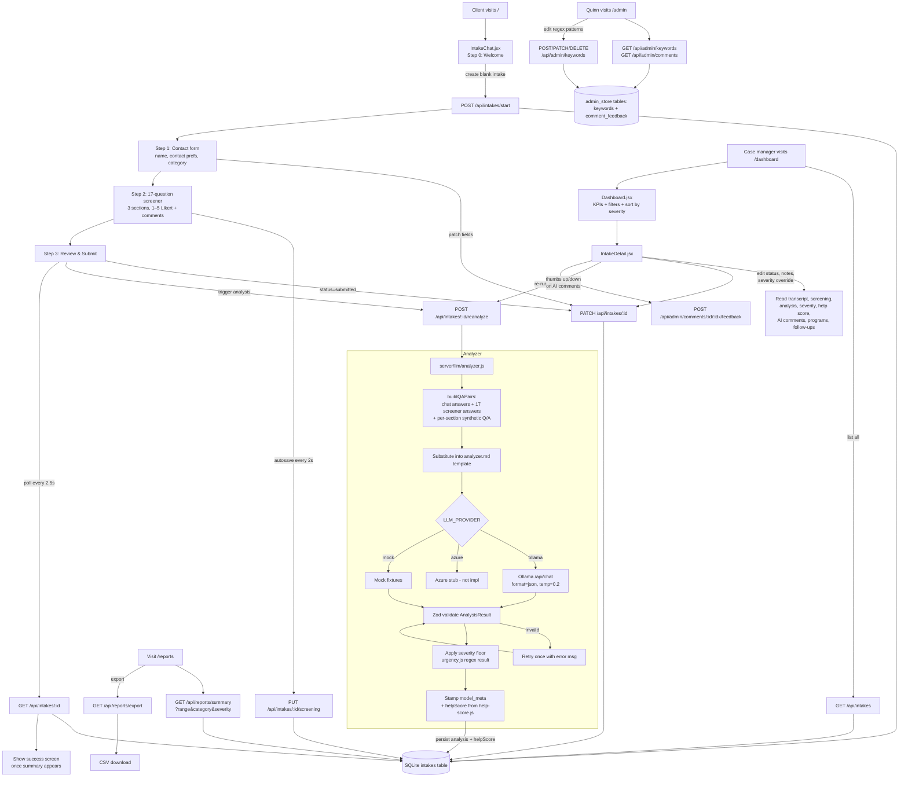

# Hope Connect — Project State

_Last audited: 2026-05-24_

This document is a snapshot of the current state of the Hope Connect codebase. It is meant as a reference point — what exists today, how the pieces fit together, where the design decisions are documented, and what is still rough. Future changes should be measured against this file.

---

## 1. What Hope Connect is

Hope Connect is a prototype of an AI-assisted intake and triage tool for a nonprofit social-services organization. The intended end-to-end workflow (Meeting 2 "Option 1") is:

```
User → AI intake → AI analysis → Case manager review → AI helps pre-fill →
User confirms → Case manager final audit → Submit to agency
```

A client fills out a guided multi-step intake form (with a 17-question health/quality-of-life screener) on a public-facing page. When they submit, an LLM analyzer reads the structured Q/A pairs and produces a staff-facing summary, a severity classification, a deterministic 0–100 help score, AI comments, recommended programs, follow-up questions, and extracted keywords. A case manager then reviews the analyzed intake on a dashboard, can override severity, add notes, and re-run the analysis.

It is a research/demo prototype, not a production system. There is no auth, no encryption, no HIPAA controls.

The repository is currently focused on **Quinn's slice** of the larger product: the analyzer pipeline, severity/keywords, the admin page, and reporting. Ted owns the public-facing landing page and the questionnaire UI (whose Q/A pairs are treated as opaque input by the analyzer).

---

## 2. Current state — what is built vs. not

What is built and working today:

- A React 19 single-page client (Vite 6, React Router 7) with six pages: Landing, Intake, Dashboard, Intake Detail, Admin, Reports.
- An Express 4 backend (`server/`) on port 3001, with REST endpoints for intake lifecycle, chat, admin, and reports.
- SQLite persistence via `better-sqlite3` at `server/data/intakes.db` (WAL mode). The README still says "in-memory only" — that is outdated; the store is now durable.
- A provider-abstracted LLM analyzer (`server/llm/analyzer.js`) that calls Ollama locally by default, with stubs for Azure and a `mock` provider used in evaluation.
- A deterministic help-score function (`server/help-score.js`) — pure, reproducible, rubric-versioned.
- A 17-question 1–5 Likert screener with mirrored client/server copies of the question definitions and the section-average helpers.
- A regex-based urgency/crisis floor that the LLM cannot de-escalate.
- A 10-fixture golden-set evaluation harness (`npm run eval:analyzer`).
- Five seeded demo intakes loaded on first boot from `server/seed/*.json` (Maria, Patricia, Sam, James, Alex — ranging from low to crisis severity).
- A design system folder of detailed specs in `docs/`, plus a `prompts/` folder containing the prompts that were used to drive the implementation phase-by-phase.

What is explicitly **not** built (per `docs/00-vision-and-scope.md`):

- No authentication, no role separation.
- No HIPAA / compliance work.
- No external program directory — "recommended programs" come from a hard-coded list inside the analyzer prompt.
- No Spanish UI strings (the analyzer is multilingual-tolerant, but the React UI is English-only).
- The Azure provider is a stub (`server/llm/providers/azure.js` throws "not yet implemented").
- The pre-fill / confirm / final-audit steps after analyzer review are designed in the vision doc but not yet implemented.

---

## 3. Tech stack

| Layer | Tool | Notes |
|---|---|---|
| Frontend | React 19, React Router 7, Vite 6 | Single SPA, no SSR. lucide-react for icons. |
| Backend | Node.js (ES modules), Express 4 | `--watch` for dev reload. |
| Persistence | SQLite via `better-sqlite3` | WAL mode, single `intakes` table with JSON `data` column. `server/data/intakes.db` is git-ignored. |
| LLM | Ollama (local), `qwen3:8b` default | `qwen3:30b` is referenced in docs as the higher-quality option. JSON mode + `/no_think`. |
| Validation | Zod 4 | `server/llm/schema.js` validates analyzer output. |
| Dev runner | `concurrently` | `npm run dev` at the repo root runs server + client together. |

The repo is a 3-workspace layout: root, `server/`, and `client/`, each with its own `package.json`. There is no monorepo tool — root simply runs the two children concurrently.

---

## 4. Repository structure

```
NonProfitAIProject/
├── package.json                # root: concurrently runs server + client
├── README.md                   # original README (some sections outdated)
├── docs/                       # design & spec docs (00–12 numbered)
├── prompts/                    # phase-by-phase implementation prompts
├── server/
│   ├── index.js                # Express entry; mounts routes, seeds, warms up
│   ├── store.js                # SQLite store + Q/A pair assembly helpers
│   ├── admin-store.js          # Keyword patterns + comment feedback tables
│   ├── ollama.js               # Ollama HTTP client for the chat helper + summary
│   ├── prompts.js              # System prompts for the conversational helper
│   ├── intake-flow.js          # 8-step legacy chat flow + post-completion analyzer trigger
│   ├── urgency.js              # Regex floor for crisis / high / medium urgency
│   ├── help-score.js           # Deterministic 0–100 help score
│   ├── screening-questions.js  # 17-question screener metadata
│   ├── screening-stats.js      # Pure section-average helpers
│   ├── seed.js                 # Loads demo cases from server/seed/*.json on first boot
│   ├── routes/
│   │   ├── intake.js           # Intake lifecycle + screening + reanalyze
│   │   ├── chat.js             # Direct Ollama chat + summary endpoints
│   │   ├── admin.js            # Keyword CRUD + AI comment feedback
│   │   └── reports.js          # KPIs, distributions, CSV export
│   ├── llm/
│   │   ├── analyzer.js         # Public analyzeIntake() — prompt → provider → validate → floor → stamp
│   │   ├── schema.js           # Zod schema for AnalysisResult
│   │   ├── prompts/
│   │   │   └── analyzer.md     # Full analyzer instructions + JSON output contract
│   │   ├── providers/
│   │   │   ├── index.js        # Picks provider from LLM_PROVIDER env var
│   │   │   ├── ollama.js       # Local Ollama, JSON mode, temp 0.2, 120s timeout
│   │   │   ├── azure.js        # Stub — throws "not yet implemented"
│   │   │   └── mock.js         # Deterministic provider used in eval / tests
│   │   └── eval/
│   │       ├── run.js          # `npm run eval:analyzer`
│   │       ├── matchers.js
│   │       ├── reporter.js
│   │       └── fixtures/       # 10 golden-set Q/A inputs + expected outputs
│   ├── seed/                   # 5 demo-intake JSON files loaded on first boot
│   └── data/                   # SQLite db lives here (git-ignored)
└── client/
    ├── vite.config.js          # dev server proxies /api → http://localhost:3001
    ├── index.html
    └── src/
        ├── main.jsx            # React entry + BrowserRouter
        ├── App.jsx             # Routes + nav (hidden on /home)
        ├── pages/
        │   ├── LandingPage.jsx
        │   ├── IntakeChat.jsx  # 4-step intake form + side-popover chat helper
        │   ├── Dashboard.jsx
        │   ├── IntakeDetail.jsx
        │   ├── Admin.jsx
        │   └── Reports.jsx
        ├── components/         # ScoreRing, HelpScore, SeverityPill, StatusBadge,
        │                       # AICommentList, ChatMessage, ScaleSelector,
        │                       # EmptyState
        └── lib/
            ├── api.js          # Single fetch wrapper + path catalog
            ├── icons.js        # Curated lucide-react re-exports + CATEGORY_ICON map
            ├── screening-questions.js   # Client mirror of server screener defs
            ├── screening-stats.js       # Client mirror of server helpers
            └── help-score-rubric.js     # Client mirror of the rubric constants
```

Two things to know about the `docs/` and `prompts/` folders. `docs/` is the spec library — `00-vision-and-scope.md` is the anchor, `01-architecture.md` shows the file layout, and the rest are per-feature specs (`02-analyzer.md`, `03-help-score.md`, `11-screening.md`, etc.). `prompts/` is the chronological set of implementation prompts that produced the code. The README in `docs/` calls itself the source of truth — "if a prompt and a doc disagree, the doc wins."

---

## 5. End-to-end flow

The diagram below shows how a single intake travels through the system from the client filling in the form to the case manager reviewing the analyzed result.



The key thing to internalize: the LLM never has authority to make a case _less_ severe than the regex floor said it was. Crisis keywords (self-harm, abuse, overdose) and high-urgency keywords (eviction today, fleeing, no food tonight) are detected by `urgency.js` independently of the model, and `analyzer.js` enforces a one-way floor — the model can escalate, never de-escalate.

---

## 6. Backend, module by module

### `server/index.js`

Express bootstrap. Mounts four route groups (`/api/intakes`, `/api/chat`, `/api/admin`, `/api/reports`), runs `seedIfEmpty()` to load demo data on first boot, listens on port 3001, then fires off `warmUpModel()` and `warmUpAnalyzer()` in the background so the first real intake does not pay the qwen3 cold-start cost (~15 s).

### `server/store.js`

The persistence layer. A single `intakes` table with `id`, `created_at`, `updated_at`, and a `data` JSON column holding the full intake record. WAL mode is enabled. The intake shape is defined in `blankIntake()` and includes status, currentStep, clientName, contactPreference, needCategory, urgencyFlag, crisisFlag, transcript, structuredAnswers, summary, staffNotes, qaPairs, analysis, helpScore, severityOverride, severityOverrideReason, screeningAnswers (3 sections), screeningComments (3 sections + general), screeningUpdatedAt, and an `isDemoData` flag.

The file also exports three pure helpers used by the analyzer: `buildQAPairs(intake)` stitches the chat-derived pairs with the 17 screener answers and three synthetic per-section averages; `buildClientBlock(intake)` and `buildScreeningBlock(intake)` produce the human-readable text blocks that get substituted into the analyzer prompt template.

### `server/admin-store.js`

A second SQLite store for admin features. Two tables: `keywords` (id, pattern, level, description, added_at) and `comment_feedback` (intake_id, comment_idx, helpful, rated_at). Seeds itself from the regex constants in `urgency.js` on first run. Validates that pattern strings compile as RegExp before writing. `getActivePatterns()` returns `{CRISIS, HIGH, MEDIUM}` arrays of compiled patterns — this is what `urgency.js` uses at runtime, meaning staff edits to the keyword table take effect immediately.

### `server/urgency.js`

Pure rule engine. Exports the three default pattern arrays (`CRISIS_PATTERNS`, `HIGH_URGENCY_PATTERNS`, `MEDIUM_URGENCY_PATTERNS`) and two functions: `assessMessage(text)` for a single message and `assessTranscript(transcript)` for a whole conversation. Returns `{urgencyFlag: 'low'|'medium'|'high', crisisFlag: boolean, triggers: string[]}`. Crisis flag, once set, stays set; urgencyFlag is the worst across all user messages.

### `server/help-score.js`

Deterministic 0–100 scoring from an `AnalysisResult`. The rubric: severity band base (crisis 86 / high 65 / medium 36 / low 8), plus up to 18 points for risk flags (3 each), an urgency-window bonus (today +6, week +3, month 0, planning −2), and up to 6 points for secondary categories. Result is clamped to a per-band ceiling. Self-harm flag floors the score at 90. Pure function — same inputs always produce the same number. The rubric is version-stamped so the dashboard can show "rubric v1" alongside the score.

### `server/screening-questions.js` + `screening-stats.js`

The 17-question screener metadata: three sections (`mental_health` 5q, `physical_health` 5q, `quality_of_life` 7q), each question with id, prompt, low-end label, high-end label, and polarity. `screening-stats.js` is pure: section averages and answered counts. Both files have **identical mirrors** in `client/src/lib/` so the React form can score and render without a server round-trip; this is the only intentional duplication in the repo.

### `server/intake-flow.js`

This is the older 8-step chat-driven intake state machine (greeting → ask_name → ask_contact → ask_category → ask_urgency → ask_situation → confirm → complete). It still works and is reachable via `POST /api/intakes/start` + `POST /api/intakes/:id/message`, but per `docs/01-architecture.md` and `docs/12-page-intake.md` the primary intake mechanism is now the form-based 4-step stepper in `IntakeChat.jsx`. The chat flow's `runAnalyzer()` function — which runs the analyzer when an intake reaches the `complete` step — is still the main entry point into the analyzer pipeline.

### `server/ollama.js`

A small HTTP client for the conversational helper (the side-popover chat in the intake page) and for the summary endpoint. Separate from the analyzer's provider — `analyzer.js` calls into `llm/providers/`, not into this file. Appends `/no_think` to disable qwen3's thinking blocks and strips any `<think>…</think>` that come back anyway. 90 s timeout for chat, 120 s for summary.

### `server/llm/analyzer.js`

The heart of the system. `analyzeIntake(intake | qaPairs, ruleSignals)`:

1. Reads `prompts/analyzer.md` once (cached at module load).
2. Builds the Q/A pair list and the client + screening text blocks.
3. Substitutes them into the template, then splits on the `\nCLIENT\n` marker — everything before is the system prompt, everything from `CLIENT` onward is the user prompt.
4. Calls `getProvider().generateAnalysis({systemPrompt, userPrompt})`. Provider chosen by `LLM_PROVIDER` env var (`ollama` default, `azure`, `mock`).
5. JSON-parses the response and validates against the Zod schema. On failure, retries **once** with the validation error appended to the user prompt.
6. Applies the severity floor from `ruleSignals` — escalates only.
7. Stamps `model_meta = {model, provider, ms, schema_version: '1.0'}`.
8. On total failure, returns a `safeFallback()` AnalysisResult tagged `pending_structured_analysis` so the UI still has something to render.

`warmUpAnalyzer()` is called at boot to preload the prompt template and warm the provider.

### `server/llm/schema.js`

Zod schema for `AnalysisResult`. The shape:

- `summary.staff_facing` and `summary.client_facing`
- `classification.primary_category` (one of `NEED_CATEGORIES`), `secondary_categories` (0–3, no duplicates, ≠ primary), `tags` (0–8, format `^[a-z][a-z0-9_]{1,38}$`)
- `severity.level` (`low|medium|high|crisis`), `severity.score` (0–100), `severity.confidence` (0–1), `severity.rationale`, `severity.signals[]`
- `risk_flags`: 8 booleans (self_harm, abuse, medical_emergency, child_at_risk, housing_loss_imminent, food_insecurity, mental_health, substance_use)
- `urgency_window`: `today|this_week|this_month|planning_ahead`
- `recommended_programs` (0–6), `follow_up_questions` (2–5), `ai_comments` (0–6, each `{type, text}`), `keywords_extracted` (5–15), `language_detected`

`SEVERITY_LEVELS` and `NEED_CATEGORIES` are also exported for use by other modules.

### `server/llm/providers/`

Each provider exports the same shape: `{name, generateAnalysis({systemPrompt, userPrompt}) -> string}`. The string is the raw JSON the model returned; the analyzer is responsible for parsing and validating.

- `ollama.js` — POSTs to `OLLAMA_URL/api/chat` with `format: 'json'`, temperature 0.2, 120 s timeout. Strips thinking blocks.
- `azure.js` — Stub that throws "not yet implemented". The comment shows the intended `response_format.json_schema` Azure OpenAI structure.
- `mock.js` — Deterministic test provider. Dispatches on substrings in the user prompt (`"want to die"` → SELF_HARM fixture, `"insulin"` → MULTI_CATEGORY, `"necesito"` → SPANISH, etc.) and returns a canned `AnalysisResult`. Used by the eval harness.

### `server/llm/prompts/analyzer.md`

The full analyzer instructions. Defines the exact JSON output schema, language detection rules, severity definitions, urgency windows, the hard-coded recommended-program list, comment types (`context`, `flag`, `suggestion`, `clarification`), follow-up guidance, the keyword extraction contract, and the safety floor.

### `server/llm/eval/`

Golden-set evaluation harness. `run.js` reads each fixture in `fixtures/`, calls `analyzeIntake(input.qaPairs, input.ruleSignals)`, and applies matchers (`expectSeverityAtLeast`, `expectPrimaryCategoryEquals`, `expectSecondaryIncludes`, `expectRiskFlagsTrue`, `expectUrgencyWindowIn`, etc.). Run with `npm run eval:analyzer`. Exit code 0 if all pass, 1 if any fail. There are currently 10 fixtures covering routine food, eviction, self-harm, domestic abuse, Spanish-only, multi-category, one-word answers, medical emergency, stable/planning, and substance mention.

### Routes

`routes/intake.js` exposes the intake lifecycle: `POST /start`, `POST /:id/message`, `GET /`, `GET /:id`, `POST /:id/reanalyze`, `PUT /:id/screening`, and a general `PATCH /:id` for updating status, summary, staffNotes, severityOverride, etc.

`routes/chat.js` exposes the conversational helper independently: `POST /reply`, `POST /summary`, `GET /status` (Ollama connectivity check).

`routes/admin.js` exposes the keyword CRUD (`GET/POST/PATCH/DELETE /keywords`), a flat AI-comment browser (`GET /comments` with `type`, `severity`, `category`, `q` filters), `GET /overrides` for severity overrides across cases, and the thumbs feedback endpoint (`POST /comments/:intakeId/:idx/feedback`).

`routes/reports.js` exposes `GET /summary?range=7|30|90|ytd|all&category=…&severity=…` (KPIs + distributions + score-over-time + top tags/keywords) and `GET /export?…` (CSV).

---

## 7. Frontend, page by page

`main.jsx` — React entry, StrictMode, BrowserRouter, mounts `<App>`.

`App.jsx` — Defines six routes (`/` IntakeChat, `/home` Landing, `/dashboard`, `/dashboard/:id`, `/admin`, `/reports`) and renders the top nav on every page except `/home`. Note the inversion: `/` is the intake form (the client-facing entry), and `/home` is the landing page. The README still describes the routes as if `/` were the intake page only — that part is current.

`pages/LandingPage.jsx` — Welcome page with marketing copy + links into the intake and dashboard.

`pages/IntakeChat.jsx` — The 4-step intake stepper. The name is a holdover from the original chat-driven design; the page is now form-based. Step 0 Welcome → creates a blank intake. Step 1 Contact → captures name, contact preference, and need category. Step 2 Screening → 17 Likert questions across three sections (mental health, physical health, quality of life) plus a general comments field; **autosaves every 2 seconds**. Step 3 Review & Submit → marks `status='submitted'`, calls `POST /:id/reanalyze`, then polls `GET /:id` every 2.5 s until `summary` appears. A side-popover chat helper hooked to `/api/chat/reply` is available throughout but closed by default — it marks itself unread if a message arrives while collapsed.

`pages/Dashboard.jsx` — Lists all intakes. Sort order: by severity (crisis → high → medium → low) then by recency. Top of the page shows KPI cards: total intakes, average help score, high-or-crisis count, crisis-flagged count, pending-analysis count. A filter sidebar narrows by category, severity, and date range (7d / 30d / 90d / YTD / all). Each row shows a status badge, client name, category icon, urgency, help-score ring, and timestamp.

`pages/IntakeDetail.jsx` — The full case view. Renders client info, contact, category, urgency flags, status, the conversation transcript, the screening answers with section averages, and the full analyzer output (summary, classification, severity, risk flags, recommended programs, follow-up questions, AI comments). Provides an editable staff notes textarea (auto-saves via PATCH), a re-analyze button, and severity-override controls (level + reason).

`pages/Admin.jsx` — Two-panel layout. Left: crisis/high/medium keyword pattern lists with live match counts and add/edit/delete buttons. Right: a flat browser of every AI comment across every intake, with filters by type / severity / category / search and thumbs-up/down feedback.

`pages/Reports.jsx` — Fetches `/api/reports/summary` and renders KPI cards (with prior-period deltas), a category breakdown, a severity distribution, help-score-over-time, and top-tags / top-keywords tables. A CSV export button hits `/api/reports/export`.

### Components

- `ScoreRing.jsx` — Circular gauge, color-coded by severity.
- `HelpScore.jsx` — Score ring + optional rubric breakdown card; uses the mirrored rubric constants in `lib/help-score-rubric.js`.
- `SeverityPill.jsx` — Colored severity label.
- `StatusBadge.jsx` — Status, urgency, and severity badges (with re-exports).
- `AICommentList.jsx` — Renders `analysis.ai_comments` with type-tagged icons + thumbs feedback wired to `api.rateComment()`.
- `ChatMessage.jsx` — Chat bubble, left for assistant / right for user.
- `ScaleSelector.jsx` — 1–5 Likert radio group used in the screening step.
- `EmptyState.jsx` — Reusable placeholder for empty dashboards / lists.

### Lib

- `lib/api.js` — Single source of truth for all API paths. Every page imports `api.startIntake()`, `api.patchIntake()`, etc. No raw `fetch('/api/...')` calls anywhere else.
- `lib/icons.js` — Curated re-exports from lucide-react plus a `CATEGORY_ICON` map so the dashboard and detail page can render an icon per need category.
- `lib/screening-questions.js`, `lib/screening-stats.js`, `lib/help-score-rubric.js` — Mirrors of the server-side constants. Intentionally duplicated so the form is fully offline-capable and the dashboard can compute previews without a round-trip.

---

## 8. Data model

The full intake record stored in SQLite (in the `data` JSON column) looks like:

```jsonc
{
  "id": "ink_<timestamp>_<rand>",
  "createdAt": "ISO-8601",
  "updatedAt": "ISO-8601",
  "status": "new" | "in_progress" | "submitted" | "in_review" | "closed",
  "currentStep": "greeting" | "ask_name" | ... | "complete" | null,

  "clientName": "Maria Garcia",
  "contactPreference": "phone" | "email" | "text" | "in-person",
  "needCategory": "Housing" | "Food" | "Healthcare" | "Employment" | "Legal" | "Utilities" | "Other",

  "urgencyFlag": "low" | "medium" | "high",       // regex floor result
  "crisisFlag": false,                              // regex crisis detection

  "transcript": [{ "role": "user" | "assistant", "content": "...", "step": "..." }],
  "structuredAnswers": { /* flat object of extracted fields */ },
  "summary": "...",                                // mirror of analysis.summary.staff_facing

  "qaPairs": [{ "question": "...", "answer": "..." }],
  "analysis": { /* AnalysisResult — see schema.js */ } | null,
  "helpScore": 78 | null,
  "severityOverride": null | "low|medium|high|crisis",
  "severityOverrideReason": "",

  "screeningAnswers": {
    "mental_health":   { "<questionId>": 1..5, ... },
    "physical_health": { "<questionId>": 1..5, ... },
    "quality_of_life": { "<questionId>": 1..5, ... }
  },
  "screeningComments": { "mental_health": "", "physical_health": "", "quality_of_life": "", "general": "" },
  "screeningUpdatedAt": "ISO-8601" | null,

  "staffNotes": "",
  "isDemoData": false
}
```

A separate `admin_store` SQLite database holds `keywords` and `comment_feedback`. The two stores are independent.

---

## 9. LLM analyzer — the contract

When an intake completes, the analyzer is called with `(qaPairs, ruleSignals)`. It returns an `AnalysisResult` with five top-level groups:

1. **summary** — A `staff_facing` paragraph for case managers and a `client_facing` paragraph that could be shown back to the user.
2. **classification** — `primary_category` (one of the seven need categories), 0–3 `secondary_categories`, and 0–8 `tags` for filtering.
3. **severity** — `level` (low/medium/high/crisis), a 0–100 score, a 0–1 confidence, a rationale string, and an array of signals.
4. **risk_flags** — Eight booleans (self_harm, abuse, medical_emergency, child_at_risk, housing_loss_imminent, food_insecurity, mental_health, substance_use).
5. Plus `urgency_window`, `recommended_programs` (from the hard-coded list in the prompt), `follow_up_questions` (2–5 for the next case-manager conversation), `ai_comments` (0–6 typed observations), `keywords_extracted` (5–15), `language_detected`, and `model_meta` stamped by the analyzer.

The deterministic `helpScore` is computed from the validated result, not by the model.

---

## 10. Notable behaviors and design choices

A few things worth knowing that aren't obvious from a quick read:

- **The regex floor is one-way.** `urgency.js` runs first; the LLM may escalate severity but never de-escalate. Crisis keywords always win.
- **The store is durable, not ephemeral.** The README still says "in-memory only" — that's wrong now. SQLite + WAL mode means demo data survives restarts. To reset, delete `server/data/intakes.db*`.
- **Screening definitions are duplicated by design.** Server (`screening-questions.js`) and client (`lib/screening-questions.js`) are intentionally identical mirrors so the form can score and render without round-trips.
- **There are two model paths.** `server/ollama.js` (chat helper + summary) and `server/llm/providers/ollama.js` (analyzer). They are not the same client and could in principle target different models.
- **The legacy chat flow still exists.** `intake-flow.js` is the original 8-step chat-driven intake; it isn't reachable from the current UI but the route handlers and the analyzer-on-completion trigger inside it still work.
- **Warm-up on boot matters.** Both `warmUpModel()` and `warmUpAnalyzer()` fire after `app.listen()` so qwen3:30b's ~15 s cold-start happens before a real user hits the form.
- **The Azure provider is a stub.** Swap-in is one file, but that file currently throws. The interface (`generateAnalysis({systemPrompt, userPrompt})`) is well-defined.
- **Hard-coded recommended programs.** `recommended_programs` come from a fixed list embedded in `analyzer.md`. A future hook would replace this with a real directory.

---

## 11. Running it

From the repo root, with Ollama already running on `localhost:11434`:

```bash
npm install
npm install --prefix server
npm install --prefix client
npm run dev
```

Backend on `http://localhost:3001`, frontend on `http://localhost:5173`. The Vite config proxies `/api/*` to the backend, so the React app uses relative paths everywhere.

To switch models: `OLLAMA_MODEL=qwen3:8b npm run dev`.

To run the analyzer eval suite: `npm run eval:analyzer --prefix server`.

To reset all demo data: delete `server/data/intakes.db*` and restart — `seedIfEmpty()` will reload the five JSON fixtures in `server/seed/`.

---

## 12. Known gaps and open questions

- The README is partially stale (claims in-memory storage, names two seeded intakes when there are now five, references qwen3:30b as the default while `server/ollama.js` defaults to qwen3:8b). Worth a refresh.
- The Azure provider is unimplemented. The vision doc says "the company will choose" the hosted provider.
- There is no auth — `/admin` and `/dashboard` are wide open. Per the vision doc this is out of scope for the demo, but it should be flagged before any external deployment.
- The "pre-fill applications → user confirms → case-manager final audit" steps from the Option-1 workflow are designed but not built. The system currently stops at "case manager reviews analysis."
- The legacy chat-driven intake (`intake-flow.js`) is reachable via the API but not via the UI. Decision pending whether to keep it as an alternative path or remove it.
- Persistence was migrated from in-memory to SQLite without updating the spec docs in `docs/`. `docs/00-vision-and-scope.md` still lists "keep in-memory store" as a locked-in decision pending the Monday meeting.

---

## 13. Where to look next

For the most current design intent, read in this order:

1. `docs/00-vision-and-scope.md` — what we're building, what's locked in, what's out of scope.
2. `docs/01-architecture.md` — the backend file layout and the analyzer call graph.
3. `docs/02-analyzer.md` — the full analyzer contract.
4. `docs/03-help-score.md` — the help-score rubric.
5. `docs/11-screening.md` — the screener and how it feeds the analyzer.
6. `docs/12-page-intake.md` — the current 4-step form design.

For implementation detail, read `server/llm/analyzer.js` and `server/llm/prompts/analyzer.md` together — the prompt is half the contract.
