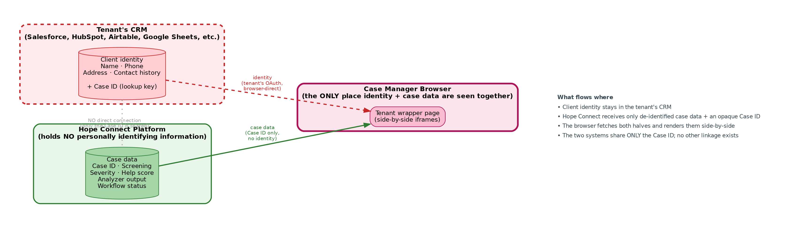
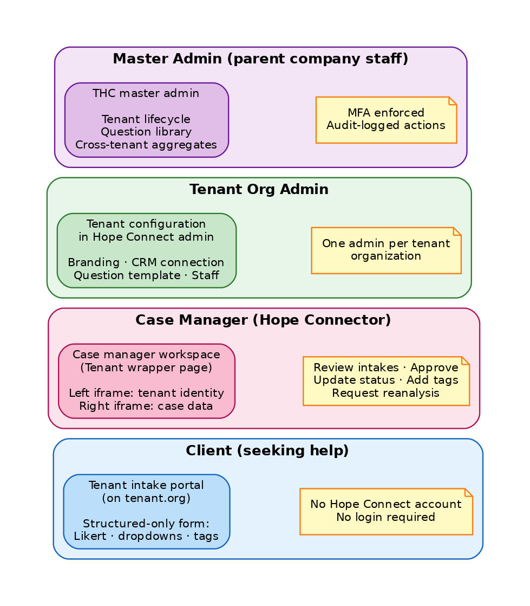
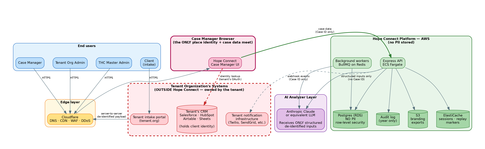
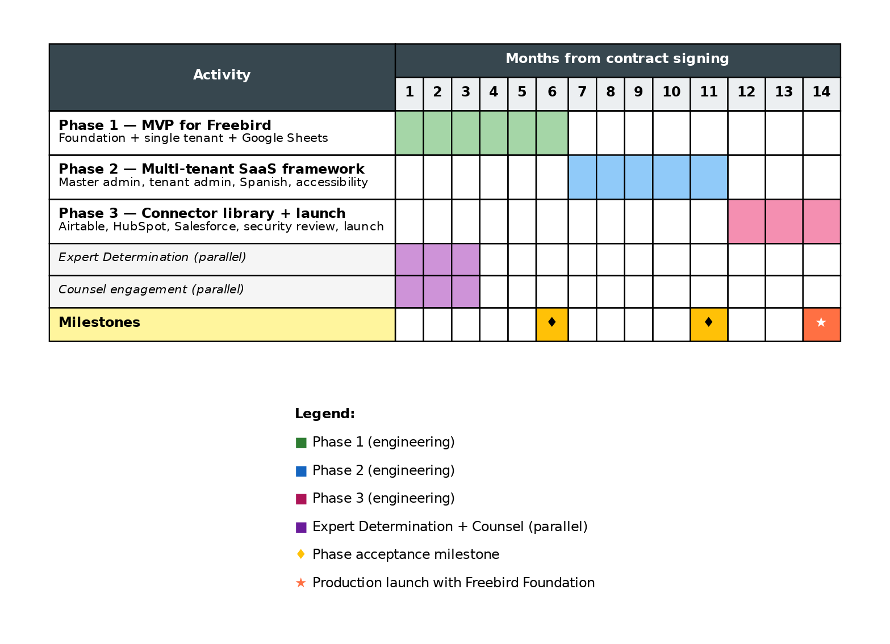
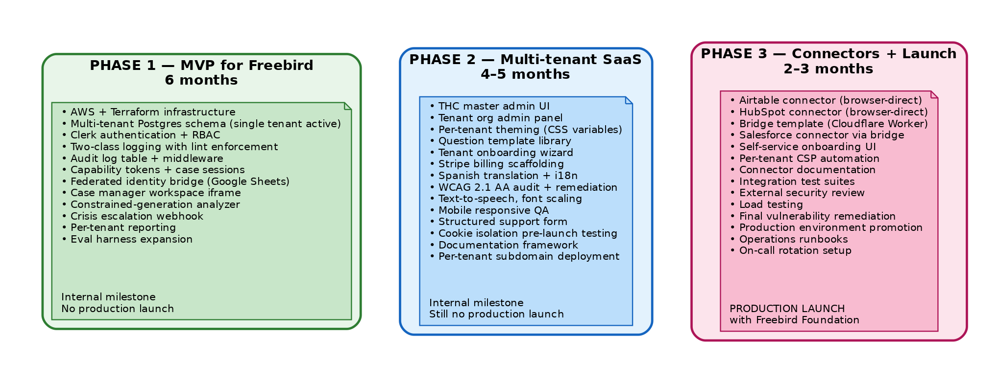
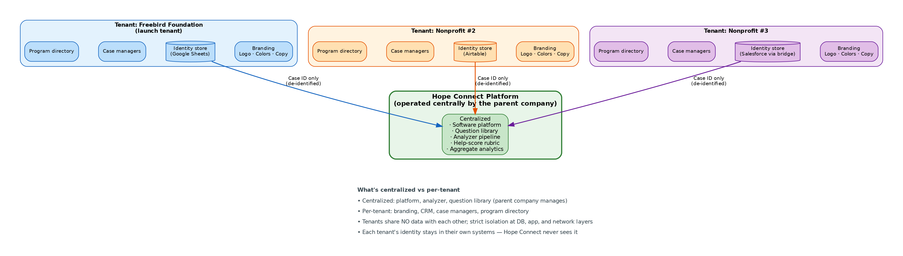

# Hope Connect — Engineering Proposal

**Prepared by (Engineering Team):** Quinn Evans & Ted Roper (the "Engineering Team" / Service Provider)
**Prepared for (Client):** Freebird Foundation — owner and operator of the Platform (the "Client")
**Product:** Hope Connect (the "Platform")
**Launch tenant:** First pilot tenant — to be determined
**Document version:** v1.0 (Draft for review)
**Effective date:** [TBD on execution]
**Estimated duration:** Approximately 14 months across three phases

**Accompanying documents:**

- *Hope Connect — Architecture & Compliance Review* (provided for evaluation by counsel retained by the Client)
- *Hope Connect — Statement of Work* (the contractual instrument)

---

## 1. Executive Summary

Hope Connect is a multi-tenant, AI-assisted intake and triage platform for nonprofit social services. The Platform transforms how community organizations receive, assess, and route requests for help by combining a configurable client-facing intake experience with a structured AI analyzer that surfaces severity, recommended program categories, and follow-up actions for case manager review.

This proposal describes a three-phase engineering plan to deliver Hope Connect from current prototype to production launch over approximately fourteen months:

- **Phase 1 (six months) — MVP.** The full architecture is built, with a single tenant configured for pilot validation. This is an internal development milestone, not a public launch.
- **Phase 2 (four to five months) — Multi-tenant SaaS framework.** The Platform becomes multi-tenant, with Spanish, accessibility, mobile responsiveness, and tenant administration tooling in place. Still an internal milestone.
- **Phase 3 (two to three months) — Connector library and production launch.** The CRM integration library is completed, external security review and load testing are performed, and Hope Connect goes live in production with the first pilot tenant.

The Platform's defining architectural choice is the **federated identity architecture**. Hope Connect itself never holds identifying client information. Each tenant organization maintains client identity in their own existing CRM (Salesforce, HubSpot, Airtable, Google Sheets, or equivalent), and the two halves of a case file are visually joined only in the case manager's browser. This decouples the Platform from HIPAA's most stringent requirements while preserving the operational utility of an integrated case management view. The legal and architectural implications are detailed in the accompanying *Hope Connect — Architecture & Compliance Review*.

This document is the engineering and delivery plan. It describes what we are building, when, and to what standards. It does not include pricing, payment terms, IP allocation, or contractual provisions — those are addressed in the accompanying *Hope Connect — Statement of Work*.

---

## 2. Background and Context

### 2.1 Engagement structure

The Freebird Foundation (the "Client") is a Charlotte-based nonprofit focused on economic mobility, affordable housing, and immigrant support. The Client is commissioning the Hope Connect Platform from the Engineering Team and will own and operate the Platform on completion. The Client will then offer the Platform to additional nonprofit organizations as tenants, with the first pilot tenant to be determined.

The Engineering Team — Quinn Evans and Ted Roper — is contracted by the Client to design, build, and launch the Platform. Post-launch, the Engineering Team continues under a maintenance retainer described in §7.3.

### 2.2 The prototype and what it demonstrated

Over April and May 2026, the Engineering Team built a working prototype of Hope Connect that demonstrated the core mechanics of the proposed system:

- A structured 17-question Likert screener spanning mental health, physical health, and quality-of-life dimensions
- An AI analyzer producing structured JSON output validated against a strict schema, with a deterministic 0–100 help-score function
- A rule-based crisis detection layer that the AI cannot override downward
- A case manager dashboard with intake list, detail view, severity flags, and analyzer output
- A golden-set evaluation harness with ten test fixtures
- An admin panel for managing keyword patterns and reviewing AI comments

The prototype validated the core analytical loop and surfaced the architectural questions that this proposal answers. It is documented in detail in `PROJECT_STATE.md` for engineering reference.

### 2.3 Service priorities

The Client has identified its primary service priorities, in order: affordable housing, economic mobility (jobs and living wages), immigrant support, food access, youth programs, and transportation. The Platform is designed to serve these categories first and to accommodate additional service categories as the Client and any future tenants identify them.

### 2.4 Strategic decisions reflected in the architecture

Three strategic decisions shape the architecture and the delivery plan:

**Multi-tenant from day one, not a single-customer build.** Hope Connect is designed as a SaaS platform that the Client will offer to additional nonprofits over time. The Platform supports multiple tenant organizations operating in parallel; the first pilot tenant is the first to come online in production. The Phase 1 architecture supports multi-tenancy from the foundation — multi-tenant data model, row-level security, organization-scoped queries — even though only a single tenant is configured during Phase 1 for validation.

**Federated identity, not centralized PHI storage.** Hope Connect does not hold client identifying information. Each tenant keeps client identity in their own existing CRM. This decision is the foundation of the Platform's conditional non-Business-Associate posture under HIPAA and is the topic of the accompanying *Hope Connect — Architecture & Compliance Review*.

**Structured-only intake, not free-text narrative.** Client intake is structured: Likert scales, single-select and multi-select dropdowns, predefined tag selections. There are no free-text fields anywhere in the client-facing intake. This architectural commitment supports the non-PHI-receipt position by ensuring that identifying information cannot enter the Platform through narrative text. The analyzer is constrained correspondingly to produce only structured output.

---

## 3. The Product

### 3.1 AI-assisted intake and triage

A client visits a tenant-hosted intake portal (branded for their tenant organization) and completes a structured screening. The form combines categorical questions (need category, urgency classification, language preference, employment and housing status) with the 17-question Likert screener and a curated set of predefined tag selections. All inputs are structured; the Platform does not collect free-text narrative.

On submission, the tenant backend generates an opaque Case Identifier, strips network metadata, applies year-only date truncation, and posts the de-identified record to Hope Connect's API. Hope Connect's analyzer pipeline then produces a structured `AnalysisResult` containing severity classification, deterministic help score, risk flags, recommended program categories, and follow-up question IDs. Case managers reviewing the intake see this analysis alongside the structured screening responses.

The analyzer is constrained by JSON schema validation to produce only enum-valued output — no free-text generation. The schema validation, severity floor enforcement, and help-score function were all built and validated in the prototype phase.

### 3.2 Case manager workspace

Case managers at each tenant organization access Hope Connect through a workspace embedded in a tenant-hosted wrapper page. The wrapper contains two isolated iframes side by side:

- An identity panel served from the tenant's origin, displaying the client's name, contact information, and contact history from the tenant's CRM
- A case data panel served from Hope Connect, displaying severity, screening responses, analyzer output, and workflow controls

The two iframes do not communicate. Each authenticates against its own backend. The case manager sees both panels rendered together and uses both to make case decisions, but no software ever joins them — the join exists only in the case manager's perception. This architectural separation is the foundation of Hope Connect's federated identity posture and is documented in detail in the *Architecture & Compliance Review*.

Case managers can update case status through structured workflow controls (`new`, `in_review`, `approved`, `contacted`, `closed`), override severity with a structured reason code, request reanalysis, and view a complete audit log of case events. Narrative notes about clients live in the tenant's CRM, not in Hope Connect; the workspace's workflow controls are structured throughout.

### 3.3 Federated identity (the core innovation)

The federated identity architecture is the Platform's defining technical and business decision. Conventional case management SaaS centralizes client identity, creating a single high-value target for security incidents and a HIPAA Business Associate relationship with every covered-entity customer. Hope Connect inverts this model: client identity stays with the tenant, in the tenant's existing systems, and Hope Connect holds only de-identified case data.

Three things make this work:

- An opaque Case Identifier randomly generated by the tenant, satisfying the requirements of 45 CFR § 164.514(c). The tenant retains the mapping from Case Identifier to client identity in their CRM. Hope Connect never sees this mapping.
- The structured-only intake described in §3.1, which prevents narrative identifiers from entering Hope Connect's data plane.
- The isolated iframe model described in §3.2, which ensures that even at view time, Hope Connect's software never processes client identifying information.

The result is a Platform that integrates with the tenant's existing operational reality (Salesforce, HubSpot, Airtable, Google Sheets) rather than asking them to migrate. For the Client's go-to-market, this is the most important differentiator: prospects don't have to abandon their existing investments to adopt Hope Connect.

{ width=95% }

### 3.4 Multi-tenant SaaS framework

Hope Connect is multi-tenant from day one. The architecture supports an arbitrary number of tenant organizations operating under a single Platform deployment, with strict data isolation enforced through row-level security at the database layer, authentication and authorization scoping at the application layer, and per-tenant CSP and subdomain isolation at the network layer.

Each tenant gets:

- A configured tenant identifier and per-tenant subdomain
- Branded user experience (logo, primary and secondary colors, custom copy strings)
- A selection from the centrally managed question template library
- Their own case manager users, managed by their own tenant organization administrator
- Their own connection to their preferred CRM via the federated identity bridge
- Their own crisis-response configuration

What stays centralized: the question library (so improvements to the screener benefit all tenants), the analyzer pipeline and prompts, the help-score rubric, the Platform software itself, and aggregate cross-tenant analytics maintained by the Client.

### 3.5 User roles

{ width=95% }

Four distinct user roles interact with the Platform:

**Client.** The person seeking help. The client does not have a Hope Connect account. They complete an intake on the tenant's intake portal and never log in to Hope Connect.

**Case Manager.** A tenant staff member who reviews intakes, makes case decisions, and coordinates outreach. They authenticate through the tenant's own subdomain and access the Hope Connect workspace through the tenant-hosted wrapper.

**Tenant Org Admin.** A tenant staff member who configures their organization's deployment: branding, case manager users, the connection to their CRM, the question template selection, the crisis-response configuration.

**Master Admin (Client staff).** The Client's operational staff. They onboard new tenants, manage the central question library, view aggregate cross-tenant analytics (with cell-size suppression), and handle escalated support.

Each role sees a different subset of the Platform, enforced by RBAC middleware and database-level row-level security policies.

### 3.6 Reporting

Two reporting surfaces exist in the Platform:

**Per-tenant reporting** for case manager and tenant admin use: KPI dashboard (intake volume, severity distribution, help-score distribution, status distribution), date-range filtering (limited to year granularity by the de-identification architecture), and CSV export of structured case data.

**Aggregate cross-tenant reporting** for Client analytical use: anonymized rollups across all tenants in a region, with minimum cell-size suppression to prevent re-identification. These reports support the Client's product decisions and, where appropriate, can be shared with state-level partners requesting demand statistics. All aggregate reporting is governed by the cell-size threshold determined by the Expert Determination engagement described in §7.1.

---

## 4. The Architecture at a Glance

{ width=95% }

The diagram above shows the complete system at a glance. Reading from top to bottom: end users (clients, case managers, tenant admins, master admins) connect via Cloudflare's edge to the Hope Connect Platform on AWS. The Platform consists of the Express API, background workers, a Postgres database holding de-identified case data, ephemeral Redis for capability tokens and case sessions, S3 for tenant configuration and audit log archives, and the analyzer LLM (Anthropic Claude via API). Critically, the diagram shows the federated boundary: the tenant's CRM lives outside Hope Connect's infrastructure, in a separate dashed box. The two systems share only the opaque Case Identifier; the join between them happens only at view time, in the case manager's browser.

This architecture has four properties that matter for the business case: (1) Hope Connect never receives client identifying information, supporting the conditional non-Business-Associate posture; (2) the Platform integrates with whatever CRM the tenant already uses; (3) the Platform's case-data plane is fully encrypted at rest and in transit, with audit logging on every case access; and (4) the analyzer LLM provider never sees Case Identifiers or tenant identifiers — only the structured screening data needed to produce the analysis.

The legal foundation of this architecture is documented in the accompanying *Hope Connect — Architecture & Compliance Review* for evaluation by counsel.

---

## 5. Three-Phase Delivery Plan

{ width=95% }

{ width=95% }

Each phase has defined goals, business outcomes, engineering deliverables, explicit out-of-scope items, and acceptance criteria. The phases are designed to allow Phase 1 work to proceed in parallel with the Expert Determination and counsel engagements that run during months 1–3.

### 5.1 Phase 1 — MVP (six months)

**Goal.** Build a working Hope Connect deployment with the full v1 architecture in place and a single tenant configured for pilot validation. Phase 1 is an internal development milestone; no production launch occurs at the end of Phase 1.

**Business outcomes at end of Phase 1.** End-to-end test intakes complete in the production environment. The federated identity architecture is functional with a Google Sheets identity store. The analyzer pipeline produces validated structured output on every intake. The case manager workspace renders the isolated iframe layout correctly. The two-class logging discipline is in place and verified. The audit log captures every case-related event.

**Engineering deliverables.** AWS infrastructure and Terraform; Postgres schema with multi-tenant data model and row-level security (configured for a single tenant); Clerk authentication and RBAC; per-tenant subdomain support; the capability token issuance, exchange flow, and replay-marker store; case session management; two-class logging discipline with lint enforcement; the Hope Connect API with strict schema validation; the federated identity bridge for Google Sheets; the constrained-generation analyzer pipeline ported from the prototype to the v4 architecture; the case manager workspace iframe; the crisis escalation webhook; basic per-tenant reporting; the eval harness expanded to 20+ golden fixtures.

**What is not in Phase 1.** No master admin UI for tenant lifecycle management. No tenant org admin panel for self-configuration. No additional CRM connectors beyond Google Sheets. No Spanish translation. No formal accessibility audit. No mobile-specific responsive QA. No structured support form. No external security review. No production launch.

**Acceptance criteria.** Test intakes complete end-to-end through the production environment. The analyzer eval harness passes 100% on all golden fixtures. Two-class logging discipline is in place with lint rules enforcing it. The audit log captures every case-related action. The federated identity flow works with Google Sheets. A case manager can perform every workflow above through the production case manager workspace. Cookie isolation testing passes on Chrome, Safari, and Firefox. Crisis escalation webhook fires within 60 seconds of a crisis-flagged submission. All Phase 1 architectural commitments from the *Architecture & Compliance Review* are met.

### 5.2 Phase 2 — Multi-Tenant SaaS Framework (four to five months)

**Goal.** Convert the working single-tenant Platform into a true multi-tenant SaaS. Add the master admin and tenant admin user surfaces. Complete the accessibility, internationalization, and mobile polish required for any tenant to operate the Platform sustainably. Still an internal development milestone; no production launch at end of Phase 2.

**Business outcomes at end of Phase 2.** The master admin can provision a new tenant from the master admin UI. A new tenant org admin can complete the onboarding wizard, configure their branding, invite their case managers, and connect their Google Sheets identity store. The Platform supports a Spanish-language intake end-to-end. Accessibility audit findings at critical and high severity are remediated. Mobile responsive layout works on iOS Safari and Android Chrome. The structured support form is operational.

**Engineering deliverables.** Master admin UI with tenant lifecycle controls (create, activate, suspend, deactivate) and the question template library management interface. Tenant org admin panel with branding configuration, case manager user management, identity service configuration, program directory management, crisis response configuration, per-tenant reporting view, and the cookie discipline pre-launch test runner. Per-tenant theming via CSS variables. The tenant onboarding wizard. Stripe billing scaffolding with subscription state tracking and the quarterly billing period defaults specified in the *Architecture & Compliance Review*. Spanish translation via professional translator with i18n framework integration. WCAG 2.1 AA audit by external accessibility consultant and engineering remediation of critical and high findings. Text-to-speech and font scaling controls. Mobile responsive QA across browsers and viewport sizes. The structured support form. Initial drafts of case manager training materials, tenant admin reference, master admin runbook, and the counsel-approved security incident response playbook.

**What is not in Phase 2.** No CRM connector beyond Google Sheets. No self-service connector onboarding UI. No external security review. No load testing. No production launch. No native mobile apps. No closed-loop referral tracking. No federal grant report templates. No multi-language support beyond English and Spanish.

**Acceptance criteria.** The master admin can onboard a new tenant from invitation to first staging-environment intake within 30 minutes. A test tenant is provisioned and operational in the staging environment. Spanish-language intake works end-to-end with professional translation. WCAG 2.1 AA audit findings at critical and high severity are remediated. Mobile responsive QA passes on iOS Safari and Android Chrome at common viewport sizes. The structured support form is operational. Cookie isolation pre-launch testing passes on Chrome, Safari, and Firefox. All Phase 2 architectural deliverables are demonstrably working in the staging environment.

### 5.3 Phase 3 — Connector Library and Production Launch (two to three months)

**Goal.** Complete the CRM integration library so the Platform credibly supports tenants of any size and any CRM background, finalize the launch hardening (external security review, load testing), and execute the production launch with the first pilot tenant.

**Business outcomes at end of Phase 3.** Hope Connect is live in production with the first pilot tenant onboarded. Four CRM integrations are operational: Google Sheets, Airtable, HubSpot, and Salesforce (via the bridge template). The self-service onboarding UI allows a new tenant org admin to connect their CRM end-to-end without engineering intervention. External security review has been completed and findings remediated. Load testing validates the Platform sustains the target throughput. The Client can credibly approach Salesforce-using nonprofits as prospects.

**Engineering deliverables.** Airtable connector (browser-direct OAuth, field mapping UI). HubSpot connector (browser-direct OAuth, field mapping UI, custom property support). Bridge template — a deployable Cloudflare Worker reference implementation tenants host on their own infrastructure for CRMs that block browser-direct access. Salesforce connector implemented via the bridge template, with documentation for tenants' Salesforce administrators. Self-service connector onboarding UI within the tenant org admin panel: connector selection, OAuth initiation, field mapping configuration, test connection diagnostics. Per-tenant CSP origin registration automation. Final connector documentation per integration. Integration test suite per connector. External security review by third-party assessor (engaged as a hard cost paid by the Client). Load testing against the target of 1000 concurrent users and 100 intakes per hour peak. Penetration test coordination (subject to budget). Final vulnerability remediation. Documentation finalization. Production environment promotion. Production launch with the first pilot tenant. Post-launch monitoring runbook. On-call rotation setup. Day-one through day-thirty operations playbook.

**What is not in Phase 3.** Bonterra Apricot connector (a separate engagement post-v1.0). ETO Social Solutions connector (separate engagement post-v1.0). Microsoft Excel via OneDrive connector (separate engagement). Notion connector (separate engagement). Custom CRM connectors for specific tenants (priced per-tenant separately). Federal grant report templates (post-v1.0). Closed-loop referral tracking (post-v1.0). Two-way SMS conversation logging (post-v1.0).

**Acceptance criteria.** All four primary connectors (Airtable, HubSpot, Salesforce via bridge, Google Sheets) are operational in the production environment. The bridge template is deployable in under 30 minutes by a technically-capable tenant. The self-service onboarding UI allows a tenant org admin to connect a new CRM without engineering involvement. A second test tenant is onboarded using Salesforce via the bridge as a real-world validation. Connector documentation covers all four primary CRMs. Integration tests pass for all four. External security review delivered with no critical findings open. Load test sustains the target throughput without errors. Hope Connect is live in production with the first pilot tenant.

---

## 6. The Multi-Tenant Model

{ width=95% }

The diagram above shows how Hope Connect's multi-tenant architecture lets the Client offer the same Platform to many nonprofit organizations without rebuilding it for each. The Platform itself — the software, the question library, the analyzer pipeline, the case manager workspace — is operated centrally by the Client. Each tenant organization is configured with its own branding, its own staff users, its own connection to its preferred CRM, and its own program directory. Multiple tenants operate in parallel on the same Platform deployment, with strict data isolation enforced at three layers: the database (row-level security keyed on `org_id`), the application (RBAC middleware scoping every query to the authenticated user's tenant), and the network (per-tenant subdomain and CSP `frame-ancestors` enumeration).

What changes per tenant is intentionally limited: branding (logo, colors, copy), the question template they pick from the central catalog (in v1, all tenants use the same template), the identity store they connect to, the case manager users they invite, the program catalog they reference, and the crisis-response contact and resources. What does not change per tenant: the analyzer, the help-score rubric, the underlying question library semantics, the Platform software, the security and audit infrastructure. This separation enables the Client to improve the analyzer or expand the question library and have those improvements reach every tenant simultaneously, while still allowing each tenant a customized user-facing experience.

The federated identity boundary means that adding a new tenant does not increase Hope Connect's risk exposure to client identifying information. Each new tenant adds a new opaque tenant identifier on Hope Connect's side and a new connection to that tenant's own CRM. Hope Connect's data plane scales linearly with case volume but never accumulates client identities the way a conventional case management SaaS would.

---

## 7. Cross-Phase Considerations

### 7.1 Expert Determination engagement (recommended)

HIPAA provides two methods for treating health information as de-identified. Safe Harbor (45 CFR § 164.514(b)(2)) is a mechanical removal of eighteen specific identifiers. Expert Determination (45 CFR § 164.514(b)(1)) is a qualified expert's certification — using accepted statistical and scientific methods — that the risk of re-identification on a given dataset is "very small."

Hope Connect's architecture cannot satisfy Safe Harbor as currently designed: Safe Harbor's restrictions on date precision and on operational knowledge of organizational context would conflict with the Platform's ability to function as a real-time case management tool. The Engineering Team has therefore designed the Platform around Expert Determination as the alternative path. A formal engagement evaluates the Platform's actual data flows, capability token handling, telemetry, tenant context, and controls, and produces a written certification.

The Engineering Team's recommendation is that the Client commission a qualified Expert Determination firm in parallel with Phase 1 (approximately months one through three of the calendar) and complete the engagement before any production data flows. The full engagement scope is documented in the accompanying *Architecture & Compliance Review*.

**The decision to commission an Expert Determination engagement rests with the Client and its retained counsel.** Counsel may determine that legal review of the architecture, without independent expert certification, is sufficient for the Client's risk tolerance — particularly given the federated identity architecture's strong structural protections. The Engineering Team will support whichever path the Client chooses. If the Client elects to proceed without Expert Determination, the launch prerequisites in the *Architecture & Compliance Review* are adjusted accordingly under counsel's documented determination.

The Expert Determination firm, if engaged, is contracted and paid directly by the Client as a hard cost.

### 7.2 Attorney engagement

Counsel retained by the Client reviews the *Architecture & Compliance Review*, drafts the Master Subscription Agreement template, drafts the Privacy Policy, conducts the formal Business Associate analysis under each tenant arrangement contemplated, and approves the security incident response procedure including pre-approved Business Associate Agreement templates for forensic firms and legal counsel. This engagement runs in parallel with Phase 1 (approximately months one through three of the calendar). Counsel is engaged and paid directly by the Client.

### 7.3 Maintenance retainer

Beginning at Phase 1 completion and continuing through Phase 3 and beyond, the Engineering Team operates under a maintenance retainer covering security patching of dependencies, bug fixes and critical issue response (with a four-hour business-day acknowledgment and 24-hour P1 resolution target), minor feature additions (eight hours or less per feature), compliance maintenance (annual review of privacy policy, terms, vendor list), tier-two tenant support escalation, monthly status reporting, and quarterly business review. The retainer's commercial terms are addressed in the accompanying *Statement of Work*.

### 7.4 Hard costs paid by the Client

The following costs are paid directly by the Client to third-party vendors and are not part of the Engineering Team's fee:

- AWS infrastructure (year one)
- Cloudflare edge services (year one)
- Clerk authentication platform (year one)
- Anthropic Claude API for the analyzer (year one usage)
- Postmark or equivalent for transactional email (year one)
- Professional Spanish translator (one-time)
- External accessibility consultant for WCAG 2.1 AA audit (one-time)
- External security reviewer for the pre-launch security review (one-time)
- Expert Determination firm (one-time, plus a remediation budget if the expert identifies additional necessary controls) — subject to the Client's election per §7.1
- Counsel for MSA, Privacy Policy, BA analysis, and incident response procedure (one-time)

Estimated totals and procurement details are addressed in the accompanying *Statement of Work*.

---

## 8. Out of Scope

The following items are explicitly out of scope for the engagement described in this proposal. They are listed to prevent scope confusion and to identify items that may become future separate engagements.

**Architectural and compliance items out of scope:**

- A HIPAA Business Associate tier for covered-entity tenants that prefer not to perform their own upstream de-identification. The current architecture supports covered-entity tenants who perform their own de-identification; a BA-tier product is a future engagement if market demand warrants it.
- AI-generated free-text content from the analyzer (architectural commitment — not a budget question)
- Free-text staff notes in Hope Connect (architectural commitment)
- A Hope Connect client portal allowing clients to log in and view their own submissions (architectural commitment to support the non-PHI-receipt posture)
- White-label sub-branding of the Hope Connect Platform itself by tenants beyond the per-tenant theming described in §3.4

**Connectors not built in v1 (post-launch engagements):**

- Bonterra Apricot connector
- ETO Social Solutions connector
- Microsoft Excel via OneDrive connector
- Notion connector
- Custom CRM connectors for specific tenants (priced separately per-tenant)

**Product features not in v1 (post-v1.0 roadmap):**

- Native mobile applications (iOS, Android)
- Closed-loop referral tracking with partner organizations
- Federal grant report templates (TANF, SNAP, CDBG)
- Multi-language support beyond English and Spanish
- Two-way SMS conversation logging
- Integration with state Medicaid Management Information Systems, child welfare systems, or law enforcement databases
- Custom analytics dashboards beyond the published reporting surface

**Operational items handled by the Client, not the Engineering Team:**

- Sales, marketing, and tenant acquisition
- Tenant relationship management and customer success
- Financial operations including billing, collections, and tax reporting
- Legal operations beyond the architectural review provided in the *Architecture & Compliance Review*

---

## 9. Team and Process

### 9.1 Engineering team

The Engineering Team is Quinn Evans and Ted Roper, operating as a two-person partnership. Both contribute to all phases. The team operates at a sustainable part-time pace, which the fourteen-month calendar reflects.

### 9.2 The prototype as evidence of capability

The Hope Connect Platform prototype built over April and May 2026 is the most direct evidence of what the Engineering Team can deliver. It includes a working 17-question screener, an AI analyzer pipeline producing structured validated output, the deterministic help-score function, the rule-based crisis floor, the case manager dashboard, the admin panel, and the ten-fixture eval harness. The prototype is documented in detail in `PROJECT_STATE.md` and can be reviewed at any time.

### 9.3 The legal review process as evidence of rigor

The architectural design behind the Platform was refined through multiple rounds of adversarial legal review against an independent reviewer. Each round identified specific architectural and legal weaknesses and required substantive revisions. The architecture delivered to the Client's counsel via the *Architecture & Compliance Review* is the version that survived this multi-round scrutiny. The review process is documented in the project repository and demonstrates the team's willingness to invite scrutiny and respond to it substantively rather than defensively.

### 9.4 The maintenance relationship after launch

The Engineering Team's relationship with the Client does not end at production launch. The maintenance retainer described in §7.3 covers ongoing support, security patching, minor feature additions, and the kinds of operational issues that surface in the months after a launch. Larger feature work, additional connectors, and future product expansions are contracted separately. The maintenance relationship is structured to be predictable for both sides.

---

## 10. Next Steps

The following sequence brings this engagement from proposal acceptance to engineering kickoff:

1. **Client review.** Review of this proposal and the accompanying *Architecture & Compliance Review* and *Statement of Work*.

2. **Counsel engagement.** The Client's retained counsel evaluates the *Architecture & Compliance Review*, confirms or refines the legal posture, identifies any required Master Subscription Agreement provisions, and approves the incident response process.

3. **Expert Determination engagement (if elected).** Per §7.1, the Client and counsel determine whether to commission a qualified Expert Determination firm. If elected, the firm is engaged for the assessment.

4. **Contract execution.** The *Statement of Work* is signed by the Client and the Engineering Team.

5. **Engineering kickoff.** Phase 1 work begins. The Expert Determination and counsel engagements continue in parallel through months one through three of Phase 1.

6. **Monthly status reporting.** The Engineering Team delivers a monthly status report against phase milestones beginning at kickoff. Quarterly business reviews are held in person or by video.

7. **Phase milestones.** Phase 1 acceptance at month six. Phase 2 acceptance at month eleven. Phase 3 acceptance and production launch at month fourteen.

The Engineering Team is available to discuss any element of this proposal in detail and to refine the plan based on the Client's input before contract execution.

---

## Appendix A — Reference Documents

This proposal travels with three other documents that together form the complete engagement package:

- **Hope Connect — Architecture & Compliance Review.** The legal and architectural depth document. Anchored by the multiple rounds of architectural revision against adversarial review. Provided to the Client's counsel for formal evaluation.
- **Hope Connect — Statement of Work.** The contractual instrument. Contains the commercial terms, payment milestones, IP allocation, change-order process, and acceptance criteria. Signed by the Client and the Engineering Team.
- **Hope Connect — Prototype Documentation (`PROJECT_STATE.md`).** Engineering reference describing the current prototype state. Included for engineering review by the Client's technical advisors.

---

## Appendix B — Diagrams

The following diagrams are referenced throughout this proposal. They are produced as separate image artifacts and embedded in the final PDF.

1. **Federated Identity Flow** (§3.3) — how the federated architecture works, showing tenant CRM, Hope Connect Platform, and browser-side join.
2. **User Roles & Workspace** (§3.5) — the four user roles and what each one sees and does.
3. **System Architecture** (§4) — the complete Platform diagram.
4. **Three-Phase Delivery Timeline** (§5) — Gantt-style fourteen-month calendar.
5. **Phase Deliverables at a Glance** (§5) — what ships at the end of each phase.
6. **Multi-Tenant Model** (§6) — how multiple tenants operate on the same Platform.
