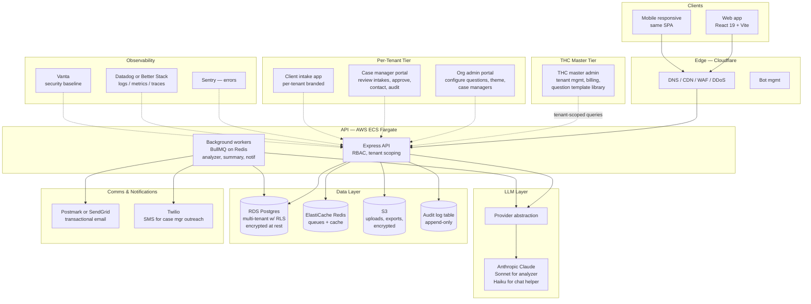

# Hope Connect — Strategy & Roadmap

_Synthesis of the 6/13/2026 in-person meeting plus prior context. This is the working draft of the architecture contract and delivery plan. Working draft means: opinionated and specific, but open for the team to push back. Open questions are called out explicitly in §9._

---

## 1. What materially changed after the 6/13 meeting

Three structural decisions emerged from this meeting that override most of what was assumed before. Re-orienting around these is the whole point of this document.

**Shift 1 — Corporate structure.** The build is no longer "an app for a nonprofit." The plan is now a for-profit parent company (the build vehicle) that owns the app and a physical space, which funds the nonprofit (Freebird Foundation). The Hope Connect (THC) is the product; the nonprofit is the first customer and the social-impact vehicle. This is a different ownership and IP conversation than the previous "$60k full transfer" assumption.

**Shift 2 — Productization to multi-tenant SaaS.** The line "almost a SaaS company where we sell frameworks to companies where the customer can then customize the app" plus the tiered-pricing comment locks in a multi-tenant architecture. The nonprofit is tenant #1; the platform must be able to onboard tenant #2, #3, #N from day one. Every architectural decision now has to assume multi-tenancy.

**Shift 3 — Data scope deliberately narrowed to dodge HIPAA.** "ID-based data — no PII or PHI" is an explicit strategy: collect only what's needed to triage and route, never store identifying or health information, sidestep the HIPAA cost burden entirely. If this holds, it cuts an estimated $30–50k of compliance work out of the build and unlocks any LLM provider with no BAA. There are practical problems with this strategy that have to be solved (see §9) but it is a major scope reduction if we can make it real.

Other meaningful but smaller-scale signals:

- **Geographic focus locked:** Charlotte NC first, expansion later.
- **Service category priority list:** affordable housing #1, economic mobility #2, then immigrant support, food access, youth programs, transport.
- **Crisis triage as a first-class UX concern** — an immediate-crisis question to short-circuit the questionnaire when needed.
- **Services layer:** consultants/relationship managers are part of the offering, not just the software.
- **Maintenance fee tightened to $1–2k/month** with on-call coverage.
- **Local data and partner ecosystem identified:** Urban League, Autism Charlotte, Isaiah House, Educated Hoodlums, Union County Crisis Ministries, Exit Ford / Nations Ford.
- **Funding landscape mentioned:** $9M Charlotte grants, $70M physical-location funding.

---

## 2. Locked-in architectural decisions

Given the meeting, the decision tree from `ARCHITECTURE_DECISIONS.md` collapses to a single branch. The choices below are what we're recommending to the team as locked. Anything the nonprofit wants to revisit later we can revisit; everything in this section is what gets built unless a future conversation overrules it.

| Decision | Choice | Why |
|---|---|---|
| **D1 — Data scope** | ID-based, no PII or PHI in primary store | Direct meeting decision. Removes HIPAA burden. |
| **D2 — Covered entity** | Not applicable | Out-of-scope by D1. |
| **D3 — Posture** | Standard SaaS security with strong baseline (encryption, RBAC, audit log, RLS, MFA for staff) | Best-practice hygiene without certification cost. Promotable to HIPAA later if the data scope changes. |
| **D4 — Tenancy** | **Multi-tenant from day one.** | Direct meeting decision. Org isolation in the schema, not bolted on later. |
| **D5 — Hosting** | AWS ECS Fargate (Docker) + RDS Postgres + Cloudflare in front | AWS gives us a path to HIPAA later without re-platforming. Docker on Cloudflare doesn't work; this is the standard pattern. |
| **D6 — LLM** | Claude Sonnet via Anthropic API direct (no BAA needed under D1) | Best quality for analyzer + structured output + Spanish. Provider abstraction stays so we can swap. |
| **D7 — Auth** | Clerk with Organizations feature, standard plan | Google OAuth for clients, MFA for staff, org-scoped users out of the box. |
| **D8 — V1 scope** | Bucket 2½ — multi-tenant MVP + post-analysis workflow + Spanish, defer mobile-native and full closed-loop to v1.5 | Matches what the nonprofit asked for. |

---

## 3. The full architecture (as proposed)

A few important things to call out about this architecture:

**Multi-tenancy lives in three places, not one.** (a) The Postgres schema has an `org_id` column on every tenant-scoped table with row-level security policies enforcing it. (b) The Express middleware extracts the tenant from the authenticated user and injects it into every query. (c) Clerk Organizations provides the user-to-org mapping at the auth layer. Defense in depth — even if one layer fails, the other two contain the blast radius.

**Three tiers of admin, not two.** THC master admins (Quinn, Ted, future staff) can see across all tenants. Tenant org admins can manage only their own org's case managers and configure their org's questionnaire. Case managers see only their assigned clients. Clients see only their own intake.

**Background workers carry the slow operations.** Analyzer calls take 5–15 seconds; we don't make the user wait synchronously. The intake submission writes a row and queues a job; the UI polls for completion. Same pattern for summary generation, notification dispatch, and any future API integration with partner orgs.

**The provider abstraction stays.** Even though we're picking Claude direct today, leaving the abstraction means we can drop in Bedrock, Azure OpenAI, or self-hosted if scale or compliance changes.

---

## 4. Feature catalog

Grouped by phase. Bold = required for v1 launch. Plain = v1.5. Italic = future.

### Client-facing intake

- **Multi-step form with per-tenant configurable questions**
- **Immediate-crisis short-circuit question** at start
- **Progress bar** and reassuring UX copy ("breathe", "we're here")
- **Help score** displayed at end of intake
- **Anonymous ID-based identity** (no email signup required to start)
- **Optional contact channel** (phone or alt-contact) collected separately, stored encrypted, time-limited
- **Spanish + English** with language toggle (defer to v1.5 launch if needed)
- WCAG 2.1 AA accessibility, text-to-speech, font scaling (v1.5)
- _Mobile-native PWA or app (future)_

### Case manager portal

- **Inbox of intakes** sortable by severity / help score / age
- **Detail view** with summary, transcript, screening, analyzer output, AI comments
- **Status workflow** (new → in review → approved → contacted → closed)
- **Approval/override controls** on AI recommendations
- **Staff notes** (per-case, auditable)
- **Reach-out queue** — surface anyone whose contact channel hasn't been used yet
- **Reanalyze button** with versioned model output
- _Communication tools (in-app messaging, future)_
- _Closed-loop referral tracking (future)_

### Org admin (tenant) portal

- **Question configuration UI** — pick from THC's template library, edit per-org
- **Theme / branding** (logo, color, copy customization)
- **Case manager management** — invite, role, deactivate
- **Per-org program directory** of resources they want surfaced
- **Per-org reporting**
- Reviews/feedback collection on case managers (v1.5)

### THC master admin

- **Tenant lifecycle** — onboard, activate, suspend, deactivate
- **Question template library** — managed centrally, tenants pick from
- **Cross-tenant analytics** — anonymized, for THC's own product decisions
- **Billing dashboard** — tier, usage, invoices
- _Consultant/relationship-manager assignment (future, when team scales)_

### Backend / platform

- **Auth via Clerk Organizations**
- **RBAC: client, case_manager, org_admin, thc_admin**
- **Row-level security in Postgres**
- **Audit log of every PHI-equivalent access** (intake views, status changes, downloads)
- **Background job system** for analyzer + notifications
- **Provider-abstracted LLM** (Claude direct in v1)
- **Eval harness** ported from current code (already exists)
- **Crisis escalation pipeline** — when crisis flag fires, surface to case manager immediately and notify org admin
- _Public API for partner-org integration (future)_

### Reporting

- **KPI dashboard** per tenant (existing)
- **Outcome tracking — did the client get help** (v1.5; this is the closed-loop feature Unite Us is famous for)
- **CSV export** (existing)
- _Federal grant report templates — TANF, SNAP, CDBG (future)_
- _Cross-tenant rolled-up anonymous data (future, sellable per the meeting)_

### Notifications & communications

- **Email outbound** to case managers when intakes come in
- **SMS outbound** to clients when case manager wants to reach out (Twilio)
- **In-app notifications**
- _Two-way SMS conversation logging (future)_

---

## 5. Phased delivery plan with timeline

Two-developer team (Quinn + Ted), $75/hr blended, part-time hours assumed. Calendar weeks assume ~25 hr/week per dev = ~50 hr/week combined.

### Phase 0 — Current state ✅

Demo prototype on SQLite + Ollama. Done. Estimated 100–160 hours invested.

### Phase 1 — Production foundation _(7–9 weeks, 280–360 hrs, $21–27k)_

The work that has to happen before any new feature ships. Almost entirely invisible to the nonprofit.

- AWS account setup + Cloudflare DNS + Terraform for infra-as-code
- Postgres schema with multi-tenant model from day one (orgs, users, intakes, programs, audit_log)
- Migrate `server/store.js` from SQLite to Postgres with Knex or Drizzle
- Add `org_id` everywhere + Postgres RLS policies
- Clerk Organizations integrated, auth middleware enforces tenant scope
- Deploy Express API to ECS Fargate behind Cloudflare
- CI/CD via GitHub Actions
- Sentry + observability wired up
- Audit log table + middleware to populate it
- BullMQ + Redis for background jobs; port analyzer to be async

### Phase 2 — Multi-tenant SaaS shell _(8–10 weeks, 320–440 hrs, $24–33k)_

The architecture that makes "sell to other nonprofits" real.

- THC master admin panel — onboard tenant, set tier, manage
- Org admin panel — manage case managers, configure questions, set theme
- Question template library — THC manages central catalog, orgs pick + customize
- Per-tenant theming (logo, colors, copy)
- Tenant signup flow (initially THC-mediated, eventually self-serve)
- Billing scaffolding (Stripe; tier model wired in even if free for tenant #1)
- Migrate existing analyzer/help-score/screening to be tenant-aware

### Phase 3 — Full Option-1 workflow _(6–8 weeks, 240–320 hrs, $18–24k)_

Closes the loop from intake to case manager review to client.

- Case manager review → approve → contact flow
- Reach-out queue UI for case managers
- Encrypted contact-channel storage (phone/alt-contact) with TTL
- SMS via Twilio for case-manager outreach (no two-way yet)
- Email via Postmark/SendGrid for transactional notifications
- Crisis escalation pipeline
- Staff notes + status workflow
- Hard-coded approved-resource immediate response (per Meeting 2 spec)

### Phase 4 — Accessibility, Spanish, mobile polish _(4–5 weeks, 160–200 hrs, $12–15k)_

- i18n framework + Spanish translation pass (engage translator)
- WCAG 2.1 AA audit and fixes
- Text-to-speech + font scaling
- Mobile responsive QA pass
- Browser testing matrix

### Phase 5 — Pre-launch hardening _(3–4 weeks, 120–160 hrs, $9–12k)_

- Load testing (target: 1000 concurrent users, 100 intakes/hour peak)
- Security review (independent contractor, ~$3–5k extra)
- Documentation for client orgs and case managers
- Onboarding script for new tenants (the "consultant" enablement)
- Charlotte launch with the nonprofit as tenant #1

### Throughput / ongoing _(across all phases)_

- Testing + QA: 160–240 hrs ($12–18k)
- Project management + client comms: built into above
- Eval suite expansion: 40–60 hrs ($3–4.5k)

### Totals

| Bucket | Hours | Cost |
|---|---|---|
| Phase 1 — Foundation | 280–360 | $21–27k |
| Phase 2 — Multi-tenant shell | 320–440 | $24–33k |
| Phase 3 — Option-1 workflow | 240–320 | $18–24k |
| Phase 4 — A11y + Spanish | 160–200 | $12–15k |
| Phase 5 — Pre-launch | 120–160 | $9–12k |
| Testing + eval | 200–300 | $15–22k |
| **Total dev labor** | **1,320–1,780** | **$99–133k** |

**Realistic calendar time at part-time pace: 9–12 months from contract signing to Charlotte launch.**

Full-time would compress to roughly half that, but neither of you is signing up to be full-time on this for a year.

### Hard costs (not included above)

| Item | Cost |
|---|---|
| AWS infrastructure (year 1) | $3–7k |
| Cloudflare (year 1) | $0–1k |
| Clerk paid plan | $1.2–2.4k/yr |
| Anthropic Claude API (year 1, ~50k intakes total) | $1.5–3k |
| Postmark + Twilio + Sentry + Datadog | $1.5–3k/yr |
| Domain + email + misc | $300–500/yr |
| Security review (independent) | $3–5k once |
| Legal — contract drafting, IP, terms-of-service, privacy policy | $4–8k once |
| Translation services (Spanish, professional) | $2–4k once |
| **Total year-1 hard costs** | **$16–34k** |

Note: no HIPAA audit, no BAAs to negotiate, no compliance-tooling subscriptions — the no-PII strategy saves roughly $20–40k here.

---

## 6. Cost model and contract structure

Given the pivot from "build a nonprofit's app" to "build a for-profit SaaS that funds a nonprofit," the original $60k full-transfer model probably isn't the right shape anymore. The asset you're producing is materially more valuable.

Three contract structures worth putting in front of the team:

### Option A — Equity + reduced cash

You retain a meaningful equity stake in the for-profit parent in exchange for a reduced cash payment.

- Cash: $30–50k spread across milestones
- Equity: 15–25% in the for-profit parent
- Monthly maintenance retainer: $1.5–2.5k starting at launch
- Hard costs paid by the company

Right shape if the for-profit succeeds — your upside scales with the product. Wrong shape if the parent company never reaches revenue.

### Option B — Full cash buyout (the original $60k model, refreshed)

The original quote, but scoped to the new reality.

- Cash: $90–120k spread across phase completions (foundation 25% → multi-tenant 25% → workflow 20% → polish 15% → launch 15%)
- IP fully transferred to the for-profit parent at final payment
- Monthly maintenance retainer: $1.5–2.5k
- Hard costs paid by the company

Right shape if you'd rather have the cash and walk away with no ownership.

### Option C — Hybrid

Smaller cash, smaller equity, ongoing license fee per tenant.

- Cash: $60–75k milestone-based
- Equity: 5–10%
- Per-tenant license fee paid back to you (e.g. $200/mo per tenant onboarded, capped or sunsetting)
- Monthly maintenance: $1.5–2.5k

Right shape if the parent's tenant count grows — captures upside without taking founder-level equity.

For the meeting with the team, my recommendation is to walk in with Option C as the proposal because it aligns incentives without demanding founder-level equity. Option A is the upside play if the team has high conviction in the parent company. Option B is the cleanest exit if either side wants a clean break later.

---

## 7. Payment milestone schedule (template, regardless of option)

If the contract is structured around milestones, here's the schedule that maps to the phase plan:

| Milestone | Trigger | % of cash |
|---|---|---|
| 1 | Contract signed + Phase 1 kickoff | 15% |
| 2 | Phase 1 complete (foundation deployed) | 20% |
| 3 | Phase 2 complete (tenant #1 fully onboarded on prod) | 25% |
| 4 | Phase 3 complete (full Option-1 workflow live) | 20% |
| 5 | Phase 4 complete (Spanish + a11y) | 10% |
| 6 | Public launch | 10% |

---

## 8. What the for-profit parent owns vs. what you own

This is the IP question and it's the one that determines the contract more than dollars.

Three layers exist:

1. **The Hope Connect product itself** — frontend, backend, schema, business logic.
2. **The analyzer pipeline and eval harness** — the AI plumbing. Reusable across products.
3. **Tenant onboarding playbook + consultant scripts** — services component.

A reasonable IP carve-up: the for-profit parent owns layer 1 outright. You retain co-ownership of layer 2 (so you could build other AI-analyzer products in unrelated domains) or license it to the parent perpetually. Layer 3 is operational and accrues to whoever runs it day-to-day.

This needs the attorney conversation — the $1,500 already spent on a nonprofit attorney was for the nonprofit's structure; the IP carve-up is a separate engagement.

---

## 9. Open questions and risks

This is the brainstorm-with-Ted list. None of these are blockers, but each one shifts the architecture or pricing.

**The "no PII or PHI" claim has practical holes.** Three problems with the strategy as stated:

- _How does the case manager actually reach the client?_ Meeting 1 said the agent reaches out the next day. That requires contact info. Solution sketch: collect phone number into an encrypted, short-TTL store separate from the intake DB, used only for outreach and purged after first contact. Worth designing carefully.
- _What is "ID-based"?_ A random user ID assigned at intake start. If the client closes their browser and never returns, they're lost forever — there's no way to log back in without an account. We need to decide: do we accept that, or do we offer an optional account?
- _"We can sell the data" raises legal questions even without HIPAA._ Selling user data, even de-identified, runs into CCPA in California, similar laws in WA / NY / CO, and broad fiduciary scrutiny when the data involves vulnerable populations. Worth a 30-minute attorney conversation before this becomes part of the pitch.

**What does "personalized per company" actually mean?** Is it:
- Question text only (org changes the wording but the schema stays)?
- Question logic (org can add/remove questions, change Likert scales)?
- New categories (org can add a "veterans services" track that didn't exist before)?
- Branching workflows (org can build conditional flows like "if homeless, ask X")?

Each of these is a different size of build. The current `server/screening-questions.js` is hardcoded; making it data-driven and editable in an admin UI is real work — probably 100–150 hours by itself. We should get a concrete answer from the nonprofit before locking phase scope.

**How does "ask if user is already receiving help from anywhere" actually work?** Manual question? Integration with partner CRMs? Lookup against a shared registry? Closed-loop with the Urban League etc.? This is the Unite Us moat and it's a multi-year build if done right; we should set expectations early.

**Crisis triage requires a crisis-response plan that goes beyond software.** If the immediate-crisis question fires, what is the case manager committed to doing? Is there a 24/7 phone number? Is there a documented escalation policy? Software can flag and notify but cannot replace a human crisis-response process. We should ask the nonprofit who answers the phone when someone's in crisis at 11pm.

**Tiered pricing tiers haven't been defined.** What's the difference between Tier 1 and Tier 2? Per-tenant per-month? Per-intake metered? Number of case managers? Without this we can't model the parent's revenue, and we can't size the Stripe integration in Phase 2.

**The "for us by us" line needs interpretation.** Is this a brand value (the team building Hope Connect comes from the communities it serves)? A hiring philosophy? A product-design constraint? Worth clarifying because it affects how we talk about the product publicly.

**Reviews / feedback — for whom?** Three possible meanings: (a) end-clients review case managers, (b) tenant orgs review THC, (c) public reviews of partner programs. All three exist as products; we should pick the one in scope.

**The physical space.** The meeting mentioned a brick-and-mortar location ("where we think our brick and mortar is — Jen"). Is that in-scope for the software (e.g., check-in kiosk?) or operationally separate?

**Mobile-native vs PWA.** The proposal mentions field workers and mobile access. Responsive web is in Phase 4; native mobile is at least 3–4 extra months and a separate codebase. We should set expectations.

**Integration with the partner orgs.** Urban League, Autism Charlotte, etc. — are these integration partners (data flows back and forth), referral partners (we send them clients but no data integration), or marketing partners (logos on the landing page)? Each is a different build.

---

## 10. What to bring to Ted tomorrow

A concrete agenda for the sync:

1. Walk through §2 — agree on the locked-in architecture or push back specifically.
2. Look at the contract options in §6, pick the one to propose to the nonprofit team.
3. Pick a side on the open questions in §9 where you can — at least get to "this is what we'll ask the nonprofit next."
4. Decide whether the timeline in §5 is aggressive, realistic, or conservative for your real availability.
5. Decide which two or three of the open questions are urgent enough to email the nonprofit about this week vs. wait for the next meeting.

Once §2, §6, and the urgent open questions resolve, we have a real architecture contract.
